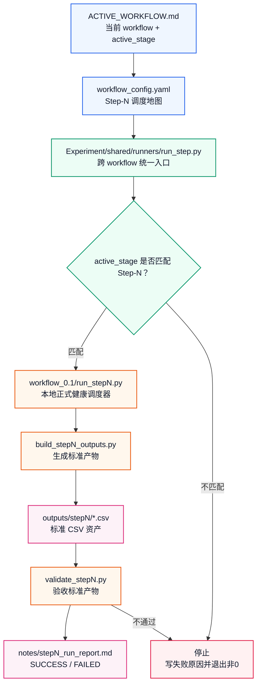
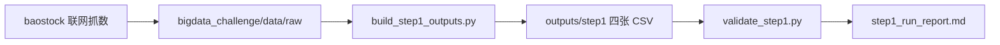
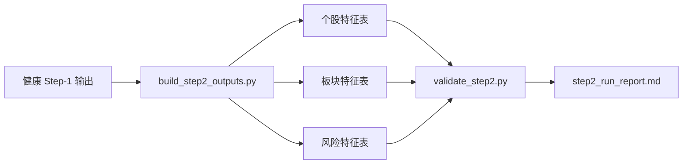
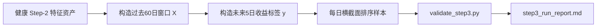
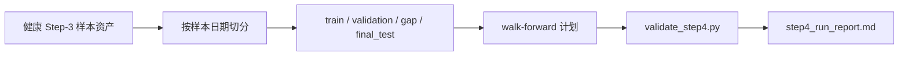
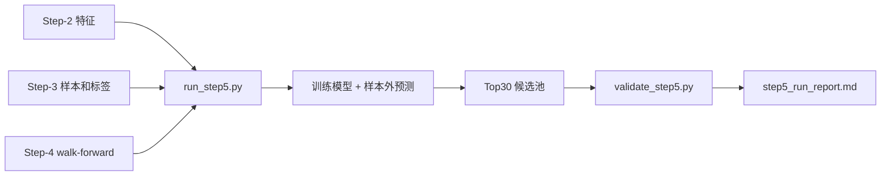
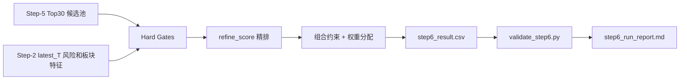
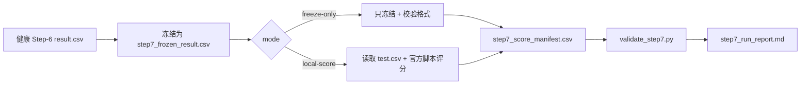
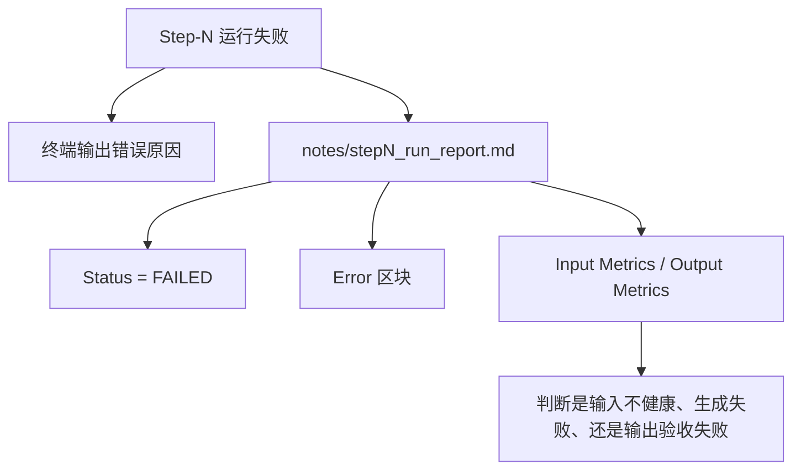

# Step-1 到 Step-7 健康体系全景说明

本文是一份跨 workflow 的说明书，用来回答：

```text
如果我从 Step-1 一直跑到 Step-7，
每一步到底在干什么？
读取什么？
生成哪些表？
怎么判断健康？
失败了去哪里看原因？
```

它不是某一次实验报告，而是健康体系的长期说明。当前以 `workflow_0.1` 的真实落地为样板，未来 `workflow_0.2` 可以继续复用这套结构。

## 1. 一句话总览

```text
Step-1 产出干净数据
Step-2 产出特征资产
Step-3 产出训练样本
Step-4 产出时间切分和回测计划
Step-5 训练模型并产出 Top30 候选池
Step-6 从 Top30 精排成最终 result.csv
Step-7 冻结、评分、复盘，但不能反向修改本轮结果
```

## 2. 总调度图



通俗理解：

```text
shared 是总调度层。
workflow_0.1 是当前策略和真实执行层。
outputs 是每一步沉淀的表。
notes 是每一步的健康报告。
```

## 3. 七步主链路图

```mermaid
flowchart LR
  classDef s1 fill:#ecfdf5,stroke:#16a34a,color:#0f172a,stroke-width:1.5px
  classDef s2 fill:#eff6ff,stroke:#2563eb,color:#0f172a,stroke-width:1.5px
  classDef s3 fill:#fff7ed,stroke:#ea580c,color:#0f172a,stroke-width:1.5px
  classDef s4 fill:#f5f3ff,stroke:#7c3aed,color:#0f172a,stroke-width:1.5px
  classDef s5 fill:#fdf2f8,stroke:#db2777,color:#0f172a,stroke-width:1.5px
  classDef s6 fill:#ecfeff,stroke:#0891b2,color:#0f172a,stroke-width:1.5px
  classDef s7 fill:#fefce8,stroke:#ca8a04,color:#0f172a,stroke-width:1.5px

  S1["Step-1<br/>数据资产"]:::s1
  S2["Step-2<br/>特征资产"]:::s2
  S3["Step-3<br/>样本资产"]:::s3
  S4["Step-4<br/>切分计划"]:::s4
  S5["Step-5<br/>模型 + Top30"]:::s5
  S6["Step-6<br/>Top5 + result.csv"]:::s6
  S7["Step-7<br/>冻结 + 评分治理"]:::s7

  S1 --> S2 --> S3 --> S4 --> S5 --> S6 --> S7
```



## 4. 每一步的角色总表

| Step | 生产线定位 | 核心输入 | 核心输出 | 不做什么 |
|---|---|---|---|---|
| Step-1 | 数据资产生产线 | baostock + raw 数据源 | 沪深300日频数据、股票摘要、板块摘要、manifest | 不筛股、不建模、不生成结果 |
| Step-2 | 特征资产生产线 | 健康 Step-1 输出 | 个股特征、板块特征、风险特征、latest_T 初筛视图 | 不联网、不训练、不生成 result.csv |
| Step-3 | 样本资产生产线 | 健康 Step-2 输出 | 样本表、窗口索引、排序标签、group 信息 | 不切分、不训练、不生成候选池 |
| Step-4 | 切分与回测计划生产线 | 健康 Step-3 输出 | split detail、walk-forward plan、final retrain plan | 不训练、不评分、不改标签 |
| Step-5 | 模型训练与候选池生产线 | 健康 Step-2/3/4 输出 | 模型记录、样本外预测、Top30 候选池 | 不生成最终 Top5、不生成 result.csv |
| Step-6 | 精排与提交文件生产线 | 健康 Step-5 Top30 + Step-2 latest_T 特征 | final_top5、ranking_log、weight_plan、result.csv | 不训练模型、不从 Top30 外选股、不评分 |
| Step-7 | 冻结评分与复盘治理生产线 | 健康 Step-6 result.csv | frozen_result、score_summary、score_manifest、leakage_check | 不改股票、不改权重、不反向调参 |

## 5. 标准目录结构

每一步成功运行后，应该形成类似结构：

```text
Experiment/workflow_0.1/experiments/exp_YYYYMMDD_stepN_workflow_0_1/
├── outputs/
│   └── stepN/
│       └── stepN_*.csv
└── notes/
    └── stepN_run_report.md
```

Step-5 额外会有模型文件：

```text
Experiment/workflow_0.1/experiments/exp_YYYYMMDD_step5_workflow_0_1/
├── models/
│   └── step5/
├── outputs/
│   └── step5/
└── notes/
```

## 6. Step-1：数据资产生产线

### Step-1 图



### Step-1 说明表

| 项目 | 内容 |
|---|---|
| 正式入口 | `Experiment/workflow_0.1/run_step1.py` |
| shared 入口 | `Experiment/shared/runners/run_step.py --step 1` |
| 策略来源 | `workflow_0.1/strategy/0.1_Step-1_数据获取流程与思考逻辑.md` |
| 生成器 | `Experiment/workflow_0.1/pipelines/build_step1_outputs.py` |
| 验收器 | `Experiment/workflow_0.1/pipelines/validate_step1.py` |
| 报告 | `notes/step1_run_report.md` |
| 下游 | Step-2 |

### Step-1 输出表

| 文件 | 作用 | 关键字段 |
|---|---|---|
| `step1_daily_raw_data.csv` | 每只沪深300股票的日频行情底表 | 股票代码、日期、开盘、收盘、成交量、成交额、换手率、涨跌幅 |
| `step1_stock_summary.csv` | 每只股票的最新状态和近 N 日摘要 | 股票代码、股票名称、最新日期、近5/20/60日收益率、板块划分 |
| `step1_sector_summary.csv` | 六大板块聚合摘要 | 板块划分、股票数量、最新成交额合计、近5/20/60日收益率均值 |
| `step1_data_manifest.csv` | 本次数据资产说明书 | latest_T、date_start、date_end、data_source、generated_at |

### Step-1 健康检查表

| 检查项 | 必须满足 |
|---|---|
| 股票池 | 当前沪深300股票数等于 300 |
| 日频数据 | 300 只股票都有 daily 数据 |
| 日期 | 当前 300 只股票最新日期一致 |
| 重复 | daily 表无 股票代码 + 日期 重复 |
| 板块 | 板块划分未匹配数量为 0 |
| 报告 | `step1_run_report.md` 写出 SUCCESS 或 FAILED |

## 7. Step-2：特征资产生产线

### Step-2 图



### Step-2 说明表

| 项目 | 内容 |
|---|---|
| 正式入口 | `Experiment/workflow_0.1/run_step2.py` |
| shared 入口 | `Experiment/shared/runners/run_step.py --step 2` |
| 策略来源 | `workflow_0.1/strategy/0.1_Step-2_特征工程与初步筛选流程与思考逻辑.md` |
| 输入 | 最近一个 SUCCESS 的 Step-1 实验，或手动指定 `--step1-experiment` |
| 生成器 | `Experiment/workflow_0.1/pipelines/build_step2_outputs.py` |
| 验收器 | `Experiment/workflow_0.1/pipelines/validate_step2.py` |
| 报告 | `notes/step2_run_report.md` |
| 下游 | Step-3、Step-5、Step-6 |

### Step-2 输出表

| 文件 | 类型 | 作用 |
|---|---|---|
| `step2_feature_table_daily.csv` | 核心表 | 股票 + 日期级别的特征宽表，是后续样本和模型的主输入 |
| `step2_sector_feature_table.csv` | 核心表 | 板块 + 日期级别的板块动量、成交、强度特征 |
| `step2_latest_t_screen.csv` | 核心表 | latest_T 的初筛视图，方便人工检查最新交易日状态 |
| `step2_feature_metadata.csv` | 核心表 | 记录每个特征来源、窗口、是否用于模型、是否用于精排、防泄漏说明 |
| `step2_data_manifest.csv` | 核心表 | 记录输入 Step-1、latest_T、feature_set_id、generated_at |
| `step2_sector_score_latest.csv` | 派生视图 | latest_T 的板块打分快照 |
| `step2_risk_feature_table.csv` | 派生视图 | 风险相关字段视图，供 Step-6 精排使用 |

### Step-2 健康检查表

| 检查项 | 必须满足 |
|---|---|
| 输入 | Step-1 报告必须 SUCCESS |
| 日期 | Step-2 latest_T 与 Step-1 latest_T 一致 |
| 重复 | `feature_table_daily` 无 股票代码 + 日期 重复 |
| 表头 | 所有标准 CSV 表头符合 `workflow_0.1_csv_v1` |
| 防泄漏 | 特征元数据必须说明计算窗口和防泄漏逻辑 |
| 报告 | `step2_run_report.md` 写出 SUCCESS 或 FAILED |

## 8. Step-3：样本资产生产线

### Step-3 图



### Step-3 说明表

| 项目 | 内容 |
|---|---|
| 正式入口 | `Experiment/workflow_0.1/run_step3.py` |
| shared 入口 | `Experiment/shared/runners/run_step.py --step 3` |
| 策略来源 | `Experiment/策略流程与实验方案.md` 的 Sample Layer |
| 输入 | 最近一个 SUCCESS 的 Step-2 实验，或手动指定 `--step2-experiment` |
| 生成器 | `Experiment/workflow_0.1/pipelines/build_step3_outputs.py` |
| 验收器 | `Experiment/workflow_0.1/pipelines/validate_step3.py` |
| 报告 | `notes/step3_run_report.md` |
| 下游 | Step-4、Step-5 |

### Step-3 输出表

| 文件 | 作用 |
|---|---|
| `step3_sample_table.csv` | 每个样本日期 T、每只股票的样本主表，包含窗口、标签、风险标记 |
| `step3_window_index.csv` | 每个 sample_id 对应的过去 60 日窗口边界和完整性 |
| `step3_group_info.csv` | 每个样本日期 T 的 group 信息，用于排序模型分组 |
| `step3_rank_label_table.csv` | 股票在每个样本日期的未来收益排序标签 |
| `step3_label_distribution.csv` | 标签分布统计，用于检查标签是否异常 |
| `step3_sample_quality_summary.csv` | 样本质量摘要 |
| `step3_sample_manifest.csv` | 记录输入 Step-2、窗口参数、标签参数、样本日期范围 |

### Step-3 健康检查表

| 检查项 | 必须满足 |
|---|---|
| 输入 | Step-2 报告必须 SUCCESS |
| 窗口 | 过去 60 日窗口必须完整 |
| 标签 | 未来 5 日开盘收益标签必须可计算 |
| 分组 | 同一日期股票必须形成同一个横截面 group |
| 防泄漏 | latest_T 不能被错误当成可训练标签日 |
| 报告 | `step3_run_report.md` 写出 SUCCESS 或 FAILED |

## 9. Step-4：切分与回测计划生产线

### Step-4 图



### Step-4 说明表

| 项目 | 内容 |
|---|---|
| 正式入口 | `Experiment/workflow_0.1/run_step4.py` |
| shared 入口 | `Experiment/shared/runners/run_step.py --step 4` |
| 策略来源 | `Experiment/策略流程与实验方案.md` 的 Split 部分 |
| 输入 | 最近一个 SUCCESS 的 Step-3 实验，或手动指定 `--step3-experiment` |
| 生成器 | `Experiment/workflow_0.1/pipelines/build_step4_outputs.py` |
| 验收器 | `Experiment/workflow_0.1/pipelines/validate_step4.py` |
| 报告 | `notes/step4_run_report.md` |
| 下游 | Step-5 |

### Step-4 输出表

| 文件 | 作用 |
|---|---|
| `step4_split_detail.csv` | 每个样本日期的 split_role、是否可训练、是否 final_test |
| `step4_split_summary.csv` | train、validation、gap、final_test 的日期和样本行数摘要 |
| `step4_walk_forward_plan.csv` | 每一轮 walk-forward 的训练窗口、gap、评估窗口 |
| `step4_final_retrain_plan.csv` | 最终重训允许使用哪些日期 |
| `step4_split_manifest.csv` | 记录输入 Step-3、切分参数、日期范围 |
| `step4_leakage_check.csv` | 防泄漏检查明细 |

### Step-4 健康检查表

| 检查项 | 必须满足 |
|---|---|
| 输入 | Step-3 报告必须 SUCCESS |
| 切分单位 | 只能按样本日期切分，不能随机打乱股票行 |
| 时间顺序 | train、gap、validation、final_test 顺序正确 |
| 集合关系 | 不同 split_role 日期不重叠 |
| Gap | train 和 validation 之间必须保留隔离期 |
| 报告 | `step4_run_report.md` 写出 SUCCESS 或 FAILED |

## 10. Step-5：模型训练与候选池生产线

### Step-5 图



### Step-5 说明表

| 项目 | 内容 |
|---|---|
| 正式入口 | `Experiment/workflow_0.1/run_step5.py` |
| shared 入口 | `Experiment/shared/runners/run_step.py --step 5` |
| 策略来源 | `Experiment/策略流程与实验方案.md` 的模型训练与融合部分 |
| 输入 | 健康 Step-2、Step-3、Step-4，同一实验链路 |
| 生成器 | `Experiment/workflow_0.1/pipelines/build_step5_outputs.py` |
| 验收器 | `Experiment/workflow_0.1/pipelines/validate_step5.py` |
| 模型目录 | `models/step5/` |
| 报告 | `notes/step5_run_report.md` |
| 下游 | Step-6 |

### Step-5 输出表

| 文件 | 作用 |
|---|---|
| `step5_model_registry.csv` | 记录模型 ID、模型家族、参数、训练/验证日期、模型文件路径 |
| `step5_feature_set_used.csv` | 记录实际进入模型的特征白名单、缺失值策略、防泄漏说明 |
| `step5_walk_forward_predictions.csv` | 每轮 walk-forward 的样本外预测结果 |
| `step5_walk_forward_metrics.csv` | Top5/Top10/Top30 recall、rank_ic 等评估指标 |
| `step5_feature_importance.csv` | 特征重要性记录 |
| `step5_candidate_top30.csv` | 最新预测日的 Top30 候选池，Step-6 只能从这里选 |
| `step5_model_manifest.csv` | 记录输入链路、参数、candidate_date、generated_at |
| `step5_leakage_check.csv` | 防泄漏检查明细 |

### Step-5 健康检查表

| 检查项 | 必须满足 |
|---|---|
| 输入链路 | Step-2、Step-3、Step-4 都必须 SUCCESS 且互相一致 |
| 特征 | 模型特征必须来自 `step5_feature_set_used.csv` 白名单 |
| 训练 | walk-forward 预测必须是真正样本外预测 |
| 模型 | 模型参数、随机种子、模型文件路径必须可追溯 |
| Top30 | `step5_candidate_top30.csv` 只包含最新预测日候选池 |
| 报告 | `step5_run_report.md` 写出 SUCCESS 或 FAILED |

## 11. Step-6：精排与提交文件生产线

### Step-6 图



### Step-6 说明表

| 项目 | 内容 |
|---|---|
| 正式入口 | `Experiment/workflow_0.1/run_step6.py` |
| shared 入口 | `Experiment/shared/runners/run_step.py --step 6` |
| 策略来源 | `Experiment/策略流程与实验方案.md` 的精排 Top30 部分 |
| 输入 | 最近一个 SUCCESS 的 Step-5 实验，并通过 manifest 推断 Step-2 |
| 生成器 | `Experiment/workflow_0.1/pipelines/build_step6_outputs.py` |
| 验收器 | `Experiment/workflow_0.1/pipelines/validate_step6.py` |
| 报告 | `notes/step6_run_report.md` |
| 下游 | Step-7 |

### Step-6 输出表

| 文件 | 作用 |
|---|---|
| `step6_ranking_log.csv` | 记录 Top30 每只股票的 gates、剔除原因、精排分、是否最终入选 |
| `step6_final_top5.csv` | 最终入选股票、权重、精排分、入选理由 |
| `step6_weight_plan.csv` | 权重方法、总权重、现金权重、仓位约束说明 |
| `step6_result.csv` | 官方提交格式，只包含 `stock_id,weight` |
| `step6_refine_manifest.csv` | 记录输入 Step-5/Step-2、candidate_date、参数 |
| `step6_leakage_check.csv` | 防泄漏检查明细 |

### Step-6 健康检查表

| 检查项 | 必须满足 |
|---|---|
| 候选来源 | 最终股票只能来自 Step-5 Top30 |
| 股票数量 | `result.csv` 股票数不超过 5 |
| 权重 | 权重非负，总和不超过 1 |
| 日志 | 每只候选股票都有保留或剔除原因 |
| 边界 | 不训练模型、不读取未来收益、不评分 |
| 报告 | `step6_run_report.md` 写出 SUCCESS 或 FAILED |

## 12. Step-7：冻结评分与复盘治理生产线

### Step-7 图



### Step-7 说明表

| 项目 | 内容 |
|---|---|
| 正式入口 | `Experiment/workflow_0.1/run_step7.py --mode freeze-only` |
| shared 入口 | `Experiment/shared/runners/run_step.py --step 7 --mode freeze-only` |
| 策略来源 | `Experiment/策略流程与实验方案.md` 的评分、回测与实验记录部分 |
| 输入 | 最近一个 SUCCESS 的 Step-6 实验，或手动指定 `--step6-experiment` |
| 生成器 | `Experiment/workflow_0.1/pipelines/build_step7_outputs.py` |
| 验收器 | `Experiment/workflow_0.1/pipelines/validate_step7.py` |
| 报告 | `notes/step7_run_report.md` |
| 下游 | 下一轮实验或下一个 workflow 的复盘输入 |

### Step-7 输出表

| 文件 | 作用 |
|---|---|
| `step7_frozen_result.csv` | 冻结后的提交文件，必须与 Step-6 result 一致 |
| `step7_score_summary.csv` | 评分模式、Final Score、结果状态、测试日期范围 |
| `step7_stock_contribution.csv` | local-score 模式下的单股贡献明细 |
| `step7_score_manifest.csv` | 记录评分脚本、test.csv、输入 Step-6、generated_at |
| `step7_leakage_check.csv` | 防泄漏检查明细 |

### Step-7 两种模式

| 模式 | 什么时候用 | 做什么 | 健康结果 |
|---|---|---|---|
| `freeze-only` | 未来行情未出现，或只需要先冻结提交文件 | 冻结 Step-6 result，校验格式，写 manifest | `FREEZE_ONLY_SUCCESS` |
| `local-score` | 已有合法 test.csv，可以本地模拟官方评分 | 冻结 result，读取 test.csv，运行官方脚本，写贡献明细 | `SCORE_SUCCESS` |

### Step-7 健康检查表

| 检查项 | 必须满足 |
|---|---|
| 输入 | Step-6 报告必须 SUCCESS |
| 冻结 | `step7_frozen_result.csv` 必须与 Step-6 result 一致 |
| 模式 | `freeze-only` 不能伪装成 `SCORE_SUCCESS` |
| 评分 | `local-score` 的 test.csv 日期必须晚于 Step-6 candidate_date |
| 治理 | Final Score 只能用于复盘和下一轮实验，不能回改本轮 Step-6 |
| 报告 | `step7_run_report.md` 写出 SUCCESS 或 FAILED |

## 13. 每一步失败时去哪里看



| 失败类型 | 常见原因 | 去哪里看 |
|---|---|---|
| active stage 不匹配 | `ACTIVE_WORKFLOW.md` 仍停在别的 Step | `Experiment/ACTIVE_WORKFLOW.md` |
| 输入不健康 | 上一步 report 不是 SUCCESS，或缺 manifest | 上一步 `notes/stepN_run_report.md` |
| 生成失败 | build 脚本中断、数据字段缺失、模型训练失败 | 当前 Step 的终端输出和 report Error |
| 输出验收失败 | 表头不对、日期不一致、重复行、防泄漏失败 | 当前 Step 的 `validate_stepN.py` 错误和 report |
| 评分治理失败 | test.csv 日期不合法，或官方脚本未成功 | Step-7 report 和 `step7_leakage_check.csv` |

## 14. shared 入口怎么用

先确认当前 active stage，例如当前是 Step-7：

```bash
/opt/miniconda3/bin/python3 Experiment/shared/validators/validate_workflow_config.py --workflow workflow_0.1
```

查看 shared runner 会调用什么，不实际运行：

```bash
/opt/miniconda3/bin/python3 Experiment/shared/runners/run_step.py --step 7 --mode freeze-only --dry-run --print-context
```

正式运行：

```bash
/opt/miniconda3/bin/python3 Experiment/shared/runners/run_step.py --step 7 --mode freeze-only
```

注意：

```text
shared runner 会检查 ACTIVE_WORKFLOW.md 里的 active_stage。
如果 active_stage 是 Step-7，就只能正式跑 Step-7。
如果要跑 Step-1 到 Step-6，需要先把 active_stage 切到对应 Step。
```

## 15. 新 workflow 复用这套体系时改哪里

| 要做的事 | 修改位置 | 说明 |
|---|---|---|
| 新建策略版本 | `Experiment/workflow_0.2/strategy/` | 写清楚这次策略变化 |
| 新建机器调度地图 | `Experiment/workflow_0.2/workflow_config.yaml` | 从 `workflow_0.1` 复制后改 workflow_id、策略来源和参数 |
| 激活新 workflow | `Experiment/ACTIVE_WORKFLOW.md` | 改成 `active_workflow: workflow_0.2` |
| 复用 shared 调度 | `Experiment/shared/runners/run_step.py` | 不需要重写总入口 |
| 复用健康规则 | `Experiment/shared/validators/` 和各 Step validator | 能抽象的继续沉淀进 shared |
| 保存实验结果 | `Experiment/workflow_0.2/experiments/` | 不要写回 `workflow_0.1/experiments/` |

## 16. 最重要的边界

```text
Step-1 到 Step-4 主要生产数据、特征、样本、切分计划。
Step-5 才开始训练模型。
Step-6 才生成最终 result.csv。
Step-7 只能冻结和评分，不能回头修改本轮结果。
```

如果这四条边界守住，后续新 workflow 就不容易乱：

```text
策略可以变。
调度入口尽量不变。
健康标准不能放松。
失败必须留下报告。
```
