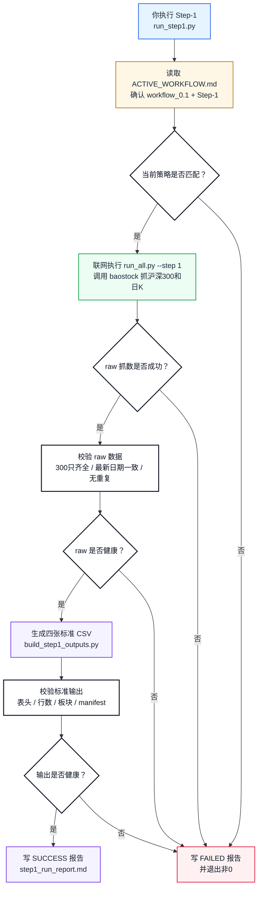
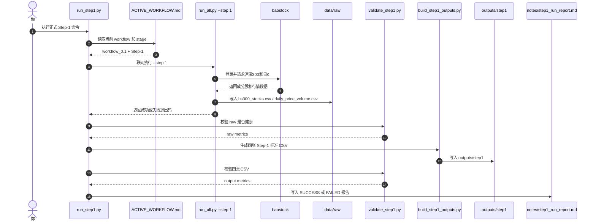
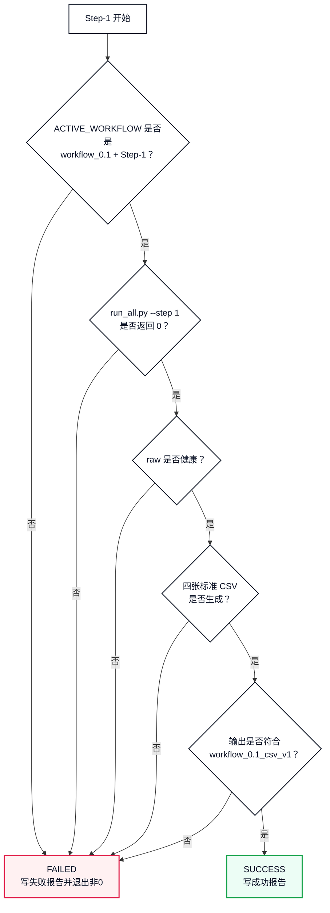
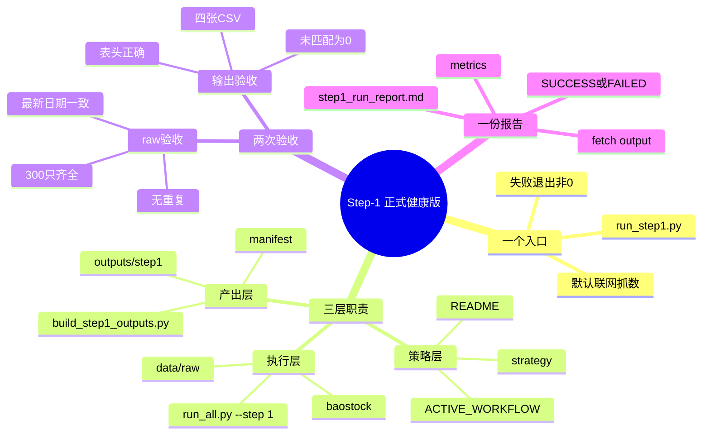

# Step-1 正式健康版运作流程

本文从 `workflow_0.1` 视角解释：当你执行 Step-1 时，背后到底运行了什么、每一层文件负责什么、什么情况下算成功、什么情况下必须失败。

## 一句话理解

Step-1 现在不再是“手动跑几个零散脚本”，而是一个正式健康流程：

```text
你执行一个入口命令
-> 系统确认当前策略版本
-> 联网抓取沪深300 raw 数据
-> 校验 raw 是否健康
-> 生成 workflow_0.1 标准四张 CSV
-> 再校验输出是否健康
-> 写入运行报告
```

正式入口只有这个：

```bash
/opt/miniconda3/bin/python3 Experiment/workflow_0.1/run_step1.py
```

## 图 1：Step-1 总体运作图



## 这一版最重要的变化

以前 Step-1 更像人工调度：

```text
读策略
-> 手动判断跑哪个脚本
-> 手动跑 raw 抓数
-> 手动检查 raw
-> 手动生成输出
-> 手动解释结果
```

现在 Step-1 变成正式调度：

```text
一个入口命令
-> 自动抓数
-> 自动验收
-> 自动生成
-> 自动写报告
-> 失败就停止
```

这意味着以后你主要改策略，我主要跑入口。流程不再散。

## 图 2：策略层、执行层、产出层

```mermaid
flowchart LR
  classDef layer fill:#f8fafc,stroke:#334155,color:#0f172a,stroke-width:2px
  classDef file fill:#ffffff,stroke:#64748b,color:#0f172a
  classDef data fill:#ecfdf5,stroke:#16a34a,color:#0f172a
  classDef output fill:#f5f3ff,stroke:#7c3aed,color:#0f172a

  subgraph S["策略层：决定 Step-1 应该做什么"]
    S1["Experiment/ACTIVE_WORKFLOW.md"]:::file
    S2["workflow_0.1/strategy/"]:::file
    S3["workflow_0.1/README.md"]:::file
  end

  subgraph R["调度层：把策略翻译成执行动作"]
    R1["workflow_0.1/run_step1.py"]:::file
  end

  subgraph E["执行层：只负责抓 raw 数据"]
    E1["bigdata_challenge/data_fetcher/run_all.py --step 1"]:::file
    E2["01_price_volume.py"]:::file
    E3["baostock 联网数据源"]:::data
  end

  subgraph D["raw 数据层：保存通用原始数据"]
    D1["bigdata_challenge/data/raw/hs300_stocks.csv"]:::data
    D2["bigdata_challenge/data/raw/daily_price_volume.csv"]:::data
    D3["bigdata_challenge/data/raw/stock_industry.csv"]:::data
  end

  subgraph O["产出层：生成本 workflow 的标准结果"]
    O1["build_step1_outputs.py"]:::file
    O2["step1_daily_raw_data.csv"]:::output
    O3["step1_stock_summary.csv"]:::output
    O4["step1_sector_summary.csv"]:::output
    O5["step1_data_manifest.csv"]:::output
  end

  subgraph V["验收层：判断 Step-1 是否健康"]
    V1["validate_step1.py"]:::file
    V2["step1_run_report.md"]:::output
  end

  S --> R --> E --> D --> O --> V
```



### 每一层的通俗解释

| 层级 | 通俗理解 | 主要文件 |
|---|---|---|
| 策略层 | 告诉系统“现在我们跑哪个 workflow，Step-1 的边界是什么” | `Experiment/ACTIVE_WORKFLOW.md`、`workflow_0.1/strategy/` |
| 调度层 | Step-1 的总开关，负责串起所有动作 | `Experiment/workflow_0.1/run_step1.py` |
| 执行层 | 只负责联网抓 raw，不负责解释策略 | `bigdata_challenge/data_fetcher/run_all.py`、`01_price_volume.py` |
| raw 数据层 | 存通用原始数据，供不同 workflow 使用 | `bigdata_challenge/data/raw/` |
| 产出层 | 把 raw 整理成 workflow_0.1 标准四张表 | `build_step1_outputs.py` |
| 验收层 | 判断这次 Step-1 是否真的健康 | `validate_step1.py`、`step1_run_report.md` |

## 图 3：执行时序图



## Step-1 具体做了什么

### 第 1 步：确认当前策略版本

`run_step1.py` 会先读：

```text
Experiment/ACTIVE_WORKFLOW.md
```

必须确认：

```text
active_workflow: workflow_0.1
active_stage: Step-1
```

如果不是这个组合，流程直接失败。这样可以避免你明明切到了别的实验版本，却误跑 workflow_0.1 的 Step-1。

### 第 2 步：联网抓 raw 数据

正式 Step-1 会联网执行：

```text
bigdata_challenge/data_fetcher/run_all.py --step 1
```

这一步背后会调用：

```text
bigdata_challenge/data_fetcher/01_price_volume.py
```

它主要做两件事：

```text
获取当前沪深300成分股
获取每只成分股的日频行情数据
```

写入 raw 数据：

```text
bigdata_challenge/data/raw/hs300_stocks.csv
bigdata_challenge/data/raw/daily_price_volume.csv
```

注意：`Step-5` 当前不属于正式健康链路。workflow_0.1 使用 `stock_industry.csv` 做行业映射，再自己聚合六大风格板块，不依赖不稳定的外部板块行情接口。

### 第 3 步：校验 raw 数据

raw 抓完以后，不直接相信文件存在，而是检查质量。

验收器：

```text
Experiment/workflow_0.1/pipelines/validate_step1.py
```

raw 必须满足：

```text
当前沪深300股票数 = 300
300只股票都有 daily 数据
当前300只股票最新日期一致
daily 表没有 股票代码 + 日期 重复
```

如果不满足，流程失败，并写入 FAILED 报告。

### 第 4 步：生成标准四张表

通过：

```text
Experiment/workflow_0.1/pipelines/build_step1_outputs.py
```

把 raw 数据整理成 workflow_0.1 规定的四张表：

```text
step1_daily_raw_data.csv
step1_stock_summary.csv
step1_sector_summary.csv
step1_data_manifest.csv
```

输出位置：

```text
Experiment/workflow_0.1/experiments/exp_YYYYMMDD_step1_workflow_0_1/outputs/step1/
```

### 第 5 步：校验标准输出

输出也不能只看“文件生成了”，还要看是否符合契约。

必须满足：

```text
四张 CSV 都存在
四张 CSV 表头符合 workflow_0.1_csv_v1
step1_stock_summary.csv 行数 = 300
板块划分未匹配数量 = 0
step1_daily_raw_data.csv 没有 股票代码 + 日期 重复
manifest 记录 latest_T、date_start、date_end、raw_交易日数、data_source、generated_at
```

### 第 6 步：写运行报告

最后写入：

```text
Experiment/workflow_0.1/experiments/exp_YYYYMMDD_step1_workflow_0_1/notes/step1_run_report.md
```

报告会告诉你：

```text
这次是 SUCCESS 还是 FAILED
执行了哪个 workflow
raw 数据目录在哪里
标准输出目录在哪里
联网抓数命令是什么
raw 验收指标
output 验收指标
如果失败，失败原因是什么
```

## 图 4：成功与失败判断



## 最近一次正式运行结果

最近一次运行时间：`2026-06-16`

运行命令：

```bash
/opt/miniconda3/bin/python3 Experiment/workflow_0.1/run_step1.py
```

报告位置：

```text
Experiment/workflow_0.1/experiments/exp_20260616_step1_workflow_0_1/notes/step1_run_report.md
```

核心结果：

| 指标 | 结果 |
|---|---:|
| 运行状态 | SUCCESS |
| 当前沪深300股票数 | 300 |
| daily 行数 | 247557 |
| daily 覆盖股票数 | 300 |
| daily 起始日期 | 2023-01-03 |
| latest_T | 2026-06-15 |
| raw 交易日数 | 833 |
| daily 重复行数 | 0 |
| stock summary 行数 | 300 |
| 板块数量 | 6 |
| 未匹配板块数量 | 0 |

为什么 `latest_T` 是 `2026-06-15`，不是 `2026-06-16`？

```text
2026-06-16 是执行日期。
baostock 当前可用的日线行情最新交易日是 2026-06-15。
所以正式 Step-1 的 latest_T 记录为 2026-06-15。
```

## 现在你以后怎么使用

### 正式跑 Step-1

```bash
/opt/miniconda3/bin/python3 Experiment/workflow_0.1/run_step1.py
```

### 如果你只想指定实验目录名

```bash
/opt/miniconda3/bin/python3 Experiment/workflow_0.1/run_step1.py --experiment-name exp_20260616_step1_my_note
```

这仍然是正式流程，仍然会联网抓数、验收 raw、生成输出、验收输出、写报告。

## 如果以后要改策略，应该改哪里

| 你想改什么 | 应该改哪里 |
|---|---|
| 切换当前 workflow | `Experiment/ACTIVE_WORKFLOW.md` |
| 改 Step-1 的策略解释 | `Experiment/workflow_0.1/strategy/` |
| 改 Step-1 输出字段标准 | `Experiment/workflow_0.1/README.md` |
| 改 raw 到标准 CSV 的整理逻辑 | `Experiment/workflow_0.1/pipelines/build_step1_outputs.py` |
| 改 Step-1 健康验收规则 | `Experiment/workflow_0.1/pipelines/validate_step1.py` |
| 改联网抓数细节 | `bigdata_challenge/data_fetcher/01_price_volume.py` |
| 改总调度流程 | `Experiment/workflow_0.1/run_step1.py` |

## 最后再压缩成一张心智图



## 这套流程的核心价值

```text
策略不再散落在脑子里。
执行不再依赖手动记忆。
输出不再只看文件是否存在。
失败不再悄悄发生。
每次实验都有报告可以复盘。
```

这就是当前 `workflow_0.1` 的 Step-1 正式健康版工作流。
