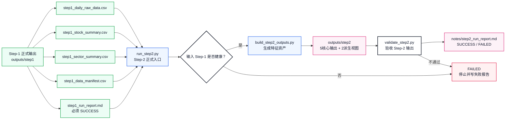
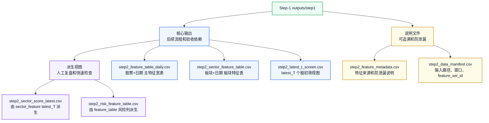
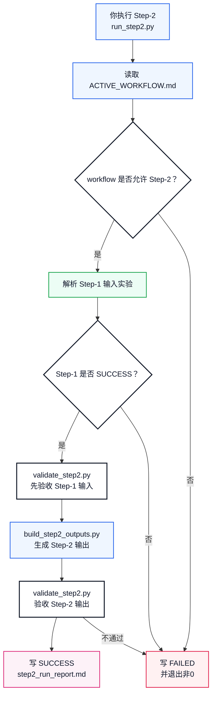
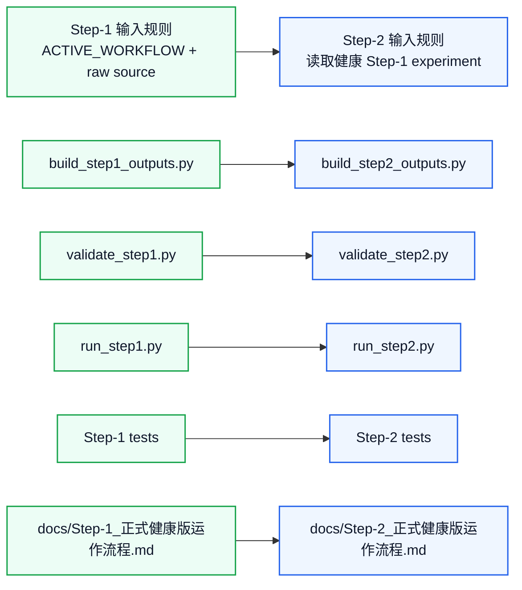

# Step-2 正式健康版体系设计

本文定义 `workflow_0.1` 的 Step-2 应该如何从“策略想法”升级成像 Step-1 一样的正式健康流程。

Step-1 已经是：

```text
数据资产生产线
```

Step-2 要建设成：

```text
特征资产生产线
```

也就是说，Step-2 不只是写几个技术指标，而是要形成一套可运行、可验收、可复盘、可追溯的特征工程体系。

## 一句话理解

Step-2 的任务是：

```text
读取一个健康的 Step-1 输出
-> 把 daily raw data 变成板块特征、个股特征、量能特征、风险标记
-> 生成 5 个核心输出 + 2 个派生视图
-> 自动验收是否无未来泄漏、日期对齐、表头正确、latest_T 一致
-> 写入 step2_run_report.md
```

它不做：

```text
不联网抓 raw 数据
不重新定义沪深300股票池
不直接生成 result.csv
不决定最终权重
不直接给最终交易结论
```

## 图 1：Step-1 到 Step-2 的衔接



## Step-2 需要补齐的六块能力

| 序号 | 能力 | 对应文件 | 作用 |
|---:|---|---|---|
| 1 | 输入规则 | `run_step2.py` / `step2_data_manifest.csv` | 明确 Step-2 读取哪一次健康 Step-1 输出 |
| 2 | 生成器 | `pipelines/build_step2_outputs.py` | 从 Step-1 四张表生成 Step-2 标准 CSV |
| 3 | 验收器 | `pipelines/validate_step2.py` | 检查表头、行数、日期、latest_T、防泄漏、派生视图一致性 |
| 4 | 总调度器 | `run_step2.py` | 串起输入检查、生成、验收、报告 |
| 5 | 测试体系 | `pipelines/tests/test_*step2*.py` | 保证生成逻辑和验收规则稳定 |
| 6 | 长期说明文档 | `docs/Step-2_正式健康版运作流程.md` | 像 Step-1 一样画图解释怎么跑、怎么验收 |

这六块合起来，Step-2 才算从策略文档变成正式流程。

## 1. Step-2 输入规则

### 推荐规则

正式 Step-2 必须读取一个已经健康通过的 Step-1 实验目录。

输入目录形态：

```text
Experiment/workflow_0.1/experiments/<step1_experiment>/
├── outputs/
│   └── step1/
│       ├── step1_daily_raw_data.csv
│       ├── step1_stock_summary.csv
│       ├── step1_sector_summary.csv
│       └── step1_data_manifest.csv
└── notes/
    └── step1_run_report.md
```

### 入口参数建议

```bash
/opt/miniconda3/bin/python3 Experiment/workflow_0.1/run_step2.py
```

默认行为：

```text
自动寻找最近一个 SUCCESS 的 Step-1 实验
```

同时允许手动指定：

```bash
/opt/miniconda3/bin/python3 Experiment/workflow_0.1/run_step2.py \
  --step1-experiment exp_20260616_step1_workflow_0_1
```

健康要求：

```text
Step-1 run report 必须是 SUCCESS
Step-1 manifest 必须存在
Step-1 latest_T 必须能读到
Step-1 daily / stock / sector 三张数据表必须存在
Step-2 report 必须记录实际读取的 Step-1 experiment
```

这样既保留“一键运行”的便利，又能在报告里追溯 Step-2 到底用了哪一次 Step-1。

## 2. build_step2_outputs.py：Step-2 生成器

目标路径：

```text
Experiment/workflow_0.1/pipelines/build_step2_outputs.py
```

它只做一件事：

```text
把 Step-1 标准输出加工成 Step-2 标准输出
```

不做：

```text
不联网
不抓 raw
不写 result.csv
不直接做最终交易结论
```

### 输入

```text
step1_daily_raw_data.csv
step1_stock_summary.csv
step1_sector_summary.csv
step1_data_manifest.csv
```

### 输出

Step-2 第一版采用：

```text
5 个核心输出 + 2 个派生视图
```

核心输出：

```text
step2_feature_table_daily.csv
step2_sector_feature_table.csv
step2_latest_t_screen.csv
step2_feature_metadata.csv
step2_data_manifest.csv
```

派生视图：

```text
step2_sector_score_latest.csv
step2_risk_feature_table.csv
```

如果派生视图和核心输出冲突，以核心输出为准。

## 图 2：Step-2 输出分层



## 3. validate_step2.py：Step-2 验收器

目标路径：

```text
Experiment/workflow_0.1/pipelines/validate_step2.py
```

它负责判断 Step-2 是否健康。

### 输入验收

```text
Step-1 report 必须 SUCCESS
Step-1 manifest 的 schema_version 必须是 workflow_0.1_csv_v1
Step-1 latest_T 必须存在
Step-1 daily 表无 股票代码 + 日期 重复
Step-1 stock summary 行数必须是 300
```

### 输出验收

```text
5 个核心输出必须存在
2 个派生视图默认生成
每张 CSV 表头必须符合 README 定义
feature_table_daily 唯一键必须是 股票代码 + 日期
sector_feature_table 唯一键必须是 日期 + 板块划分
latest_t_screen 只能包含 latest_T 当天记录
feature_metadata 必须覆盖所有新增特征
data_manifest 必须记录 input_step1_path、latest_T、feature_set_id
```

### 防未来信息泄漏验收

Step-2 所有特征只能使用预测日 `T` 及以前的数据。

验收规则：

```text
ret_5、ma5、amount_ma5 等 rolling 特征只能使用当前行及以前历史
latest_t_screen 只能从 latest_T 当天的特征表筛出
metadata 中每个特征必须写防泄漏说明
manifest 必须记录 Step-1 input latest_T
```

### 派生视图一致性验收

```text
step2_sector_score_latest.csv
= step2_sector_feature_table.csv 中 latest_T 当天记录

step2_risk_feature_table.csv
= step2_feature_table_daily.csv 中风险相关字段子集
```

如果不一致，Step-2 失败。

## 4. run_step2.py：正式调度入口

目标路径：

```text
Experiment/workflow_0.1/run_step2.py
```

它对齐 Step-1 的 `run_step1.py`，负责串起全流程：

```text
读取 ACTIVE_WORKFLOW
-> 确认 active_workflow=workflow_0.1
-> 确认当前允许跑 Step-2
-> 找到或读取指定 Step-1 实验
-> 校验 Step-1 输入健康
-> 调用 build_step2_outputs.py
-> 调用 validate_step2.py
-> 写 step2_run_report.md
```

建议命令：

```bash
/opt/miniconda3/bin/python3 Experiment/workflow_0.1/run_step2.py
```

指定输入：

```bash
/opt/miniconda3/bin/python3 Experiment/workflow_0.1/run_step2.py \
  --step1-experiment exp_20260616_step1_workflow_0_1
```

指定输出实验名：

```bash
/opt/miniconda3/bin/python3 Experiment/workflow_0.1/run_step2.py \
  --step1-experiment exp_20260616_step1_workflow_0_1 \
  --experiment-name exp_20260617_step2_workflow_0_1
```

## 图 3：Step-2 正式运行流程



## 5. Step-2 测试体系

测试目录：

```text
Experiment/workflow_0.1/pipelines/tests/
```

建议新增：

```text
test_build_step2_outputs.py
test_validate_step2.py
test_run_step2_runner.py
```

### 生成器测试

覆盖：

```text
能从最小 Step-1 fixture 生成 5 个核心输出 + 2 个派生视图
feature_table_daily 表头正确
sector_feature_table 表头正确
latest_t_screen 只包含 latest_T
metadata 覆盖新增特征
manifest 记录 input_step1_path 和 feature_set_id
```

### 验收器测试

覆盖：

```text
缺少 Step-1 输入时失败
Step-1 report 不是 SUCCESS 时失败
feature_table_daily 有重复 股票代码+日期 时失败
latest_t_screen 包含非 latest_T 日期时失败
派生视图和核心输出不一致时失败
metadata 缺少防泄漏说明时失败
```

### runner 测试

覆盖：

```text
workflow 不匹配时拒绝运行
Step-1 输入不健康时写 FAILED 报告
Step-2 输出健康时写 SUCCESS 报告
失败时返回非0
成功时返回0
```

## 6. Step-2 长期说明文档

目标路径：

```text
Experiment/workflow_0.1/docs/Step-2_正式健康版运作流程.md
```

它应该像 Step-1 文档一样回答：

```text
Step-2 一句话是什么
它从 Step-1 读取什么
它生成哪些核心输出和派生视图
每个 CSV 是什么粒度
健康验收标准是什么
失败报告在哪里
哪些东西不是 Step-2 负责
```

这份文档是“长期说明书”，不是某一次实验报告。

单次实验报告应该放在：

```text
Experiment/workflow_0.1/experiments/<step2_experiment>/notes/step2_run_report.md
```

## 图 4：Step-2 体系和 Step-1 体系的对应关系



## Step-2 成功标准草案

Step-2 成功不是“文件生成了”就算成功，而是必须满足：

```text
读取的 Step-1 实验是 SUCCESS
Step-2 latest_T 与 Step-1 latest_T 一致
5 个核心输出全部存在
2 个派生视图默认生成
所有 CSV 表头符合 workflow_0.1_csv_v1
feature_table_daily 无 股票代码 + 日期 重复
sector_feature_table 无 日期 + 板块划分 重复
latest_t_screen 只包含 latest_T
feature_metadata 覆盖新增特征并写明防泄漏说明
step2_data_manifest 记录 input_step1_path、feature_set_id、latest_T、生成时间
step2_run_report.md 写入 SUCCESS
```

失败时必须：

```text
写入 step2_run_report.md
Status = FAILED
说明失败阶段
说明失败原因
退出码非0
```

## 建议建设顺序

```text
1. 先实现 Step-2 输入规则
2. 写 build_step2_outputs.py
3. 写 validate_step2.py
4. 写 run_step2.py
5. 写 tests
6. 写 docs/Step-2_正式健康版运作流程.md
```

为什么这个顺序合理：

```text
先确定吃什么输入
再决定怎么生成输出
再规定怎样才算健康
再把流程串起来
再用测试固定行为
最后写长期说明文档方便交接
```

## 当前状态

截至目前：

```text
Step-2 策略文档：已有
Step-2 CSV schema：已有
Step-2 核心输出 / 派生视图区分：已有
Step-2 正式入口 run_step2.py：已实现
Step-2 生成器 build_step2_outputs.py：已实现
Step-2 验收器 validate_step2.py：已实现
Step-2 测试体系：已实现
Step-2 正式运行报告：已实现
```

当前 Step-2 已经可以像 Step-1 一样通过正式入口完整运行、自动验收并写运行报告。

最近一次正式运行：

```text
输入 Step-1 实验：exp_20260616_step1_workflow_0_1
输出 Step-2 实验：exp_20260617_step2_workflow_0_1
latest_T：2026-06-15
运行报告：Experiment/workflow_0.1/experiments/exp_20260617_step2_workflow_0_1/notes/step2_run_report.md
状态：SUCCESS
```

## 最后压缩成一句话

```text
Step-1 负责把 raw 数据变成健康的数据资产。
Step-2 负责把健康的数据资产变成健康的特征资产。
```

这就是 `workflow_0.1` Step-2 对应 Step-1 的正式健康版体系。
