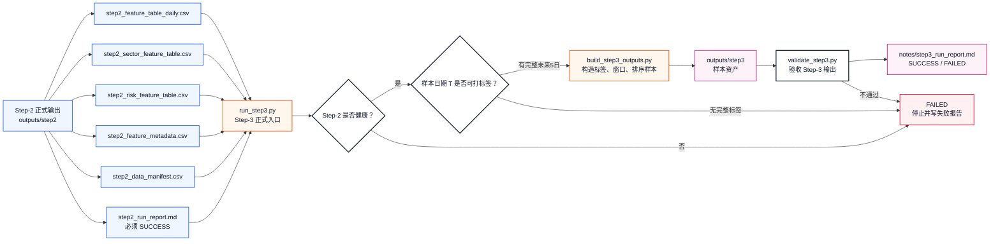
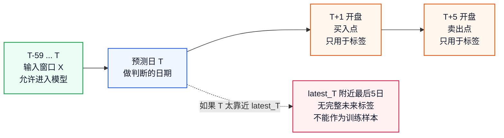
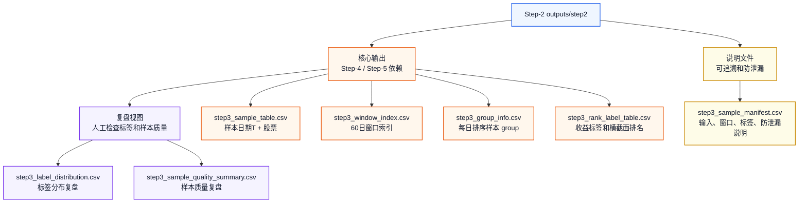
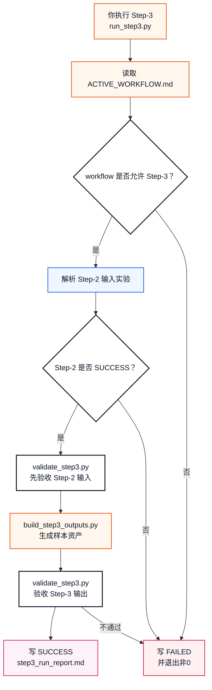

# Step-3 正式健康版体系设计

本文定义 `workflow_0.1` 的 Step-3 应该如何从“七步总策略里的样本层想法”升级成像 Step-1、Step-2 一样可运行、可验收、可复盘的正式健康流程。

Step-1 已经是：

```text
数据资产生产线
```

Step-2 已经是：

```text
特征资产生产线
```

Step-3 要建设成：

```text
样本资产生产线
```

也就是说，Step-3 不只是把某个旧脚本跑一下，而是要把 Step-2 的特征资产包装成 Step-4 / Step-5 能安全使用的训练样本资产。

## 策略来源

Step-3 当前没有 `workflow_0.1/strategy/` 下的专门改写策略。

因此 Step-3 的策略源头仍然是七步总策略：

```text
Experiment/策略流程与实验方案.md
```

核心章节是：

```text
3.3 第 3 步：标签、滑动窗口和排序样本 Sample Layer
```

旧样例脚本：

```text
sample_experiment/step3_build_samples.py
```

只能作为教学参考，不能作为正式健康版 Step-3 的执行入口。

原因是旧脚本存在三个关键缺口：

```text
不读取 workflow_0.1 正式 Step-2 输出
没有真正构造可供 Step-5 使用的窗口样本资产
输出只是示例文件，不是正式可验收产物
```

## 一句话理解

Step-3 的任务是：

```text
读取一个健康的 Step-2 输出
-> 为每个合法样本日期 T 构造过去 60 日输入窗口 X
-> 为每只股票构造未来 5 日收益标签 y
-> 把同一天股票打包成每日横截面排序样本
-> 生成样本表、窗口索引、分组信息、排序标签、样本说明
-> 自动验收窗口完整、标签完整、无未来泄漏、group 对齐
-> 写入 step3_run_report.md
```

它不做：

```text
不联网抓 raw 数据
不重新计算 Step-2 特征
不训练模型
不切分 train / validation
不输出 candidate_top30.csv
不生成 result.csv
```

## 图 1：Step-2 到 Step-3 的衔接



## Step-3 需要补齐的六块能力

| 序号 | 能力 | 对应文件 | 作用 |
|---:|---|---|---|
| 1 | 输入规则 | `run_step3.py` / `step3_sample_manifest.csv` | 明确 Step-3 读取哪一次健康 Step-2 输出 |
| 2 | 生成器 | `pipelines/build_step3_outputs.py` | 从 Step-2 标准输出生成 Step-3 样本资产 |
| 3 | 验收器 | `pipelines/validate_step3.py` | 检查窗口、标签、group、表头、防泄漏 |
| 4 | 总调度器 | `run_step3.py` | 串起输入检查、生成、验收、报告 |
| 5 | 测试体系 | `pipelines/tests/test_*step3*.py` | 固定边界行为，防止假标签和未来泄漏 |
| 6 | 长期说明文档 | `docs/Step-3_正式健康版运作流程.md` | 像 Step-1 一样画图解释怎么跑、怎么验收 |

这六块合起来，Step-3 才算从总策略文档变成正式流程。

## 1. Step-3 输入规则

正式 Step-3 必须读取一个已经健康通过的 Step-2 实验目录。

输入目录形态：

```text
Experiment/workflow_0.1/experiments/<step2_experiment>/
├── outputs/
│   └── step2/
│       ├── step2_feature_table_daily.csv
│       ├── step2_sector_feature_table.csv
│       ├── step2_latest_t_screen.csv
│       ├── step2_feature_metadata.csv
│       ├── step2_data_manifest.csv
│       ├── step2_sector_score_latest.csv
│       └── step2_risk_feature_table.csv
└── notes/
    └── step2_run_report.md
```

入口参数建议：

```bash
/opt/miniconda3/bin/python3 Experiment/workflow_0.1/run_step3.py
```

默认行为：

```text
自动寻找最近一个 SUCCESS 的 Step-2 实验
```

同时允许手动指定：

```bash
/opt/miniconda3/bin/python3 Experiment/workflow_0.1/run_step3.py \
  --step2-experiment exp_20260617_step2_workflow_0_1
```

健康要求：

```text
Step-2 run report 必须是 SUCCESS
Step-2 manifest 必须存在
Step-2 latest_T 必须能读到
Step-2 feature / sector / risk / metadata / manifest 必须存在
Step-2 feature_table_daily 必须无 股票代码 + 日期 重复
Step-3 report 必须记录实际读取的 Step-2 experiment
```

## 2. Step-3 的关键边界：latest_T 不等于最后可打标签 T

Step-3 第一次引入未来标签。

标签公式是：

```text
label_ret_5d_open_to_open = (open_T+5 - open_T+1) / open_T+1
```

这意味着：

```text
如果 Step-2 最新日期 latest_T 是 2026-06-15
那么 Step-3 不能给 2026-06-15 构造训练标签
因为没有 2026-06-16 之后未来5日开盘价
```

按照当前 Step-2 正式实验：

```text
input_step2_experiment: exp_20260617_step2_workflow_0_1
latest_T: 2026-06-15
feature_table 交易日数: 833
第一天可满足60日窗口的样本T: 2023-04-03
最后一天可满足未来5日标签的样本T: 2026-06-08
```

因此第一版 Step-3 默认采用：

```text
training_sample_mode
```

也就是只生成有完整未来 5 日标签的训练样本。

后续如果要给最新 T 日做真实预测，可以另开：

```text
prediction_sample_mode
```

prediction mode 只生成最新 T 的输入窗口，不生成 label，也不能混进训练样本。

## 图 2：Step-3 的时间边界



## 3. build_step3_outputs.py：Step-3 生成器

目标路径：

```text
Experiment/workflow_0.1/pipelines/build_step3_outputs.py
```

它只做一件事：

```text
把 Step-2 标准特征输出加工成 Step-3 标准样本输出
```

不做：

```text
不联网
不重新抓 raw
不重新计算 Step-2 特征
不切分训练集和验证集
不训练模型
不输出 Top30 或 Top5
```

### 第一版默认参数

```text
sample_mode: training
window_length: 60
prediction_horizon: 5
label_buy_price: T+1 开盘
label_sell_price: T+5 开盘
label_type: direct_return
stock_pool_mode: use_step2_available_universe
min_group_stock_count: 1
drop_missing_label: true
drop_incomplete_window: true
```

说明：

```text
stock_pool_mode 第一版先使用 Step-2 feature_table_daily 中实际可得股票池。
如果后续 Step-1 补齐历史沪深300成分股截面，Step-3 再升级为 historical_hs300_universe。
```

## 4. Step-3 输出设计

Step-3 第一版采用：

```text
5 个核心输出 + 2 个复盘视图
```

核心输出是 Step-4 / Step-5 和验收依赖的标准接口：

```text
outputs/step3/
├── step3_sample_table.csv
├── step3_window_index.csv
├── step3_group_info.csv
├── step3_rank_label_table.csv
└── step3_sample_manifest.csv
```

复盘视图用于人工检查：

```text
outputs/step3/
├── step3_label_distribution.csv
└── step3_sample_quality_summary.csv
```

### `step3_sample_table.csv`

行粒度：

```text
样本日期T + 股票代码
```

唯一键：

```text
样本日期T + 股票代码
```

用途：

```text
Step-3 的主样本表。
记录每个样本行的窗口边界、标签、排序名次和过滤状态。
```

第一版核心表头：

```csv
sample_id,样本日期T,股票代码,股票名称,板块划分,原始行业,window_start,window_end,window_length,feature_count,label_open_t1_date,label_open_t5_date,label_open_t1,label_open_t5,label_ret_5d_open_to_open,label_rank_desc,label_pct_rank,label_top5_flag,label_top10_flag,label_top30_flag,risk_any_flag,low_liquidity_flag,no_trade_or_abnormal_flag,样本可用标记,样本过滤原因
```

### `step3_window_index.csv`

行粒度：

```text
样本日期T + 股票代码
```

唯一键：

```text
样本日期T + 股票代码
```

用途：

```text
记录每个样本对应的 60 日窗口边界。
第一版不把 60 日 × F 个特征全部展开成超大 CSV，而是用索引指向 Step-2 feature_table_daily。
Step-5 可以根据这个索引稳定重建窗口数据。
```

第一版核心表头：

```csv
sample_id,样本日期T,股票代码,window_start,window_end,window_length,window_row_count,source_feature_table,window_start_row_number,window_end_row_number,窗口完整标记,窗口过滤原因
```

说明：

```text
如果 Step-5 确定模型输入必须提前物化为三维张量，后续可新增 step3_sequence_tensor.npz。
该文件属于模型输入物化产物，不替代 CSV 级别的样本审计资产。
```

### `step3_group_info.csv`

行粒度：

```text
每个样本日期T一行
```

唯一键：

```text
样本日期T
```

用途：

```text
记录每天这个排序样本包含多少只股票，以及它在 sample_table 中的边界。
Step-4 时间切分和 Step-5 排序训练都需要 group 信息。
```

第一版核心表头：

```csv
样本日期T,group_id,group_start_row,group_end_row,group_stock_count,可用样本数,不可用样本数,label_mean,label_std,label_min,label_max,top5_label_mean,bottom5_label_mean
```

### `step3_rank_label_table.csv`

行粒度：

```text
样本日期T + 股票代码
```

唯一键：

```text
样本日期T + 股票代码
```

用途：

```text
单独记录标签和横截面排名，方便 Step-5 实验直接收益标签、排名标签、TopK 分类标签。
```

第一版核心表头：

```csv
样本日期T,股票代码,股票名称,label_ret_5d_open_to_open,label_rank_desc,label_pct_rank,label_top5_flag,label_top10_flag,label_top30_flag,label_available_flag,label_filter_reason
```

### `step3_sample_manifest.csv`

行粒度：

```text
每个说明项一行
```

唯一键：

```text
项目
```

用途：

```text
记录 Step-3 输入来源、窗口长度、标签口径、样本日期范围、生成时间和注意事项。
```

表头：

```csv
项目,说明
```

至少必须记录：

```csv
项目,说明
schema_version,workflow_0.1_csv_v1
sample_set_id,sample_set_v1_60d_5d_open_to_open
input_step2_path,outputs/step2
input_step2_experiment,exp_xxx
input_step2_latest_T,YYYY-MM-DD
sample_mode,training
window_length,60
prediction_horizon,5
label_formula,(open_T+5 - open_T+1) / open_T+1
label_price_field,开盘
sample_date_start,YYYY-MM-DD
sample_date_end,YYYY-MM-DD
sample_date_count,N
sample_row_count,N
feature_count,N
generated_at,YYYY-MM-DD HH:MM:SS
data_window_note,说明
leakage_control_note,说明
```

### `step3_label_distribution.csv`

定位：

```text
复盘视图
```

用途：

```text
按样本日期或整体统计 label 分布，检查是否存在大面积假标签、极端值或标签偏斜。
```

建议表头：

```csv
统计范围,样本日期T,样本数,label_mean,label_std,label_min,label_p05,label_p25,label_median,label_p75,label_p95,label_max,positive_ratio,top5_mean,bottom5_mean
```

### `step3_sample_quality_summary.csv`

定位：

```text
复盘视图
```

用途：

```text
记录样本过滤原因、窗口完整率、标签完整率、每日股票数量范围。
```

建议表头：

```csv
项目,说明
```

## 图 3：Step-3 输出分层



## 5. validate_step3.py：Step-3 验收器

目标路径：

```text
Experiment/workflow_0.1/pipelines/validate_step3.py
```

它负责判断 Step-3 是否健康。

### 输入验收

```text
Step-2 report 必须 SUCCESS
Step-2 manifest 的 schema_version 必须是 workflow_0.1_csv_v1
Step-2 latest_T 必须存在
Step-2 feature_table_daily 必须无 股票代码 + 日期 重复
Step-2 metadata 必须存在并记录防泄漏说明
```

### 输出验收

```text
5 个核心输出必须存在
2 个复盘视图默认生成
每张 CSV 表头必须符合 Step-3 体系定义
sample_table 唯一键必须是 样本日期T + 股票代码
window_index 唯一键必须是 样本日期T + 股票代码
group_info 唯一键必须是 样本日期T
rank_label_table 唯一键必须是 样本日期T + 股票代码
manifest 必须记录 input_step2_path、sample_set_id、window_length、prediction_horizon、label_formula、generated_at
```

### 窗口验收

```text
每个可用样本必须有完整 60 日窗口
window_end 必须等于 样本日期T
window_start 必须早于 样本日期T
窗口内所有日期必须 <= 样本日期T
窗口行数必须等于 window_length
窗口不完整的样本不能被标记为可用
```

### 标签验收

```text
每个可用样本必须有 T+1 开盘价和 T+5 开盘价
label_open_t1_date 必须晚于 样本日期T
label_open_t5_date 必须晚于 label_open_t1_date
label_open_t1 和 label_open_t5 必须大于 0
label_ret_5d_open_to_open 不能为空、不能 inf
缺少未来标签的样本不能被填 0
最后可打标签 T 必须 <= input_step2_latest_T 往前 5 个交易日
```

### group 验收

```text
group_info 的 group_stock_count 必须等于 sample_table 中该日期行数
group_start_row / group_end_row 必须能覆盖 sample_table 中该日期区间
rank_label_table 的每个日期排名必须从 1 开始
label_top5_flag 每日最多 5 个
label_top10_flag 每日最多 10 个
label_top30_flag 每日最多 30 个
```

### 防未来信息泄漏验收

```text
输入窗口 X 只能来自 T 及以前
标签 y 只能作为答案字段，不能进入 feature_count 对应的模型输入字段
sample_table 允许记录 label，但 Step-5 构造 X 时必须排除所有 label / future_* 字段
manifest 必须写 leakage_control_note
```

## 6. run_step3.py：正式调度入口

目标路径：

```text
Experiment/workflow_0.1/run_step3.py
```

它对齐 Step-1 的 `run_step1.py` 和 Step-2 的 `run_step2.py`，负责串起全流程：

```text
读取 ACTIVE_WORKFLOW
-> 确认 active_workflow=workflow_0.1
-> 确认当前允许跑 Step-3
-> 找到或读取指定 Step-2 实验
-> 校验 Step-2 输入健康
-> 调用 build_step3_outputs.py
-> 调用 validate_step3.py
-> 写 step3_run_report.md
```

建议命令：

```bash
/opt/miniconda3/bin/python3 Experiment/workflow_0.1/run_step3.py
```

指定输入：

```bash
/opt/miniconda3/bin/python3 Experiment/workflow_0.1/run_step3.py \
  --step2-experiment exp_20260617_step2_workflow_0_1
```

指定输出实验名：

```bash
/opt/miniconda3/bin/python3 Experiment/workflow_0.1/run_step3.py \
  --step2-experiment exp_20260617_step2_workflow_0_1 \
  --experiment-name exp_20260617_step3_workflow_0_1
```

## 图 4：Step-3 正式运行流程



## 7. Step-3 测试体系

测试目录：

```text
Experiment/workflow_0.1/pipelines/tests/
```

建议新增：

```text
test_build_step3_outputs.py
test_validate_step3.py
test_run_step3_runner.py
```

### 生成器测试

覆盖：

```text
能从最小 Step-2 fixture 生成 5 个核心输出 + 2 个复盘视图
sample_table 表头正确
window_index 表头正确
group_info 表头正确
rank_label_table 表头正确
manifest 记录 sample_set_id、window_length、prediction_horizon、label_formula
最后 5 个交易日不会被错误构造成有标签训练样本
```

### 验收器测试

覆盖：

```text
Step-2 report 不是 SUCCESS 时失败
sample_table 有重复 样本日期T + 股票代码 时失败
window_row_count 不等于 60 时失败
window_end 晚于 样本日期T 时失败
缺少 T+1 或 T+5 开盘价时失败
label 被填 0 伪造时失败
label_top5_flag 每日超过 5 个时失败
group_info 计数和 sample_table 不一致时失败
manifest 缺 leakage_control_note 时失败
```

### runner 测试

覆盖：

```text
workflow 不匹配时拒绝运行
active_stage 不是 Step-3 时拒绝运行
Step-2 输入不健康时写 FAILED 报告
Step-3 输出健康时写 SUCCESS 报告
失败时返回非0
成功时返回0
```

## 8. Step-3 长期说明文档

目标路径：

```text
Experiment/workflow_0.1/docs/Step-3_正式健康版运作流程.md
```

它应该像 Step-1 文档一样回答：

```text
Step-3 一句话是什么
它从 Step-2 读取什么
它生成哪些样本资产
为什么 latest_T 附近不能直接打标签
每个 CSV 是什么粒度
健康验收标准是什么
失败报告在哪里
哪些东西不是 Step-3 负责
```

这份文档是“长期说明书”，不是某一次实验报告。

单次实验报告应该放在：

```text
Experiment/workflow_0.1/experiments/<step3_experiment>/notes/step3_run_report.md
```

## 图 5：Step-3 和前后步骤的关系


## Step-3 成功标准草案

Step-3 成功不是“文件生成了”就算成功，而是必须满足：

```text
读取的 Step-2 实验是 SUCCESS
Step-3 sample_set_id 明确
5 个核心输出全部存在
2 个复盘视图默认生成
所有 CSV 表头符合 Step-3 体系定义
sample_table 无 样本日期T + 股票代码 重复
window_index 无 样本日期T + 股票代码 重复
每个可用样本都有完整 60 日窗口
每个可用样本都有完整 T+1 到 T+5 开盘标签
最后 5 个无完整未来标签的日期不能进入训练样本
rank_label_table 每日排名、Top5、Top10、Top30 标记正确
group_info 与 sample_table 行数完全对齐
manifest 记录 input_step2_path、window_length、prediction_horizon、label_formula、generated_at、leakage_control_note
step3_run_report.md 写入 SUCCESS
```

失败时必须：

```text
写入 step3_run_report.md
Status = FAILED
说明失败阶段
说明失败原因
退出码非0
```

## 建议建设顺序

```text
1. 先实现 Step-3 输入规则
2. 写 build_step3_outputs.py
3. 写 validate_step3.py
4. 写 run_step3.py
5. 写 tests
6. 写 docs/Step-3_正式健康版运作流程.md
7. 再决定是否物化 step3_sequence_tensor.npz
```

为什么这个顺序合理：

```text
先确定吃哪个 Step-2 实验
再确定如何构造标签和窗口
再规定怎样才算健康
再把流程串起来
再用测试固定行为
最后再考虑大体积 tensor 物化，避免提前把格式锁死
```

## 当前状态

截至目前：

```text
Step-3 策略源头：已有，来自 Experiment/策略流程与实验方案.md
Step-3 体系设计：已有，本文件
Step-3 CSV schema 草案：已有，本文件
Step-3 正式入口 run_step3.py：已实现
Step-3 生成器 build_step3_outputs.py：已实现
Step-3 验收器 validate_step3.py：已实现
Step-3 测试体系：已实现
Step-3 正式运行报告：已实现
```

当前 Step-3 已经可以像 Step-1 / Step-2 一样通过正式入口完整运行、自动验收并写运行报告。

最近一次正式运行：

```text
输入 Step-2 实验：exp_20260617_step2_workflow_0_1
输出 Step-3 实验：exp_20260617_step3_workflow_0_1
input_step2_latest_T：2026-06-15
last_labelable_T：2026-06-08
sample_date_start：2023-04-03
sample_date_end：2026-06-08
sample_row_count：228357
sample_date_count：769
运行报告：Experiment/workflow_0.1/experiments/exp_20260617_step3_workflow_0_1/notes/step3_run_report.md
状态：SUCCESS
```

## 最后压缩成一句话

```text
Step-1 负责把 raw 数据变成健康的数据资产。
Step-2 负责把健康的数据资产变成健康的特征资产。
Step-3 负责把健康的特征资产变成健康的训练样本资产。
```

这就是 `workflow_0.1` Step-3 对应 Step-1 / Step-2 的正式健康版体系。
