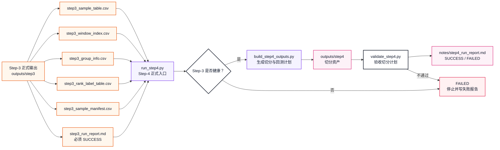
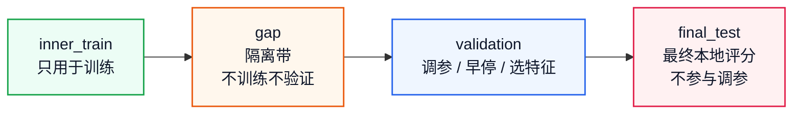
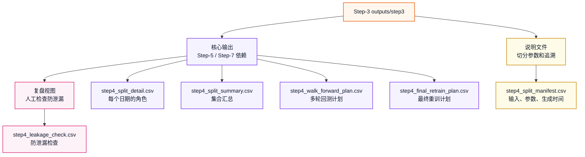
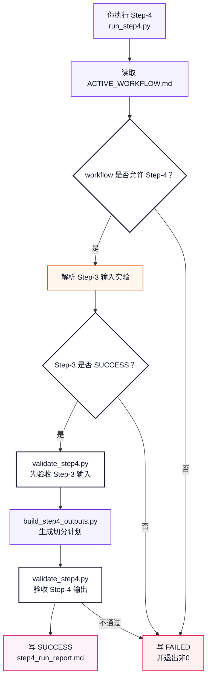
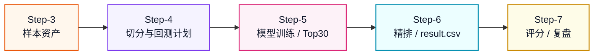

# Step-4 正式健康版体系设计

本文定义 `workflow_0.1` 的 Step-4 应该如何从“时间切分想法”升级成像 Step-1、Step-2、Step-3 一样可运行、可验收、可复盘的正式健康流程。

Step-1 是：

```text
数据资产生产线
```

Step-2 是：

```text
特征资产生产线
```

Step-3 是：

```text
样本资产生产线
```

Step-4 要建设成：

```text
切分与回测计划生产线
```

也就是说，Step-4 不训练模型，也不评分；它负责决定后续 Step-5 / Step-6 / Step-7 在哪些日期训练、哪些日期验证、哪些日期必须隔离、哪些日期只能最终评分一次。

## 策略来源

Step-4 当前没有 `workflow_0.1/strategy/` 下的专门改写策略。

因此 Step-4 的策略源头仍然是七步总策略：

```text
Experiment/策略流程与实验方案.md
```

核心章节是：

```text
4. 第 4 步：数据切分 Split
```

旧样例脚本：

```text
sample_experiment/step4_split_data.py
```

只能作为教学参考，不能作为正式健康版 Step-4 的执行入口。

原因是旧脚本存在这些边界问题：

```text
它直接读取 data/train.csv
它内部重建简化版标签和样本
它不读取 workflow_0.1 正式 Step-3 输出
它输出 txt 和简化 split_detail，不是正式可验收切分资产
```

正式 Step-4 必须读取我们刚跑通的 Step-3 样本资产。

## 一句话理解

Step-4 的任务是：

```text
读取一个健康的 Step-3 输出
-> 按样本日期做时间切分
-> 留出 final_test 日期
-> 在 train / validation 之间设置 Gap
-> 生成 walk-forward 多轮训练和评估计划
-> 生成最终全量重训计划
-> 自动验收无日期重叠、无随机打乱、Gap 足够、防泄漏说明完整
-> 写入 step4_run_report.md
```

它不做：

```text
不联网抓 raw 数据
不重新计算 Step-2 特征
不重新构造 Step-3 标签
不训练模型
不生成 candidate_top30.csv
不精排 Top5
不生成 result.csv
不评分
```

## 图 1：Step-3 到 Step-4 的衔接



## Step-4 需要补齐的六块能力

| 序号 | 能力 | 对应文件 | 作用 |
|---:|---|---|---|
| 1 | 输入规则 | `run_step4.py` / `step4_split_manifest.csv` | 明确 Step-4 读取哪一次健康 Step-3 输出 |
| 2 | 生成器 | `pipelines/build_step4_outputs.py` | 从 Step-3 样本日期生成切分计划和 walk-forward 计划 |
| 3 | 验收器 | `pipelines/validate_step4.py` | 检查时间顺序、Gap、互斥集合、walk-forward 合法性 |
| 4 | 总调度器 | `run_step4.py` | 串起输入检查、生成、验收、报告 |
| 5 | 测试体系 | `pipelines/tests/test_*step4*.py` | 固定边界行为，防止随机切分和日期重叠 |
| 6 | 长期说明文档 | `docs/Step-4_正式健康版运作流程.md` | 像 Step-1 一样画图解释怎么跑、怎么验收 |

这六块合起来，Step-4 才算从策略文档变成正式流程。

## 1. Step-4 输入规则

正式 Step-4 必须读取一个已经健康通过的 Step-3 实验目录。

输入目录形态：

```text
Experiment/workflow_0.1/experiments/<step3_experiment>/
├── outputs/
│   └── step3/
│       ├── step3_sample_table.csv
│       ├── step3_window_index.csv
│       ├── step3_group_info.csv
│       ├── step3_rank_label_table.csv
│       ├── step3_sample_manifest.csv
│       ├── step3_label_distribution.csv
│       └── step3_sample_quality_summary.csv
└── notes/
    └── step3_run_report.md
```

入口参数建议：

```bash
/opt/miniconda3/bin/python3 Experiment/workflow_0.1/run_step4.py
```

默认行为：

```text
自动寻找最近一个 SUCCESS 的 Step-3 实验
```

同时允许手动指定：

```bash
/opt/miniconda3/bin/python3 Experiment/workflow_0.1/run_step4.py \
  --step3-experiment exp_20260617_step3_workflow_0_1
```

健康要求：

```text
Step-3 run report 必须是 SUCCESS
Step-3 manifest 必须存在
Step-3 sample_date_start / sample_date_end 必须能读到
Step-3 group_info 必须按样本日期有序
Step-3 sample_table / group_info / rank_label_table 必须存在
Step-4 report 必须记录实际读取的 Step-3 experiment
```

## 2. Step-4 的关键边界：切分的是样本日期，不是股票行

Step-4 只能按时间切分：

```text
一个样本日期 T 是一道横截面排序题
同一天的全部股票必须归属同一个集合
不能把同一天的一部分股票放 train，另一部分股票放 validation
不能随机打乱股票行
```

因此 Step-4 的基本单位是：

```text
样本日期T
```

而不是：

```text
单只股票的一行样本
```

## 3. 第一版默认参数

第一版 Step-4 采用七步总策略里的默认值：

```text
train_window: 252
gap_days: 5
eval_days: 5
walk_forward_step: 5
train_ratio: 0.80
final_test_days: 5
split_mode: time_ordered
```

这些参数的含义：

```text
train_window = 每轮 walk-forward 使用过去 252 个样本日期训练
gap_days = train 和 validation/eval 之间留 5 个样本日期隔离
eval_days = 每轮评估 5 个样本日期，贴合比赛未来5日周期
walk_forward_step = 每轮向前推进 5 个样本日期
train_ratio = 单次 inner_train / validation 切分的训练比例
final_test_days = 留出最后 5 个样本日期，只用于最终本地评分
```

当前 Step-3 正式实验对应的可预期数字：

```text
input_step3_experiment: exp_20260617_step3_workflow_0_1
sample_date_start: 2023-04-03
sample_date_end: 2026-06-08
sample_date_count: 769
final_test: 2026-06-02 ~ 2026-06-08，共5个样本日期
inner_train: 2023-04-03 ~ 2025-10-13，共611个样本日期
gap: 2025-10-14 ~ 2025-10-20，共5个样本日期
validation: 2025-10-21 ~ 2026-06-01，共148个样本日期
walk_forward_rounds: 102
```

这些数字不是写死规则，而是当前输入数据在默认参数下的预期结果。

## 图 2：Step-4 时间切分结构



## 4. build_step4_outputs.py：Step-4 生成器

目标路径：

```text
Experiment/workflow_0.1/pipelines/build_step4_outputs.py
```

它只做一件事：

```text
把 Step-3 的样本日期序列加工成 Step-4 标准切分计划
```

不做：

```text
不联网
不重新抓 raw
不重新计算特征
不重新构造标签
不训练模型
不生成候选池
不评分
```

## 5. Step-4 输出设计

Step-4 第一版采用：

```text
5 个核心输出 + 1 个复盘视图
```

核心输出是 Step-5 和验收依赖的标准接口：

```text
outputs/step4/
├── step4_split_detail.csv
├── step4_split_summary.csv
├── step4_walk_forward_plan.csv
├── step4_final_retrain_plan.csv
└── step4_split_manifest.csv
```

复盘视图用于人工检查：

```text
outputs/step4/
└── step4_leakage_check.csv
```

### `step4_split_detail.csv`

行粒度：

```text
每个样本日期T一行
```

唯一键：

```text
样本日期T
```

用途：

```text
记录每个样本日期属于 inner_train、gap、validation、final_test 中哪一类。
Step-5 后续训练时必须按这个文件选择训练样本。
```

第一版核心表头：

```csv
样本日期T,split_role,split_order,group_id,group_stock_count,sample_row_count,is_train_allowed,is_validation_allowed,is_final_test,leakage_guard_note
```

### `step4_split_summary.csv`

行粒度：

```text
每个 split_role 一行
```

唯一键：

```text
split_role
```

用途：

```text
汇总每个集合的日期范围、日期数、样本行数、用途。
```

第一版核心表头：

```csv
split_role,date_start,date_end,date_count,sample_row_count,usage_note
```

### `step4_walk_forward_plan.csv`

行粒度：

```text
每一轮 walk-forward 一行
```

唯一键：

```text
wf_round
```

用途：

```text
定义后续 Step-5 / Step-6 / Step-7 每轮应该如何训练、预测、冻结、评分。
```

第一版核心表头：

```csv
wf_round,train_start,train_end,train_date_count,gap_start,gap_end,gap_date_count,eval_start,eval_end,eval_date_count,train_sample_rows,eval_sample_rows,train_window,gap_days,eval_days,walk_forward_step,round_status
```

### `step4_final_retrain_plan.csv`

行粒度：

```text
每个样本日期T一行
```

唯一键：

```text
样本日期T
```

用途：

```text
定义正式提交前最终全量重训可使用哪些样本日期。
第一版建议不使用 final_test 日期，不使用单次切分里的 gap 日期；使用 inner_train + validation。
```

第一版核心表头：

```csv
样本日期T,final_retrain_allowed,source_split_role,reason
```

### `step4_split_manifest.csv`

行粒度：

```text
每个说明项一行
```

唯一键：

```text
项目
```

用途：

```text
记录 Step-4 输入来源、切分参数、walk-forward 轮数、生成时间和防泄漏说明。
```

表头：

```csv
项目,说明
```

至少必须记录：

```csv
项目,说明
schema_version,workflow_0.1_csv_v1
split_set_id,split_set_v1_time_252_gap5_eval5
input_step3_path,outputs/step3
input_step3_experiment,exp_xxx
input_step3_sample_set_id,sample_set_v1_60d_5d_open_to_open
sample_date_start,YYYY-MM-DD
sample_date_end,YYYY-MM-DD
sample_date_count,N
train_window,252
gap_days,5
eval_days,5
walk_forward_step,5
train_ratio,0.80
final_test_days,5
walk_forward_rounds,N
generated_at,YYYY-MM-DD HH:MM:SS
data_window_note,说明
leakage_control_note,说明
```

### `step4_leakage_check.csv`

定位：

```text
复盘视图
```

用途：

```text
记录关键防泄漏检查项是否通过。
```

建议表头：

```csv
检查项,状态,说明
```

## 图 3：Step-4 输出分层



## 6. validate_step4.py：Step-4 验收器

目标路径：

```text
Experiment/workflow_0.1/pipelines/validate_step4.py
```

它负责判断 Step-4 是否健康。

### 输入验收

```text
Step-3 report 必须 SUCCESS
Step-3 manifest 的 schema_version 必须是 workflow_0.1_csv_v1
Step-3 sample_set_id 必须存在
Step-3 group_info 必须无重复 样本日期T
Step-3 sample_table 和 group_info 的日期范围必须一致
```

### 输出验收

```text
5 个核心输出必须存在
1 个复盘视图默认生成
每张 CSV 表头必须符合 Step-4 体系定义
split_detail 唯一键必须是 样本日期T
split_summary 唯一键必须是 split_role
walk_forward_plan 唯一键必须是 wf_round
final_retrain_plan 唯一键必须是 样本日期T
manifest 必须记录 split_set_id、input_step3_path、train_window、gap_days、eval_days、walk_forward_rounds、generated_at
```

### 时间顺序验收

```text
所有样本日期必须升序
split_order 必须与样本日期顺序一致
inner_train 日期必须早于 gap
gap 日期必须早于 validation
validation 日期必须早于 final_test
四类集合日期不能重叠
不能存在 unassigned 日期
```

### Gap 验收

```text
inner_train 和 validation 之间必须有 gap_days 个样本日期
每一轮 walk-forward 的 train_end 和 eval_start 之间必须有 gap_days 个样本日期
gap 日期不允许训练
gap 日期不允许 validation
```

### Walk-forward 验收

```text
每轮 train_date_count 必须等于 train_window
每轮 gap_date_count 必须等于 gap_days
每轮 eval_date_count 必须等于 eval_days
每轮 train_end < gap_start <= gap_end < eval_start <= eval_end
后一轮起点必须按 walk_forward_step 向前推进
eval 日期不能出现在 train 日期里
walk_forward_plan 至少有 1 轮
```

### final_test 验收

```text
final_test 必须是样本日期序列最后 final_test_days 个日期
final_test 不允许训练
final_test 不允许 validation
final_test 不允许进入 final_retrain_allowed=true
```

### 防未来信息泄漏验收

```text
不允许随机切分
不允许同一天股票分属不同集合
训练样本日期必须早于评估样本日期
validation / final_test 不得参与训练参数选择之外的非法环节
manifest 必须写 leakage_control_note
leakage_check 每项必须 PASS
```

## 7. run_step4.py：正式调度入口

目标路径：

```text
Experiment/workflow_0.1/run_step4.py
```

它对齐 Step-1 / Step-2 / Step-3 的 runner，负责串起全流程：

```text
读取 ACTIVE_WORKFLOW
-> 确认 active_workflow=workflow_0.1
-> 确认当前允许跑 Step-4
-> 找到或读取指定 Step-3 实验
-> 校验 Step-3 输入健康
-> 调用 build_step4_outputs.py
-> 调用 validate_step4.py
-> 写 step4_run_report.md
```

建议命令：

```bash
/opt/miniconda3/bin/python3 Experiment/workflow_0.1/run_step4.py
```

指定输入：

```bash
/opt/miniconda3/bin/python3 Experiment/workflow_0.1/run_step4.py \
  --step3-experiment exp_20260617_step3_workflow_0_1
```

指定输出实验名：

```bash
/opt/miniconda3/bin/python3 Experiment/workflow_0.1/run_step4.py \
  --step3-experiment exp_20260617_step3_workflow_0_1 \
  --experiment-name exp_20260617_step4_workflow_0_1
```

## 图 4：Step-4 正式运行流程



## 8. Step-4 测试体系

测试目录：

```text
Experiment/workflow_0.1/pipelines/tests/
```

建议新增：

```text
test_build_step4_outputs.py
test_validate_step4.py
test_run_step4_runner.py
```

### 生成器测试

覆盖：

```text
能从最小 Step-3 fixture 生成 5 个核心输出 + 1 个复盘视图
split_detail 表头正确
split_summary 表头正确
walk_forward_plan 表头正确
final_retrain_plan 表头正确
manifest 记录 split_set_id、train_window、gap_days、eval_days
final_test 是最后 final_test_days 个样本日期
walk_forward 轮数符合参数预期
```

### 验收器测试

覆盖：

```text
Step-3 report 不是 SUCCESS 时失败
split_detail 日期重复时失败
inner_train / gap / validation / final_test 日期重叠时失败
Gap 天数不足时失败
walk_forward train_date_count 不等于 train_window 时失败
walk_forward eval 与 train 重叠时失败
final_test 被标记为可训练时失败
leakage_check 存在非 PASS 时失败
manifest 缺 leakage_control_note 时失败
```

### runner 测试

覆盖：

```text
workflow 不匹配时拒绝运行
active_stage 不是 Step-4 时拒绝运行
Step-3 输入不健康时写 FAILED 报告
Step-4 输出健康时写 SUCCESS 报告
失败时返回非0
成功时返回0
```

## 9. Step-4 长期说明文档

目标路径：

```text
Experiment/workflow_0.1/docs/Step-4_正式健康版运作流程.md
```

它应该像 Step-1 文档一样回答：

```text
Step-4 一句话是什么
它从 Step-3 读取什么
它生成哪些切分资产
为什么不能随机切分
Gap 为什么必须存在
Walk-forward 每轮怎么定义
final_test 为什么不能参与调参
健康验收标准是什么
失败报告在哪里
哪些东西不是 Step-4 负责
```

这份文档是“长期说明书”，不是某一次实验报告。

单次实验报告应该放在：

```text
Experiment/workflow_0.1/experiments/<step4_experiment>/notes/step4_run_report.md
```

## 图 5：Step-4 和前后步骤的关系



## Step-4 成功标准草案

Step-4 成功不是“文件生成了”就算成功，而是必须满足：

```text
读取的 Step-3 实验是 SUCCESS
Step-4 split_set_id 明确
5 个核心输出全部存在
1 个复盘视图默认生成
所有 CSV 表头符合 Step-4 体系定义
split_detail 无重复 样本日期T
所有样本日期都有且只有一个 split_role
inner_train / gap / validation / final_test 互斥
train 和 validation 之间有完整 gap_days
walk_forward 每轮 train / gap / eval 顺序正确
walk_forward 每轮 train_date_count = train_window
walk_forward 每轮 gap_date_count = gap_days
walk_forward 每轮 eval_date_count = eval_days
final_test 是最后 final_test_days 个样本日期
final_test 不允许训练、不允许 validation、不允许 final_retrain
manifest 记录 input_step3_path、split_set_id、train_window、gap_days、eval_days、walk_forward_rounds、generated_at、leakage_control_note
step4_run_report.md 写入 SUCCESS
```

失败时必须：

```text
写入 step4_run_report.md
Status = FAILED
说明失败阶段
说明失败原因
退出码非0
```

## 建议建设顺序

```text
1. 先实现 Step-4 输入规则
2. 写 build_step4_outputs.py
3. 写 validate_step4.py
4. 写 run_step4.py
5. 写 tests
6. 写 docs/Step-4_正式健康版运作流程.md
7. 再进入 Step-5 模型训练体系
```

为什么这个顺序合理：

```text
先确定吃哪个 Step-3 实验
再确定切分参数
再规定怎样才算无泄漏
再把流程串起来
再用测试固定行为
最后才让 Step-5 使用这些切分计划训练模型
```

## 当前状态

截至目前：

```text
Step-4 策略源头：已有，来自 Experiment/策略流程与实验方案.md
Step-4 体系设计：已有，本文件
Step-4 CSV schema 草案：已有，本文件
Step-4 正式入口 run_step4.py：已实现
Step-4 生成器 build_step4_outputs.py：已实现
Step-4 验收器 validate_step4.py：已实现
Step-4 测试体系：已实现
Step-4 正式运行报告：已生成
最近一次正式运行：exp_20260617_step4_workflow_0_1，Status=SUCCESS
```

所以 Step-4 已经不是旧 sample 脚本阶段，而是具备正式切分计划生产线。下一步可以让 Step-5 读取 Step-4 的切分与 walk-forward 计划，进入模型训练体系。

## 最后压缩成一句话

```text
Step-1 把 raw 数据变成健康的数据资产。
Step-2 把数据资产变成健康的特征资产。
Step-3 把特征资产变成健康的训练样本资产。
Step-4 把样本资产变成健康的时间切分与回测计划资产。
```

这就是 `workflow_0.1` Step-4 对应前面步骤的正式健康版体系。
