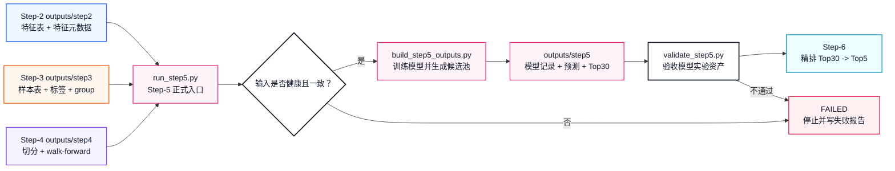
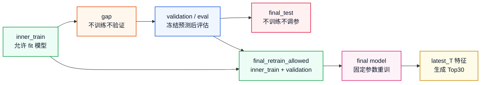
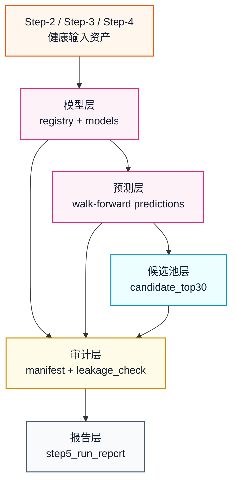
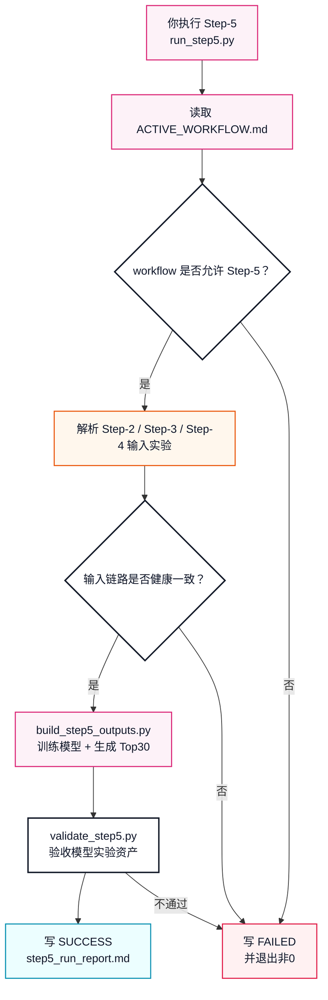
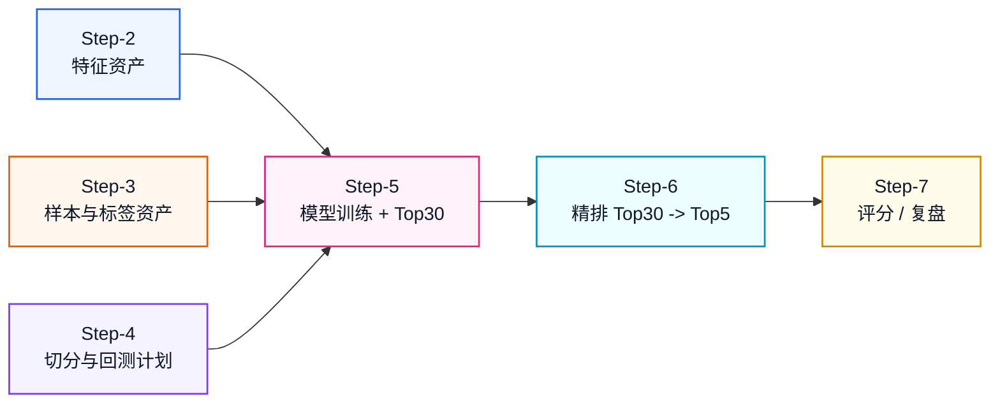

# Step-5 正式健康版体系设计

本文定义 `workflow_0.1` 的 Step-5 应该如何从“模型训练想法”升级成像 Step-1 到 Step-4 一样可运行、可验收、可复盘的正式健康流程。

Step-1 是：

```text
数据资产生产线
```

Step-2 是：

```text
特征资产生产线
```

Step-3 是：

```text
样本资产生产线
```

Step-4 是：

```text
切分与回测计划生产线
```

Step-5 要建设成：

```text
模型训练与候选池生产线
```

也就是说，Step-5 第一次真正进入模型层。它不再只是整理 CSV，而是要训练模型、记录模型、生成样本外预测，并输出给 Step-6 使用的 Top30 候选池。

## 策略来源

Step-5 当前没有 `workflow_0.1/strategy/` 下的专门改写策略。

因此 Step-5 的策略源头仍然是七步总策略：

```text
Experiment/策略流程与实验方案.md
```

核心章节是：

```text
5. 第 5 步：模型训练与融合
```

总策略明确写出 Step-5 的核心边界：

```text
第 5 步的终点不是 result.csv，而是 candidate_top30.csv。
模型负责召回候选池。
精排负责最终拍板。
```

这意味着正式 Step-5 不能越界生成最终 `result.csv`，也不能直接决定最终 Top5 和权重。

## 一句话理解

Step-5 的任务是：

```text
读取健康 Step-2 特征
-> 读取健康 Step-3 样本和标签
-> 读取健康 Step-4 切分与 walk-forward 计划
-> 按 Step-4 的时间规则训练模型
-> 生成 walk-forward 样本外预测
-> 记录模型、特征、参数、随机种子和训练窗口
-> 用最终合法训练样本重训模型
-> 对最新预测日生成 Top30 候选池
-> 校验没有训练/验证/final_test 泄漏
-> 写入 step5_run_report.md
```

它不做：

```text
不联网抓 raw 数据
不重新计算 Step-2 特征
不重新构造 Step-3 标签
不重新切分训练集和验证集
不绕过 Step-4 的 split_detail 和 walk_forward_plan
不生成最终 Top5
不生成 result.csv
不做官方评分
```

## 图 1：Step-2 / Step-3 / Step-4 到 Step-5 的衔接



## Step-5 和前四步最大的不同

前四步的健康重点是：

```text
文件是否存在
表头是否正确
日期是否一致
数据是否完整
是否有未来泄漏
```

Step-5 的健康重点要新增：

```text
模型训练是否可复现
训练/验证/final_test 是否严格隔离
特征列是否来自合法特征白名单
标准化、缺失值处理、模型 fit 是否只在训练集完成
walk-forward 预测是否是真正样本外预测
candidate_top30.csv 是否只包含最新预测日的 Top30
模型文件、参数、特征、随机种子是否能追溯
```

所以 Step-5 不只是“能训出一个模型”，而是要回答：

```text
这个模型到底用哪些数据训练？
用哪些特征？
在哪些日期验证？
是否偷看了未来？
Top30 是怎么来的？
下一次能不能复现？
```

## Step-5 需要补齐的七块能力

| 序号 | 能力 | 对应文件 | 作用 |
|---:|---|---|---|
| 1 | 输入规则 | `run_step5.py` / `step5_model_manifest.csv` | 明确读取哪一次 Step-2、Step-3、Step-4 |
| 2 | 特征白名单 | `step5_feature_set_used.csv` | 固定哪些 Step-2 特征真正进入模型 |
| 3 | 模型训练器 | `pipelines/build_step5_outputs.py` | 按 Step-4 训练模型并生成预测 |
| 4 | 模型产物 | `models/step5/*.joblib` | 保存本次实验可复现的模型文件 |
| 5 | 验收器 | `pipelines/validate_step5.py` | 检查输入、训练、预测、Top30、manifest、防泄漏 |
| 6 | 总调度器 | `run_step5.py` | 串起输入检查、训练、输出验收、报告 |
| 7 | 测试体系 | `pipelines/tests/test_*step5*.py` | 固定无泄漏、Top30、模型记录等边界 |

这七块合起来，Step-5 才算从策略文档变成正式模型实验流程。

## 1. Step-5 输入规则

正式 Step-5 必须同时读取三个已经健康通过的实验输出。

### 输入一：健康 Step-2 特征资产

```text
Experiment/workflow_0.1/experiments/<step2_experiment>/
├── outputs/
│   └── step2/
│       ├── step2_feature_table_daily.csv
│       ├── step2_sector_feature_table.csv
│       ├── step2_sector_score_latest.csv
│       ├── step2_latest_t_screen.csv
│       ├── step2_risk_feature_table.csv
│       ├── step2_feature_metadata.csv
│       └── step2_data_manifest.csv
└── notes/
    └── step2_run_report.md
```

Step-5 从这里读取：

```text
每日特征宽表
最新预测日 latest_T
特征元数据
哪些特征允许用于模型
每个特征的防泄漏说明
```

### 输入二：健康 Step-3 样本资产

```text
Experiment/workflow_0.1/experiments/<step3_experiment>/
├── outputs/
│   └── step3/
│       ├── step3_sample_table.csv
│       ├── step3_window_index.csv
│       ├── step3_group_info.csv
│       ├── step3_rank_label_table.csv
│       ├── step3_sample_manifest.csv
│       ├── step3_label_distribution.csv
│       └── step3_sample_quality_summary.csv
└── notes/
    └── step3_run_report.md
```

Step-5 从这里读取：

```text
样本日期T
股票代码
未来5日收益标签
每日横截面排名
Top5 / Top10 / Top30 标签
group = 日期
```

### 输入三：健康 Step-4 切分资产

```text
Experiment/workflow_0.1/experiments/<step4_experiment>/
├── outputs/
│   └── step4/
│       ├── step4_split_detail.csv
│       ├── step4_split_summary.csv
│       ├── step4_walk_forward_plan.csv
│       ├── step4_final_retrain_plan.csv
│       ├── step4_split_manifest.csv
│       └── step4_leakage_check.csv
└── notes/
    └── step4_run_report.md
```

Step-5 从这里读取：

```text
哪些日期能训练
哪些日期是 Gap
哪些日期只能 validation
哪些日期是 final_test
walk-forward 每一轮训练区间、Gap 区间和评估区间
最终重训允许使用哪些日期
```

## 2. 输入一致性要求

Step-5 不能随便拿三个实验拼起来。正式验收必须确认它们是同一条链路：

```text
Step-2 report 必须 SUCCESS
Step-3 report 必须 SUCCESS
Step-4 report 必须 SUCCESS
Step-3 manifest 记录的 input_step2_experiment 必须等于实际读取的 Step-2
Step-4 manifest 记录的 input_step3_experiment 必须等于实际读取的 Step-3
Step-4 split_detail 的日期集合必须等于 Step-3 sample_table 的样本日期集合
Step-2 feature_table_daily 必须覆盖 Step-3 所有样本日期
Step-2 feature_table_daily 必须覆盖 latest_T，用于生成最新 Top30
```

这条规则的含义是：

```text
Step-5 可以自动寻找最近成功实验
但必须确认这些实验真的前后相连
不能把 A 实验的特征、B 实验的标签、C 实验的切分硬拼起来
```

## 3. 第一版模型边界

总策略建议 Step-5 的模型路线是：

```text
LightGBM Ranker
LightGBM Regressor
LightGBM / HistGradientBoosting Classifier
RandomForest 或 ExtraTrees 作为稳健性视角
排名平均融合
输出 candidate_top30.csv
```

但第一版健康实现的优先级应该是：

```text
先保证流程可复现、无泄漏、能稳定生成 Top30
再逐步增加模型复杂度
```

因此 Step-5 可以分成三层实现：

```text
第一层：baseline_model_v1
    使用可复现的树模型或线性/集成模型打通训练和 Top30 输出

第二层：ranker_model_v1
    引入 LightGBM Ranker，group = 样本日期T

第三层：fusion_model_v1
    对 ranker / regressor / classifier 做横截面排名融合
```

健康体系不强制第一天就上最复杂模型，但强制每个模型都要可登记、可复现、可验收。

## 4. Step-5 的核心防泄漏规则

Step-5 最危险的地方不是模型训练失败，而是训练成功但过程不干净。

必须禁止：

```text
用 validation 日期训练模型
用 final_test 日期训练模型
用 gap 日期训练模型
在全量数据上 fit 标准化器、缺失值填充器或特征选择器
把 label_ret_5d_open_to_open、label_rank_desc、label_top*_flag 当作模型特征
把未来价格 label_open_t1 / label_open_t5 当作模型特征
不使用 Step-4 切分，自己重新 random split
用 final_test 表现反向调整模型参数或融合权重
生成 result.csv
```

允许：

```text
在 walk-forward 每一轮的 train 区间 fit 模型
在该轮 eval 区间冻结预测并记录样本外预测
用 eval 真实标签计算 Step-5 层面的召回指标
用 inner_train + validation 中 final_retrain_allowed=1 的日期做最终重训
对 Step-2 latest_T 生成 candidate_top30.csv
```

当前正式实现额外采用一条保守规则：

```text
如果 Step-4 的某一轮 walk-forward eval 区间与 final_test 日期重叠，
Step-5 会跳过该轮用于模型选择和指标汇总。
```

原因是：

```text
final_test 是本地最终保留区，不能为了多一轮 walk-forward 指标而污染模型选择。
```

注意：

```text
validation 可以用于调参和模型选择
final_test 只能作为最终本地保留区，不能参与模型选择
Step-5 第一版不应该用 final_test 结果调模型
```

## 图 2：Step-5 防泄漏结构



## 5. Step-5 输出设计

Step-5 第一版建议采用：

```text
8 个核心 CSV + 1 个模型目录 + 1 个运行报告
```

目录形态：

```text
Experiment/workflow_0.1/experiments/<step5_experiment>/
├── outputs/
│   └── step5/
│       ├── step5_model_registry.csv
│       ├── step5_feature_set_used.csv
│       ├── step5_walk_forward_predictions.csv
│       ├── step5_walk_forward_metrics.csv
│       ├── step5_feature_importance.csv
│       ├── step5_candidate_top30.csv
│       ├── step5_model_manifest.csv
│       └── step5_leakage_check.csv
├── models/
│   └── step5/
│       ├── final_model_xxx.joblib
│       └── wf_round_xxx_model_xxx.joblib
└── notes/
    └── step5_run_report.md
```

为什么不是只保存一个模型文件：

```text
模型文件给机器复现
CSV 给后续步骤读取和人工复盘
manifest 给实验治理和溯源
leakage_check 给健康验收
```

### `step5_model_registry.csv`

行粒度：

```text
每个模型 / 每个训练阶段一行
```

用途：

```text
记录本次到底训练了哪些模型、参数是什么、训练区间是什么、模型文件在哪里。
```

第一版核心表头：

```csv
model_id,model_role,model_family,model_params,feature_set_id,label_field,train_start,train_end,validation_start,validation_end,random_seed,model_artifact_path,status,note
```

### `step5_feature_set_used.csv`

行粒度：

```text
每个入模特征一行
```

用途：

```text
固定本次模型到底用了哪些特征，防止模型偷偷把标签列、未来列、ID列吃进去。
```

第一版核心表头：

```csv
feature_name,source_table,feature_group,used_for_model,fit_scope,missing_value_policy,leakage_guard_note
```

### `step5_walk_forward_predictions.csv`

行粒度：

```text
每轮 walk-forward 的每个评估日期、每只股票一行
```

用途：

```text
记录样本外预测。它是判断模型有没有泛化能力的关键表。
```

第一版核心表头：

```csv
wf_round,预测日期T,股票代码,股票名称,板块划分,model_id,model_score,model_rank,fusion_score,fusion_rank,candidate_top30_flag,label_ret_5d_open_to_open,label_rank_desc,label_top5_flag,label_top10_flag,label_top30_flag,prediction_scope
```

说明：

```text
这里允许保留真实标签，因为它只用于 walk-forward 复盘。
这些标签不能作为模型输入，只能在预测冻结后用于计算指标。
```

### `step5_walk_forward_metrics.csv`

行粒度：

```text
每轮 walk-forward 一行
```

用途：

```text
评估模型召回 Top30 的质量，而不是最终组合收益。
最终组合收益留给 Step-7。
```

第一版核心表头：

```csv
wf_round,eval_start,eval_end,eval_date_count,candidate_size,top5_recall,top10_recall,top30_recall,rank_ic_mean,rank_ic_median,candidate_label_mean,universe_label_mean,positive_ratio,status
```

### `step5_feature_importance.csv`

行粒度：

```text
每个模型、每个特征一行
```

用途：

```text
复盘模型主要依赖哪些特征，检查是否依赖异常或疑似泄漏字段。
```

第一版核心表头：

```csv
model_id,feature_name,importance,importance_rank,importance_type,wf_round,note
```

### `step5_candidate_top30.csv`

行粒度：

```text
最新预测日 Top30 每只股票一行
```

用途：

```text
这是 Step-5 给 Step-6 的核心交付。
Step-6 只能在这 30 只股票里继续精排。
```

第一版核心表头：

```csv
candidate_date,股票代码,股票名称,板块划分,model_score,model_rank,fusion_score,fusion_rank,model_source,fusion_method,candidate_size,generated_at
```

健康要求：

```text
行数必须等于 30
股票代码不能重复
model_rank 必须是 1 到 30
fusion_rank 必须是 1 到 30
candidate_date 必须等于 Step-2 latest_T，除非显式指定模拟预测日
不能包含 label_ret_5d_open_to_open 等未来标签字段
不能包含 weight 字段
不能包含 final_selected 字段
不能生成 result.csv
```

### `step5_model_manifest.csv`

行粒度：

```text
每个说明项一行
```

用途：

```text
记录输入来源、模型版本、候选池大小、特征数量、随机种子、生成时间和防泄漏说明。
```

表头：

```csv
项目,说明
```

至少必须记录：

```csv
项目,说明
schema_version,workflow_0.1_csv_v1
model_set_id,model_set_v1_baseline_top30
input_step2_experiment,exp_xxx
input_step3_experiment,exp_xxx
input_step4_experiment,exp_xxx
input_step2_latest_T,YYYY-MM-DD
input_step3_sample_set_id,sample_set_v1_60d_5d_open_to_open
input_step4_split_set_id,split_set_v1_time_252_gap5_eval5
feature_count,N
model_count,N
candidate_size,30
prediction_date,YYYY-MM-DD
random_seed,2026
training_policy,walk_forward_then_final_retrain
fusion_method,rank_average_v1
generated_at,YYYY-MM-DD HH:MM:SS
data_window_note,说明
leakage_control_note,说明
```

### `step5_leakage_check.csv`

行粒度：

```text
每个检查项一行
```

用途：

```text
让 Step-5 的防泄漏检查可见，而不是藏在代码里。
```

第一版核心表头：

```csv
检查项,状态,说明
```

必须覆盖：

```text
input_chain_consistent
feature_whitelist_used
label_columns_excluded_from_features
train_dates_follow_step4
gap_dates_not_used_for_training
validation_not_used_for_training
final_test_not_used_for_training
preprocessing_fit_train_only
walk_forward_predictions_out_of_sample
candidate_top30_no_future_labels
manifest_leakage_note
```

所有状态必须是：

```text
PASS
```

只要有一个 `FAIL`，正式 Step-5 必须失败。

## 图 3：Step-5 输出分层



## 6. build_step5_outputs.py：Step-5 生成器

目标路径：

```text
Experiment/workflow_0.1/pipelines/build_step5_outputs.py
```

它负责：

```text
读取 Step-2 特征表和元数据
读取 Step-3 样本标签和 group 信息
读取 Step-4 split_detail、walk_forward_plan、final_retrain_plan
生成特征白名单
按 walk-forward 每一轮训练模型
对每轮 eval 日期生成样本外预测
计算 Step-5 层面的 Top30 召回质量
按 final_retrain_plan 重训最终模型
对 Step-2 latest_T 生成 candidate_top30.csv
保存模型文件
写 model_registry、manifest、leakage_check
```

它不负责：

```text
不决定最终 Top5
不生成 result.csv
不计算官方组合收益
不根据 final_test 表现反复调参
```

## 7. validate_step5.py：Step-5 验收器

目标路径：

```text
Experiment/workflow_0.1/pipelines/validate_step5.py
```

### 输入验收

```text
Step-2 report 必须 SUCCESS
Step-3 report 必须 SUCCESS
Step-4 report 必须 SUCCESS
Step-2 / Step-3 / Step-4 manifest 链路必须一致
Step-2 feature_metadata 中 used_for_model=是 的特征必须有防泄漏说明
Step-3 sample_table 必须有 label_ret_5d_open_to_open 和 label_rank_desc
Step-4 leakage_check 必须全部 PASS
Step-4 walk_forward_plan 至少有 1 轮
```

### 特征验收

```text
入模特征必须来自 step2_feature_metadata 中 是否用于模型=是 的特征
不能包含 股票代码、股票名称、日期、行业名 等纯 ID 字段
不能包含 label_ 前缀字段
不能包含 future_ 前缀字段
不能包含 label_open_t1 / label_open_t5
不能包含 label_top5_flag / label_top10_flag / label_top30_flag
不能包含 validation / final_test 产生的统计字段
```

### 训练验收

```text
每轮 walk-forward 的训练日期必须等于 Step-4 指定的 train_start ~ train_end
每轮训练不能包含 gap 日期
每轮训练不能包含 eval 日期
每轮训练不能包含 final_test 日期
每轮 eval 预测必须只覆盖 Step-4 指定的 eval_start ~ eval_end
final model 只能使用 final_retrain_allowed=1 的日期
所有模型必须记录 random_seed
所有模型必须在 registry 中有 model_artifact_path
```

### 输出验收

```text
8 个核心 CSV 必须存在
模型目录必须存在
每张 CSV 表头必须符合 Step-5 体系定义
candidate_top30.csv 行数必须等于 candidate_size
candidate_top30.csv 股票代码不能重复
candidate_top30.csv 不能包含未来标签字段
candidate_top30.csv 不能包含 weight 或 final_selected
walk_forward_predictions 中每轮每日期每股票最多一行
walk_forward_metrics 每轮最多一行
manifest 必须记录模型、特征、输入实验、candidate_size、prediction_date、generated_at
leakage_check 每项必须 PASS
```

## 8. run_step5.py：正式调度入口

目标路径：

```text
Experiment/workflow_0.1/run_step5.py
```

它对齐前四步 runner，负责串起全流程：

```text
读取 ACTIVE_WORKFLOW
-> 确认 active_workflow=workflow_0.1
-> 确认 active_stage=Step-5
-> 找到或读取指定 Step-2 / Step-3 / Step-4 实验
-> 校验输入链路健康且一致
-> 调用 build_step5_outputs.py
-> 调用 validate_step5.py
-> 写 step5_run_report.md
```

建议命令：

```bash
/opt/miniconda3/bin/python3 Experiment/workflow_0.1/run_step5.py
```

指定输入：

```bash
/opt/miniconda3/bin/python3 Experiment/workflow_0.1/run_step5.py \
  --step2-experiment exp_20260617_step2_workflow_0_1 \
  --step3-experiment exp_20260617_step3_workflow_0_1 \
  --step4-experiment exp_20260617_step4_workflow_0_1
```

指定输出实验名：

```bash
/opt/miniconda3/bin/python3 Experiment/workflow_0.1/run_step5.py \
  --experiment-name exp_20260617_step5_workflow_0_1
```

## 图 4：Step-5 正式运行流程



## 9. Step-5 测试体系

测试目录：

```text
Experiment/workflow_0.1/pipelines/tests/
```

建议新增：

```text
test_build_step5_outputs.py
test_validate_step5.py
test_run_step5_runner.py
```

### 生成器测试

覆盖：

```text
能从最小 Step-2 / Step-3 / Step-4 fixture 生成 8 个核心 CSV
能生成 candidate_top30.csv
candidate_top30 行数等于 candidate_size
不会把 label 字段放入 feature_set_used
walk-forward 预测只覆盖 eval 日期
final model 只使用 final_retrain_allowed 日期
manifest 记录 input_step2 / input_step3 / input_step4
```

### 验收器测试

覆盖：

```text
Step-2 / Step-3 / Step-4 任一 report 不是 SUCCESS 时失败
输入链路不一致时失败
feature_set_used 包含 label 字段时失败
candidate_top30 行数不是 30 时失败
candidate_top30 股票重复时失败
candidate_top30 包含 weight 或 final_selected 时失败
walk_forward_predictions 含训练日期预测冒充 eval 时失败
model_registry 缺 random_seed 或 model_artifact_path 时失败
leakage_check 存在非 PASS 时失败
manifest 缺 leakage_control_note 时失败
```

### runner 测试

覆盖：

```text
workflow 不匹配时拒绝运行
active_stage 不是 Step-5 时拒绝运行
输入不健康时写 FAILED 报告
输出健康时写 SUCCESS 报告
失败时返回非0
成功时返回0
```

## 10. Step-5 成功标准草案

Step-5 成功不是“模型训练没有报错”就算成功，而是必须满足：

```text
读取的 Step-2 实验是 SUCCESS
读取的 Step-3 实验是 SUCCESS
读取的 Step-4 实验是 SUCCESS
Step-2 / Step-3 / Step-4 manifest 链路一致
所有入模特征来自 Step-2 特征白名单
入模特征不包含标签字段、未来字段、最终评分字段
每轮 walk-forward 训练日期严格来自 Step-4 train 区间
每轮 walk-forward 评估日期严格来自 Step-4 eval 区间
Gap 日期不参与训练
final_test 日期不参与训练和模型选择
最终重训只使用 final_retrain_allowed=1 的日期
candidate_top30.csv 正好 30 行
candidate_top30.csv 股票代码无重复
candidate_top30.csv 不包含 weight / final_selected / result 字段
model_registry 记录模型、参数、随机种子、模型文件路径
feature_set_used 记录特征来源和防泄漏说明
walk_forward_metrics 记录每轮 Top30 召回质量
manifest 记录 input_step2、input_step3、input_step4、model_set_id、candidate_size、prediction_date、generated_at
leakage_check 每项 PASS
notes/step5_run_report.md 写入 SUCCESS
```

失败时必须：

```text
写入 step5_run_report.md
Status = FAILED
说明失败阶段
说明失败原因
退出码非0
```

## 11. Step-5 和 Step-6 的边界

Step-5 输出：

```text
candidate_top30.csv
```

Step-6 输入：

```text
candidate_top30.csv
```

Step-6 输出：

```text
result.csv
```

因此：

```text
Step-5 负责粗排召回
Step-6 负责精排拍板
Step-7 负责评分复盘
```

不能让 Step-5 直接做 Step-6 的事情。

## 图 5：Step-5 和前后步骤的关系



## 建议建设顺序

```text
1. 先实现 Step-5 输入链路校验
2. 写 feature whitelist 生成逻辑
3. 写最小 baseline 模型训练逻辑
4. 写 walk-forward 样本外预测
5. 写 candidate_top30 生成逻辑
6. 写 validate_step5.py
7. 写 run_step5.py
8. 写 tests
9. 再考虑 LightGBM Ranker、多模型融合、OOF Stacking
```

为什么这个顺序合理：

```text
先保证数据不能错接
再保证特征不能泄漏
再保证模型训练可复现
再保证 candidate_top30 能稳定交给 Step-6
最后再追求模型复杂度和收益表现
```

## 当前状态

截至目前：

```text
Step-5 策略源头：已有，来自 Experiment/策略流程与实验方案.md
Step-5 体系设计：已有，本文件
Step-5 CSV schema 草案：已有，本文件
Step-5 正式入口 run_step5.py：已实现
Step-5 生成器 build_step5_outputs.py：已实现
Step-5 验收器 validate_step5.py：已实现
Step-5 测试体系：已实现
Step-5 正式运行报告：已生成
最近一次正式运行：exp_20260617_step5_workflow_0_1，Status=SUCCESS
当前模型版本：baseline_correlation_rank，用于打通健康链路；后续可升级 LightGBM Ranker
```

所以 Step-5 已经具备正式模型训练与候选池生产线。下一步可以让 Step-6 读取 `step5_candidate_top30.csv` 进入精排体系，也可以在 Step-5 内部继续升级 LightGBM Ranker / 多模型融合。

## 最后压缩成一句话

```text
Step-1 把 raw 数据变成健康的数据资产。
Step-2 把数据资产变成健康的特征资产。
Step-3 把特征资产变成健康的训练样本资产。
Step-4 把样本资产变成健康的时间切分与回测计划资产。
Step-5 把这些资产变成可复现、无泄漏、可交给 Step-6 的 Top30 候选池。
```

这就是 `workflow_0.1` Step-5 对应前面步骤的正式健康版体系。
