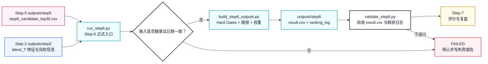
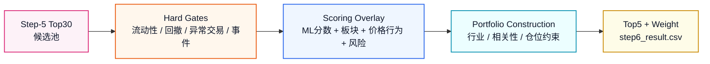
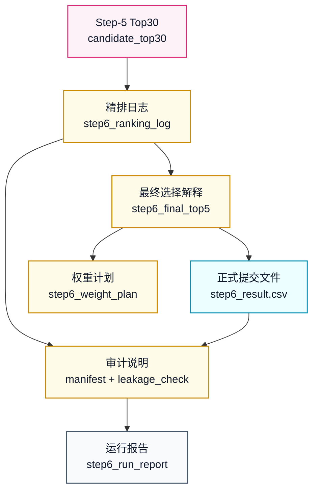
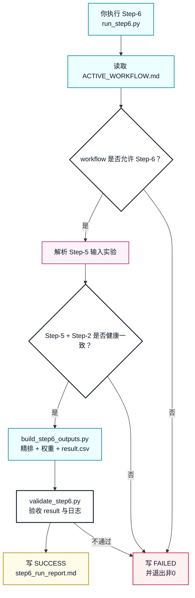
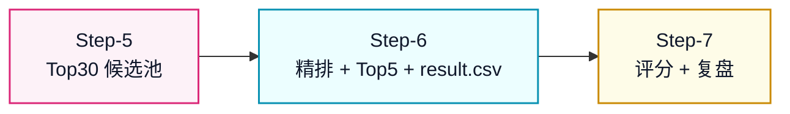

# Step-6 正式健康版体系设计

本文定义 `workflow_0.1` 的 Step-6 应该如何从“精排想法”升级成像 Step-1 到 Step-5 一样可运行、可验收、可复盘的正式健康流程。

Step-1 是：

```text
数据资产生产线
```

Step-2 是：

```text
特征资产生产线
```

Step-3 是：

```text
样本资产生产线
```

Step-4 是：

```text
切分与回测计划生产线
```

Step-5 是：

```text
模型训练与候选池生产线
```

Step-6 要建设成：

```text
精排与提交文件生产线
```

也就是说，Step-6 不再训练模型，也不重新召回股票。它负责从 Step-5 给出的 Top30 候选池里，基于风险、行业、流动性、价格行为和组合约束，选出最终 Top5，并生成唯一正式提交文件 `result.csv`。

## 策略来源

Step-6 当前没有 `workflow_0.1/strategy/` 下的专门改写策略。

因此 Step-6 的策略源头仍然是七步总策略：

```text
Experiment/策略流程与实验方案.md
```

核心章节是：

```text
6. 第 6 步：精排 Top30 候选池
```

总策略明确写出 Step-6 的核心边界：

```text
第 6 步从 candidate_top30.csv 开始，
最终生成唯一正式提交文件 result.csv。
```

这意味着正式 Step-6 的核心原则是：

```text
只能在 Step-5 的 Top30 候选池内部精排。
不能回到沪深300全市场重新选股。
不能训练新模型替代 Step-5。
不能评分。
```

## 一句话理解

Step-6 的任务是：

```text
读取健康 Step-5 候选池
-> 读取 Step-2 最新日可用特征、风险特征和板块特征
-> 只在 Top30 内执行 Hard Gates
-> 计算 refine_score 精排分
-> 按行业、相关性、风险和仓位约束构建组合
-> 选出最终 Top5 或少于5只
-> 分配权重
-> 生成 step6_result.csv
-> 校验格式、权重、来源和防泄漏
-> 写入 step6_run_report.md
```

它不做：

```text
不联网抓 raw 数据
不重新计算 Step-2 特征
不重新构造 Step-3 标签
不重新切分数据
不训练模型
不修改 Step-5 模型分数
不从 Top30 之外选股票
不读取未来收益标签
不做官方评分
不复盘收益表现
```

## 图 1：Step-5 到 Step-6 的衔接



## Step-6 和 Step-5 最大的不同

Step-5 的健康重点是：

```text
模型训练是否可复现
Top30 候选池是否无泄漏
模型和特征是否可追溯
```

Step-6 的健康重点变成：

```text
是否只从 Top30 内精排
是否正确生成唯一 result.csv
股票数量是否 <= 5
权重是否非负且总和 <= 1
Hard Gates 是否有记录
剔除原因是否有记录
行业、相关性、风险、仓位约束是否有记录
是否没有读取未来收益或最终评分信息
```

所以 Step-6 不只是“取模型分数前5名”，而是要回答：

```text
为什么这5只入选？
为什么其他25只没入选？
有没有违反流动性、回撤、行业集中或相关性约束？
仓位为什么是这个比例？
这个 result.csv 是否可以直接交给 Step-7 评分？
```

## Step-6 需要补齐的六块能力

| 序号 | 能力 | 对应文件 | 作用 |
|---:|---|---|---|
| 1 | 输入规则 | `run_step6.py` / `step6_refine_manifest.csv` | 明确读取哪一次 Step-5 和 Step-2 |
| 2 | 精排生成器 | `pipelines/build_step6_outputs.py` | 从 Top30 执行 gates、打分、组合构建和权重分配 |
| 3 | 验收器 | `pipelines/validate_step6.py` | 检查 result.csv、Top30 来源、权重、字段、防泄漏 |
| 4 | 总调度器 | `run_step6.py` | 串起输入检查、精排、验收、报告 |
| 5 | 测试体系 | `pipelines/tests/test_*step6*.py` | 固定 Top30 边界、权重、result 格式、兜底规则 |
| 6 | 长期说明文档 | `docs/Step-6_正式健康版体系设计.md` | 解释 Step-6 如何从候选池生成最终提交文件 |

这六块合起来，Step-6 才算从策略文档变成正式精排流程。

## 1. Step-6 输入规则

正式 Step-6 必须读取一个已经健康通过的 Step-5 实验目录。

### 输入一：健康 Step-5 候选池资产

```text
Experiment/workflow_0.1/experiments/<step5_experiment>/
├── outputs/
│   └── step5/
│       ├── step5_model_registry.csv
│       ├── step5_feature_set_used.csv
│       ├── step5_walk_forward_predictions.csv
│       ├── step5_walk_forward_metrics.csv
│       ├── step5_feature_importance.csv
│       ├── step5_candidate_top30.csv
│       ├── step5_model_manifest.csv
│       └── step5_leakage_check.csv
├── models/
│   └── step5/
└── notes/
    └── step5_run_report.md
```

Step-6 从这里读取：

```text
candidate_date
股票代码
股票名称
板块划分
model_score
model_rank
fusion_score
fusion_rank
model_source
fusion_method
```

### 输入二：健康 Step-2 最新日特征资产

Step-6 还需要读取同链路 Step-2 的最新日特征，用于风险、流动性、板块和价格行为判断：

```text
Experiment/workflow_0.1/experiments/<step2_experiment>/
├── outputs/
│   └── step2/
│       ├── step2_feature_table_daily.csv
│       ├── step2_sector_feature_table.csv
│       ├── step2_sector_score_latest.csv
│       ├── step2_latest_t_screen.csv
│       ├── step2_risk_feature_table.csv
│       ├── step2_feature_metadata.csv
│       └── step2_data_manifest.csv
└── notes/
    └── step2_run_report.md
```

Step-6 从这里读取：

```text
latest_T
成交额 / 成交量 / 换手率
max_drawdown_20
extreme_drop_20_flag
low_liquidity_flag
no_trade_or_abnormal_flag
risk_any_flag
sector_ret_5 / sector_short_score
price action 相关字段
```

如果后续要引入基本面或事件日历，则必须先在 Step-1 / Step-2 形成可追溯数据资产，Step-6 不能临时联网抓一个不可复现的事件表。

## 2. 输入一致性要求

Step-6 不能随便拿 Step-5 和 Step-2 拼起来。正式验收必须确认：

```text
Step-5 report 必须 SUCCESS
Step-5 leakage_check 必须全部 PASS
Step-5 manifest 记录的 input_step2_experiment 必须等于实际读取的 Step-2
Step-5 candidate_date 必须等于 Step-2 latest_T
Step-5 candidate_top30.csv 行数必须等于 candidate_size
Step-5 candidate_top30.csv 股票代码不能重复
Step-2 latest_T 特征必须覆盖 Top30 股票
Step-6 report 必须记录实际读取的 Step-5 和 Step-2 实验
```

这条规则的含义是：

```text
Step-6 可以自动寻找最近成功 Step-5
但必须顺着 Step-5 manifest 找到同链路 Step-2
不能拿一个旧特征表精排一个新候选池
```

## 3. 第一版精排策略边界

总策略中的 Step-6 包含很多可调规则：

```text
市场状态 Gate
Hard Gates
Scoring Overlay
Portfolio Construction
权重策略
精排失败兜底规则
```

第一版健康实现的优先级应该是：

```text
先保证只从 Top30 选 Top5
先保证 result.csv 格式和权重合法
先保证每只候选股票都有精排日志
先保证不读取未来信息
再逐步增强基本面、事件、相关性和仓位逻辑
```

因此 Step-6 可以分三层实现：

```text
第一层：refine_rule_v1
    基于 Step-5 fusion_rank、Step-2 风险/流动性字段和板块信息做可解释精排。

第二层：portfolio_constraint_v1
    加入行业最多持股数量、相关性阈值、市场弱势降仓等组合约束。

第三层：event_fundamental_overlay_v1
    在 Step-1/Step-2 已经形成数据资产后，引入公告日可追溯的基本面和事件日历。
```

健康体系不强制第一版就使用全部金融规则，但强制每条规则都要留下日志。

## 4. Step-6 的核心防泄漏规则

Step-6 最危险的地方不是精排规则简单，而是为了看起来更聪明，偷偷读了预测日之后的信息。

必须禁止：

```text
从 Step-5 Top30 之外选股票
读取 Step-3 的 label_ret_5d_open_to_open
读取 Step-5 walk_forward_predictions 中的真实 label 字段来精排最新候选池
读取 Step-7 评分结果反向改 result.csv
读取预测日T之后才公告的基本面或事件信息
临时联网抓不可复现的新闻、公告或事件数据
生成多个互相冲突的 result.csv
输出 weight < 0
输出 weight sum > 1
输出超过5只股票
```

允许：

```text
读取 Step-5 candidate_top30.csv 的模型分数和排名
读取 Step-2 latest_T 已经可用的价量、板块、风险特征
使用 Step-1 / Step-2 中已经可追溯的基本面或事件字段
用 Hard Gates 剔除不可交易或风险过高股票
输出少于5只股票，并把剩余仓位视为现金
记录现金仓位，但 result.csv 不写现金行
```

注意：

```text
Step-6 可以生成 result.csv。
Step-6 不能评分 result.csv。
Step-7 才负责评分和复盘。
```

## 图 2：Step-6 精排漏斗



## 5. Step-6 输出设计

Step-6 第一版建议采用：

```text
6 个核心 CSV + 1 个运行报告
```

目录形态：

```text
Experiment/workflow_0.1/experiments/<step6_experiment>/
├── outputs/
│   └── step6/
│       ├── step6_ranking_log.csv
│       ├── step6_final_top5.csv
│       ├── step6_result.csv
│       ├── step6_weight_plan.csv
│       ├── step6_refine_manifest.csv
│       └── step6_leakage_check.csv
└── notes/
    └── step6_run_report.md
```

为什么不只输出 `result.csv`：

```text
result.csv 给 Step-7 评分
ranking_log.csv 解释每只 Top30 为什么入选或剔除
final_top5.csv 解释最终 Top5 的精排理由
weight_plan.csv 解释仓位和现金
manifest.csv 记录输入来源和策略版本
leakage_check.csv 记录防泄漏检查
```

### `step6_ranking_log.csv`

行粒度：

```text
Step-5 Top30 每只股票一行
```

用途：

```text
记录每只候选股的模型排名、精排分、门槛状态、剔除原因、是否最终入选。
```

第一版核心表头：

```csv
candidate_date,股票代码,股票名称,板块划分,model_rank,model_score,fusion_rank,fusion_score,gate_status,removed_reason,liquidity_gate,risk_gate,event_gate,sector_constraint_status,correlation_constraint_status,ml_rank_score,sector_momentum_score,price_action_score,risk_adjustment_score,refine_score,final_selected,final_rank,weight,note
```

### `step6_final_top5.csv`

行粒度：

```text
最终入选股票每只一行
```

用途：

```text
给人工复盘看最终选择，不要求完全等同官方 result.csv 字段。
```

第一版核心表头：

```csv
trade_date,股票代码,股票名称,板块划分,final_rank,weight,refine_score,model_rank,selection_reason
```

健康要求：

```text
行数 <= 5
股票代码必须来自 step5_candidate_top30.csv
weight >= 0
weight sum <= 1
```

### `step6_result.csv`

行粒度：

```text
最终提交股票每只一行
```

用途：

```text
这是 Step-6 给 Step-7 的核心交付。
Step-7 应该直接读取这张表评分。
```

第一版核心表头：

```csv
stock_id,weight
```

健康要求：

```text
行数 <= 5
stock_id 不能重复
stock_id 必须来自 Step-5 Top30
weight 必须是数字
weight >= 0
weight sum <= 1
不能包含股票名称、模型分数、未来标签或解释字段
```

### `step6_weight_plan.csv`

行粒度：

```text
每次 Step-6 运行一行
```

用途：

```text
记录权重策略、总仓位、现金仓位和约束说明。
```

第一版核心表头：

```csv
trade_date,weighting_method,selected_count,total_weight,cash_weight,max_single_weight,min_single_weight,market_regime,position_note,constraint_note
```

### `step6_refine_manifest.csv`

行粒度：

```text
每个说明项一行
```

用途：

```text
记录输入来源、精排规则版本、权重版本、生成时间和防泄漏说明。
```

表头：

```csv
项目,说明
```

至少必须记录：

```csv
项目,说明
schema_version,workflow_0.1_csv_v1
refine_set_id,refine_set_v1_rule_top5_equal_weight
input_step5_experiment,exp_xxx
input_step2_experiment,exp_xxx
input_candidate_date,YYYY-MM-DD
input_candidate_size,30
selected_count,N
weighting_method,equal_weight_v1
total_weight,0.0~1.0
cash_weight,0.0~1.0
max_stock_count,5
generated_at,YYYY-MM-DD HH:MM:SS
data_window_note,说明
leakage_control_note,说明
```

### `step6_leakage_check.csv`

行粒度：

```text
每个检查项一行
```

用途：

```text
记录 Step-6 防泄漏和边界检查是否通过。
```

第一版核心表头：

```csv
检查项,状态,说明
```

必须覆盖：

```text
input_step5_success
candidate_date_matches_step2_latest_T
all_selected_from_top30
no_future_label_columns_used
no_step7_score_used
result_schema_valid
result_stock_count_lte_5
result_weight_non_negative
result_weight_sum_lte_1
ranking_log_covers_all_candidates
manifest_leakage_note
```

所有状态必须是：

```text
PASS
```

只要有一个 `FAIL`，正式 Step-6 必须失败。

## 图 3：Step-6 输出分层



## 6. build_step6_outputs.py：Step-6 生成器

目标路径：

```text
Experiment/workflow_0.1/pipelines/build_step6_outputs.py
```

它负责：

```text
读取 Step-5 candidate_top30
读取 Step-5 manifest，找到同链路 Step-2
读取 Step-2 latest_T 特征和风险信息
把 Step-2 最新特征合并到 Top30
执行 Hard Gates
计算 refine_score
按组合约束选择 Top5
分配权重
生成 step6_result.csv
写 ranking_log、final_top5、weight_plan、manifest、leakage_check
```

它不负责：

```text
不训练模型
不修改 Step-5 candidate_top30
不从 Top30 之外补股票
不读取 Step-3 label
不读取 Step-5 walk-forward 真实标签
不运行评分脚本
```

## 7. validate_step6.py：Step-6 验收器

目标路径：

```text
Experiment/workflow_0.1/pipelines/validate_step6.py
```

### 输入验收

```text
Step-5 report 必须 SUCCESS
Step-5 leakage_check 必须全部 PASS
Step-5 candidate_top30.csv 必须存在
Step-5 candidate_top30.csv 行数必须等于 manifest candidate_size
Step-5 candidate_top30.csv 股票代码不能重复
Step-5 candidate_top30.csv 不能包含未来标签字段
Step-2 report 必须 SUCCESS
Step-2 latest_T 必须等于 Step-5 candidate_date
Step-2 latest_T 特征必须覆盖 Top30 股票
```

### 精排验收

```text
ranking_log 必须覆盖 Top30 全部股票
ranking_log 每只股票最多一行
ranking_log 中 final_selected=1 的股票必须与 final_top5 一致
所有 gate_status 必须是 pass / removed / relaxed / selected 中之一
被剔除股票必须有 removed_reason
refine_score 必须是数字
final_rank 必须连续
```

### result.csv 验收

```text
step6_result.csv 必须存在
表头必须严格等于 stock_id,weight
行数 <= 5
stock_id 必须来自 Step-5 Top30
stock_id 不能重复
weight 必须为数字
weight >= 0
weight sum <= 1
不能包含额外解释字段
```

### 防泄漏验收

```text
不能读取 Step-3 label_ret_5d_open_to_open
不能读取 Step-5 walk_forward_predictions 的 label 字段精排最新候选池
不能读取 Step-7 评分结果
不能使用 candidate_date 之后才可得的数据
manifest 必须写 leakage_control_note
leakage_check 每项必须 PASS
```

## 8. run_step6.py：正式调度入口

目标路径：

```text
Experiment/workflow_0.1/run_step6.py
```

它对齐前五步 runner，负责串起全流程：

```text
读取 ACTIVE_WORKFLOW
-> 确认 active_workflow=workflow_0.1
-> 确认 active_stage=Step-6
-> 找到或读取指定 Step-5 实验
-> 通过 Step-5 manifest 推断同链路 Step-2
-> 校验输入健康且日期一致
-> 调用 build_step6_outputs.py
-> 调用 validate_step6.py
-> 写 step6_run_report.md
```

建议命令：

```bash
/opt/miniconda3/bin/python3 Experiment/workflow_0.1/run_step6.py
```

指定输入：

```bash
/opt/miniconda3/bin/python3 Experiment/workflow_0.1/run_step6.py \
  --step5-experiment exp_20260617_step5_workflow_0_1
```

指定输出实验名：

```bash
/opt/miniconda3/bin/python3 Experiment/workflow_0.1/run_step6.py \
  --experiment-name exp_20260617_step6_workflow_0_1
```

## 图 4：Step-6 正式运行流程



## 9. Step-6 测试体系

测试目录：

```text
Experiment/workflow_0.1/pipelines/tests/
```

建议新增：

```text
test_build_step6_outputs.py
test_validate_step6.py
test_run_step6_runner.py
```

### 生成器测试

覆盖：

```text
能从最小 Step-5 candidate_top30 fixture 生成 6 个核心 CSV
result.csv 表头严格为 stock_id,weight
result.csv 行数 <= 5
ranking_log 覆盖全部 Top30
final_top5 只包含 Top30 股票
weight_plan 记录 total_weight 和 cash_weight
manifest 记录 input_step5_experiment 和 refine_set_id
```

### 验收器测试

覆盖：

```text
Step-5 report 不是 SUCCESS 时失败
Step-5 candidate_top30 股票重复时失败
Step-5 candidate_date 与 Step-2 latest_T 不一致时失败
ranking_log 少候选股时失败
result.csv 多于5只时失败
result.csv 有非Top30股票时失败
result.csv weight < 0 时失败
result.csv weight sum > 1 时失败
result.csv 多出解释字段时失败
leakage_check 存在非 PASS 时失败
manifest 缺 leakage_control_note 时失败
```

### runner 测试

覆盖：

```text
workflow 不匹配时拒绝运行
active_stage 不是 Step-6 时拒绝运行
输入不健康时写 FAILED 报告
输出健康时写 SUCCESS 报告
失败时返回非0
成功时返回0
```

## 10. Step-6 成功标准草案

Step-6 成功不是“生成了 result.csv”就算成功，而是必须满足：

```text
读取的 Step-5 实验是 SUCCESS
读取的 Step-2 实验是 SUCCESS
Step-5 / Step-2 manifest 链路一致
candidate_date 等于 Step-2 latest_T
ranking_log 覆盖 Step-5 Top30 全部股票
final_top5 只来自 Step-5 Top30
step6_result.csv 表头严格等于 stock_id,weight
step6_result.csv 行数 <= 5
step6_result.csv stock_id 无重复
step6_result.csv weight 全部 >= 0
step6_result.csv weight sum <= 1
step6_result.csv 不包含解释字段、模型字段或未来标签字段
weight_plan 记录 selected_count、total_weight、cash_weight、weighting_method
manifest 记录 input_step5、input_step2、refine_set_id、generated_at、leakage_control_note
leakage_check 每项 PASS
notes/step6_run_report.md 写入 SUCCESS
```

失败时必须：

```text
写入 step6_run_report.md
Status = FAILED
说明失败阶段
说明失败原因
退出码非0
```

## 11. Step-6 和 Step-7 的边界

Step-6 输出：

```text
step6_result.csv
```

Step-7 输入：

```text
step6_result.csv
```

Step-7 输出：

```text
评分结果、收益明细、复盘报告
```

因此：

```text
Step-6 负责生成可以评分的最终组合。
Step-7 负责冻结后评分和复盘。
Step-7 的评分结果不能反向修改本次 Step-6 的 result.csv。
```

## 图 5：Step-6 和前后步骤的关系



## 建议建设顺序

```text
1. 先实现 Step-6 输入链路校验
2. 写最小 Hard Gates 和 refine_score 规则
3. 写 Top5 组合选择和等权权重
4. 写 step6_result.csv 生成逻辑
5. 写 ranking_log / final_top5 / weight_plan
6. 写 validate_step6.py
7. 写 run_step6.py
8. 写 tests
9. 后续再增强行业约束、相关性约束、事件和基本面规则
```

为什么这个顺序合理：

```text
先保证 Step-6 不越过 Top30
再保证 result.csv 合法
再保证每个选择都有解释
最后再追求更复杂的金融精排逻辑
```

## 当前状态

截至目前：

```text
Step-6 策略源头：已有，来自 Experiment/策略流程与实验方案.md
Step-6 体系设计：已有，本文件
Step-6 CSV schema 草案：已有，本文件
Step-6 正式入口 run_step6.py：已实现
Step-6 生成器 build_step6_outputs.py：已实现
Step-6 验收器 validate_step6.py：已实现
Step-6 测试体系：已实现
Step-6 正式运行报告：已生成
最近一次正式实验：exp_20260617_step6_workflow_0_1
最近一次正式运行状态：SUCCESS
```

所以 Step-6 现在已经不是手写一个 `result.csv`，而是一条正式精排与提交文件生产线。

当前第一版实现采用：

```text
refine_set_v1_rule_top5_equal_weight
```

它的含义是：

```text
只在 Step-5 Top30 内精排
硬性剔除不可交易、缺 latest_T 特征、低流动性或成交额过低候选
对极端回撤和 risk_any_flag 做软惩罚
第一轮每个板块最多 2 只
如果不足 5 只，再允许放松板块约束
最终最多 5 只，每只等权 20%
```

最近一次正式 Step-6 输出位置：

```text
Experiment/workflow_0.1/experiments/exp_20260617_step6_workflow_0_1/
├── outputs/step6/
│   ├── step6_ranking_log.csv
│   ├── step6_final_top5.csv
│   ├── step6_result.csv
│   ├── step6_weight_plan.csv
│   ├── step6_refine_manifest.csv
│   └── step6_leakage_check.csv
└── notes/
    └── step6_run_report.md
```

## 最后压缩成一句话

```text
Step-1 把 raw 数据变成健康的数据资产。
Step-2 把数据资产变成健康的特征资产。
Step-3 把特征资产变成健康的训练样本资产。
Step-4 把样本资产变成健康的时间切分与回测计划资产。
Step-5 把这些资产变成可复现、无泄漏、可交给 Step-6 的 Top30 候选池。
Step-6 把 Top30 候选池变成可提交、可评分、可复盘的 Top5 result.csv。
```

这就是 `workflow_0.1` Step-6 对应前面步骤的正式健康版体系。
