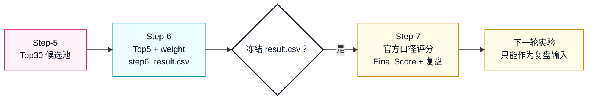
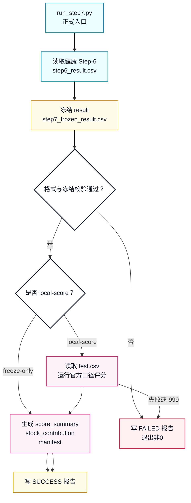
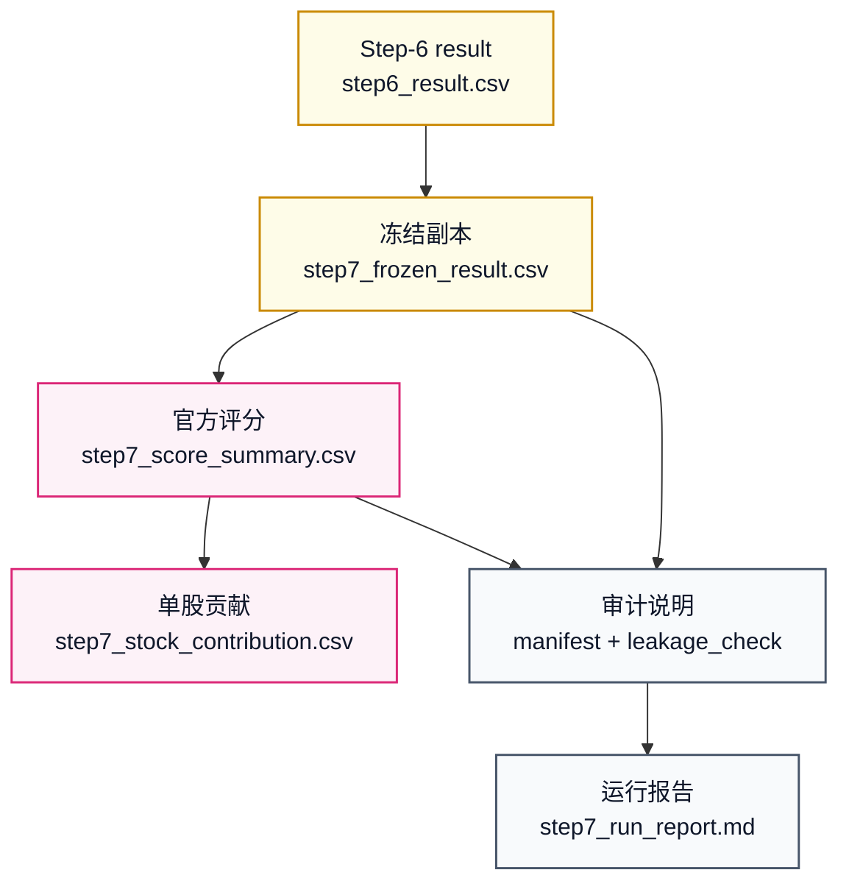

# Step-7 正式健康版体系设计

本文定义 `workflow_0.1` 的 Step-7 应该如何从“跑一下官方脚本”升级成可追溯、可复盘、可防泄漏的正式评分治理流程。

Step-1 是：

```text
数据资产生产线
```

Step-2 是：

```text
特征资产生产线
```

Step-3 是：

```text
样本资产生产线
```

Step-4 是：

```text
切分与回测计划生产线
```

Step-5 是：

```text
模型训练与候选池生产线
```

Step-6 是：

```text
精排与提交文件生产线
```

Step-7 要建设成：

```text
冻结评分与复盘治理生产线
```

也就是说，Step-7 不再改股票、不再改权重、不再训练模型。它只在 Step-6 已经生成并冻结 `result.csv` 之后，按官方口径验证、评分、记录明细和复盘。

## 策略来源

Step-7 当前没有 `workflow_0.1/strategy/` 下的专门改写策略。

因此 Step-7 的策略源头仍然是七步总策略：

```text
Experiment/策略流程与实验方案.md
```

核心章节是：

```text
7. 第 7 步：评分、回测与实验记录
```

本地官方评分脚本是：

```text
THU-BDC2026-main/test/score_self.py
```

官方脚本默认读取：

```text
THU-BDC2026-main/output/result.csv
THU-BDC2026-main/data/test.csv
```

官方脚本默认写出：

```text
THU-BDC2026-main/temp/tmp.csv
```

`tmp.csv` 中包含：

```csv
Team Name,Final Score
```

## 一句话理解

Step-7 的任务是：

```text
读取健康 Step-6 实验
-> 冻结 step6_result.csv
-> 校验 result.csv 官方格式
-> 在冻结之后读取 test.csv
-> 按官方口径计算 Final Score
-> 生成单股贡献明细
-> 生成评分 manifest 和 leakage_check
-> 写入 step7_run_report.md
-> 只把结果用于复盘和下一轮实验，不回改本轮 Step-6
```

它不做：

```text
不联网抓 raw 数据
不重新计算 Step-2 特征
不重新构造 Step-3 标签
不重新切分 Step-4
不训练 Step-5 模型
不修改 Step-6 Top5 或权重
不根据 test.csv 反向调参
不把 Final Score 写回 Step-6
```

## 图 1：Step-7 在全链路中的位置



## Step-7 最大的风险

Step-7 最大风险不是代码写错，而是泄漏。

核心边界是：

```text
Step-6 生成 result.csv 之前：
    不能读取 test.csv。

Step-6 生成 result.csv 之后：
    必须冻结 result.csv。

Step-7 评分之后：
    可以复盘、记录、进入下一轮实验。
    不能反向修改本轮 result.csv。
```

这意味着：

```text
同一次实验里，Step-7 的 Final Score 是评价，不是调参信号。
如果想根据 Step-7 结果调整策略，必须开下一轮实验或下一个 workflow。
```

## Step-7 的两种健康模式

### 模式一：freeze-only

适用场景：

```text
未来真实行情还没有出来
或正式比赛只需要先准备提交文件
```

做什么：

```text
读取 Step-6
复制 step6_result.csv 为 frozen_result.csv
校验 result.csv 字段、行数、权重、重复股票
写 freeze manifest
写 leakage_check
写运行报告
```

不做什么：

```text
不读取 test.csv
不计算 Final Score
不生成单股收益贡献
```

健康状态应该是：

```text
FREEZE_ONLY_SUCCESS
```

不能把它误写成：

```text
SCORE_SUCCESS
```

### 模式二：local-score

适用场景：

```text
本地 test.csv 已经存在
需要用官方口径模拟评分
```

做什么：

```text
读取 Step-6
冻结 result.csv
校验 result.csv
复制官方评分脚本和 test.csv 到隔离评分工作区
运行官方评分脚本
读取 temp/tmp.csv
生成单股收益贡献明细
写 score manifest
写 leakage_check
写运行报告
```

健康状态应该是：

```text
SCORE_SUCCESS
```

前提是：

```text
Step-6 report 是 SUCCESS
Step-6 leakage_check 全部 PASS
frozen_result.csv 与 step6_result.csv 内容一致
官方脚本运行成功
Final Score 不是 -999
```

## 官方评分口径

`score_self.py` 的核心公式是：

```text
单股收益 = (最后一个交易日开盘价 - 第一个交易日开盘价) / 第一个交易日开盘价
Final Score = Σ(单股收益 × weight)
```

当前官方脚本逻辑：

```text
读取 output/result.csv
读取 data/test.csv
检查 result.csv 是否最多 5 只股票
检查权重和是否在 0 到 1 之间
把 stock_id/weight 重命名为 股票代码/权重
从 test.csv 中只保留提交股票
每只股票取最后 5 条记录
用开盘价计算单股收益
计算加权收益
写入 temp/tmp.csv
```

注意：

```text
官方脚本没有显式检查重复股票。
官方脚本没有显式检查股票代码是否全部能匹配 test.csv。
官方脚本没有显式检查每只股票是否刚好有 5 条 test 记录。
```

所以 workflow 自己的 Step-7 验收要比官方脚本更严格。

## 图 2：Step-7 正式运行流程



## Step-7 输入规则

正式 Step-7 必须读取一个健康通过的 Step-6 实验目录。

### 输入一：Step-6 结果资产

```text
Experiment/workflow_0.1/experiments/<step6_experiment>/
├── outputs/
│   └── step6/
│       ├── step6_ranking_log.csv
│       ├── step6_final_top5.csv
│       ├── step6_result.csv
│       ├── step6_weight_plan.csv
│       ├── step6_refine_manifest.csv
│       └── step6_leakage_check.csv
└── notes/
    └── step6_run_report.md
```

必须满足：

```text
Step-6 report = SUCCESS
Step-6 leakage_check 全部 PASS
step6_result.csv 存在
step6_result.csv 表头严格等于 stock_id,weight
step6_result.csv 行数 <= 5
step6_result.csv stock_id 无重复
step6_result.csv weight >= 0
step6_result.csv weight sum <= 1
```

### 输入二：官方测试数据

本地评分模式读取：

```text
THU-BDC2026-main/data/test.csv
```

必须满足：

```text
test.csv 存在
包含 股票代码、日期、开盘、收盘
Step-7 只能在 frozen_result.csv 生成后读取 test.csv
frozen_result.csv 中每只股票在 test.csv 中至少有 5 条记录
```

正式比赛时，未来行情由组委会持有，不在本地 workflow 中提前读取。

## Step-7 输出设计

Step-7 第一版建议采用：

```text
5 个核心 CSV + 1 个运行报告 + 1 个可选官方评分工作区
```

目录形态：

```text
Experiment/workflow_0.1/experiments/<step7_experiment>/
├── outputs/
│   └── step7/
│       ├── step7_frozen_result.csv
│       ├── step7_score_summary.csv
│       ├── step7_stock_contribution.csv
│       ├── step7_score_manifest.csv
│       └── step7_leakage_check.csv
├── official_scoring_workspace/
│   ├── output/
│   │   └── result.csv
│   ├── data/
│   │   └── test.csv
│   ├── temp/
│   │   └── tmp.csv
│   └── test/
│       └── score_self.py
└── notes/
    └── step7_run_report.md
```

为什么不直接在 `THU-BDC2026-main/` 里覆盖文件：

```text
避免污染官方参考目录
避免多个实验互相覆盖 output/result.csv 和 temp/tmp.csv
保证每次评分都能完整复现
```

### `step7_frozen_result.csv`

行粒度：

```text
最终提交股票每只一行
```

来源：

```text
从 Step-6 step6_result.csv 复制而来
```

表头：

```csv
stock_id,weight
```

健康要求：

```text
必须与 Step-6 step6_result.csv 内容一致
冻结后不得被评分过程修改
```

### `step7_score_summary.csv`

行粒度：

```text
每次 Step-7 评分一行
```

第一版表头：

```csv
experiment_id,score_mode,team_name,final_score,result_status,selected_count,total_weight,test_date_start,test_date_end,official_script_path,official_tmp_path,generated_at,note
```

说明：

```text
freeze-only 模式下 final_score 为空，result_status=FREEZE_ONLY_SUCCESS。
local-score 模式下 final_score 必须来自官方口径，result_status=SCORE_SUCCESS 或 FAILED。
```

### `step7_stock_contribution.csv`

行粒度：

```text
最终持仓股票每只一行
```

第一版表头：

```csv
stock_id,股票名称,板块划分,weight,open_first,open_last,return_5d_open_to_open,score_contribution,test_date_start,test_date_end,matched_test_rows
```

用途：

```text
解释 Final Score 到底来自哪些股票。
```

如果是 freeze-only 模式：

```text
这张表可以为空，但必须有表头。
```

### `step7_score_manifest.csv`

行粒度：

```text
每个说明项一行
```

表头：

```csv
项目,说明
```

至少记录：

```csv
项目,说明
schema_version,workflow_0.1_csv_v1
evaluation_set_id,evaluation_set_v1_official_score
input_step6_experiment,exp_xxx
input_step6_result_path,path
frozen_result_path,path
score_mode,freeze-only/local-score
official_script_path,path
test_data_path,path
selected_count,N
total_weight,0.0~1.0
final_score,value or empty
generated_at,YYYY-MM-DD HH:MM:SS
data_window_note,说明
leakage_control_note,说明
```

### `step7_leakage_check.csv`

行粒度：

```text
每个检查项一行
```

表头：

```csv
检查项,状态,说明
```

必须覆盖：

```text
input_step6_success
input_step6_leakage_pass
result_frozen_before_test_read
frozen_result_matches_step6_result
result_schema_valid
result_stock_count_lte_5
result_stock_id_unique
result_weight_non_negative
result_weight_sum_lte_1
test_data_read_after_freeze
official_score_not_used_to_modify_step6
manifest_leakage_note
```

local-score 模式还必须覆盖：

```text
test_data_available
selected_stocks_covered_by_test
each_selected_stock_has_5_test_rows
official_script_completed
final_score_not_negative_999
stock_contribution_matches_final_score
```

所有必须项状态必须是：

```text
PASS
```

只要有一个核心检查是 `FAIL`，正式 Step-7 必须失败。

## Step-7 需要补齐的六块能力

| 序号 | 能力 | 对应文件 | 作用 |
|---:|---|---|---|
| 1 | 输入规则 | `run_step7.py` / `step7_score_manifest.csv` | 明确读取哪一次 Step-6 和哪个 test.csv |
| 2 | 冻结与评分生成器 | `pipelines/build_step7_outputs.py` | 冻结 result、运行官方口径评分、生成贡献明细 |
| 3 | 验收器 | `pipelines/validate_step7.py` | 检查冻结、格式、权重、官方分数、防泄漏 |
| 4 | 总调度器 | `run_step7.py` | 串起输入检查、冻结、评分、验收、报告 |
| 5 | 测试体系 | `pipelines/tests/test_*step7*.py` | 固定冻结边界、官方格式、评分失败、-999 等场景 |
| 6 | 长期说明文档 | `docs/Step-7_正式健康版体系设计.md` | 解释 Step-7 如何评分和复盘 |

## build_step7_outputs.py：Step-7 生成器

目标路径：

```text
Experiment/workflow_0.1/pipelines/build_step7_outputs.py
```

它负责：

```text
读取 Step-6 result
复制成 frozen_result
校验 frozen_result 基础格式
在 local-score 模式下准备隔离 official_scoring_workspace
复制 score_self.py、test.csv、result.csv
运行官方评分脚本
读取 tmp.csv
生成 score_summary
生成 stock_contribution
生成 score_manifest
生成 leakage_check
```

它不负责：

```text
不修改 Step-6 输出
不重新选股
不重新分配权重
不训练模型
不调参
不把 Final Score 写回 Step-6
```

## validate_step7.py：Step-7 验收器

目标路径：

```text
Experiment/workflow_0.1/pipelines/validate_step7.py
```

### 输入验收

```text
Step-6 report 必须 SUCCESS
Step-6 leakage_check 必须全部 PASS
Step-6 result 必须存在
Step-6 result 表头必须严格为 stock_id,weight
Step-6 result 股票数 <= 5
Step-6 result stock_id 无重复
Step-6 result weight >= 0
Step-6 result weight sum <= 1
```

### 冻结验收

```text
step7_frozen_result.csv 必须存在
frozen_result 内容必须等于 Step-6 step6_result.csv
manifest 必须记录 frozen_result_path
leakage_check 必须记录 result_frozen_before_test_read
```

### 本地评分验收

```text
test.csv 必须存在
test.csv 必须包含 股票代码、日期、开盘、收盘
每只入选股票至少有 5 条 test 记录
official tmp.csv 必须存在
Final Score 必须为数字
Final Score 不能等于 -999
stock_contribution 的贡献求和必须等于 Final Score
```

### 防泄漏验收

```text
test.csv 只能在 frozen_result 之后读取
official score 不能用于修改 Step-6 result
score manifest 必须写 leakage_control_note
leakage_check 必须全部 PASS
```

## run_step7.py：正式调度入口

目标路径：

```text
Experiment/workflow_0.1/run_step7.py
```

建议命令：

```bash
/opt/miniconda3/bin/python3 Experiment/workflow_0.1/run_step7.py --mode local-score
```

只冻结不评分：

```bash
/opt/miniconda3/bin/python3 Experiment/workflow_0.1/run_step7.py --mode freeze-only
```

指定输入 Step-6：

```bash
/opt/miniconda3/bin/python3 Experiment/workflow_0.1/run_step7.py \
  --step6-experiment exp_20260617_step6_workflow_0_1 \
  --mode local-score
```

默认流程：

```text
读取 ACTIVE_WORKFLOW
-> 确认 active_workflow=workflow_0.1
-> 确认 active_stage=Step-7
-> 找到或读取指定 Step-6 实验
-> 校验 Step-6 健康
-> 冻结 step6_result.csv
-> 按 mode 决定是否读取 test.csv 并评分
-> 生成 Step-7 标准 CSV
-> 校验 Step-7 输出
-> 写入 notes/step7_run_report.md
```

## 图 3：Step-7 输出分层



## Step-7 测试体系

测试目录：

```text
Experiment/workflow_0.1/pipelines/tests/
```

建议新增：

```text
test_build_step7_outputs.py
test_validate_step7.py
test_run_step7_runner.py
```

### 生成器测试

覆盖：

```text
能从最小 Step-6 fixture 生成 frozen_result
freeze-only 模式不读取 test.csv
local-score 模式能生成 score_summary 和 stock_contribution
官方脚本 tmp.csv 被复制或记录
stock_contribution 贡献和等于 Final Score
```

### 验收器测试

覆盖：

```text
Step-6 report 不是 SUCCESS 时失败
Step-6 leakage_check 非 PASS 时失败
frozen_result 与 Step-6 result 不一致时失败
result.csv 多于 5 只时失败
result.csv weight sum > 1 时失败
test.csv 缺入选股票时失败
每只股票不足 5 条 test 记录时失败
Final Score = -999 时失败
leakage_check 非 PASS 时失败
```

### runner 测试

覆盖：

```text
active_stage 不是 Step-7 时失败
自动找到最近 SUCCESS 的 Step-6
失败时写 step7_run_report.md
成功时写 step7_run_report.md
freeze-only 和 local-score 分别走正确分支
```

## Step-7 成功标准

freeze-only 成功必须满足：

```text
Step-6 report = SUCCESS
Step-6 leakage_check 全部 PASS
step7_frozen_result.csv 存在
frozen_result 与 step6_result 内容一致
frozen_result 表头严格等于 stock_id,weight
股票数 <= 5
stock_id 无重复
weight >= 0
weight sum <= 1
manifest 记录 score_mode=freeze-only
leakage_check 全部 PASS
notes/step7_run_report.md 存在
```

local-score 成功必须额外满足：

```text
test.csv 存在
test.csv 覆盖所有入选股票
每只入选股票至少 5 条 test 记录
官方评分脚本成功运行
tmp.csv 存在
Final Score 是数字
Final Score != -999
stock_contribution 贡献求和等于 Final Score
manifest 记录 score_mode=local-score
manifest 记录 official_script_path 和 test_data_path
```

## 当前状态

截至目前：

```text
Step-7 策略源头：已有，来自 Experiment/策略流程与实验方案.md
Step-7 官方评分脚本：已有，THU-BDC2026-main/test/score_self.py
Step-7 本地 test.csv：已有，THU-BDC2026-main/data/test.csv
Step-7 体系设计：已有，本文件
Step-7 CSV schema 草案：已有，本文件
Step-7 正式入口 run_step7.py：已实现
Step-7 生成器 build_step7_outputs.py：已实现
Step-7 验收器 validate_step7.py：已实现
Step-7 测试体系：已实现
Step-7 正式运行报告：已生成
最近一次 freeze-only 正式实验：exp_20260617_step7_workflow_0_1
最近一次 freeze-only 状态：FREEZE_ONLY_SUCCESS
最近一次 local-score 尝试：exp_20260617_step7_local_score_workflow_0_1
最近一次 local-score 状态：FAILED
```

所以 Step-7 现在已经不是手动覆盖 `THU-BDC2026-main/output/result.csv`，而是一条隔离、可复现、不会污染官方目录的评分治理流程。

当前 `local-score` 被阻止的原因是：

```text
Step-6 candidate_date = 2026-06-15
THU-BDC2026-main/data/test.csv selected stocks test_date_start = 2026-03-09
```

这说明这份本地 `test.csv` 不是本轮 Step-6 提交日之后的未来 5 日行情，不能作为健康评分答案使用。

当前健康完成的是：

```text
freeze-only
```

它已经完成：

```text
冻结 step6_result.csv
校验 result 格式
确认权重合法
确认不读取 test.csv
写入 manifest 和 leakage_check
写入 step7_run_report.md
```

## 最后压缩成一句话

```text
Step-7 是 result.csv 冻结之后的官方口径评分与复盘层；它可以告诉我们这次策略表现如何，但不能回头修改这次已经冻结的提交结果。
```

这就是 `workflow_0.1` Step-7 对应前面步骤的正式健康版体系。
