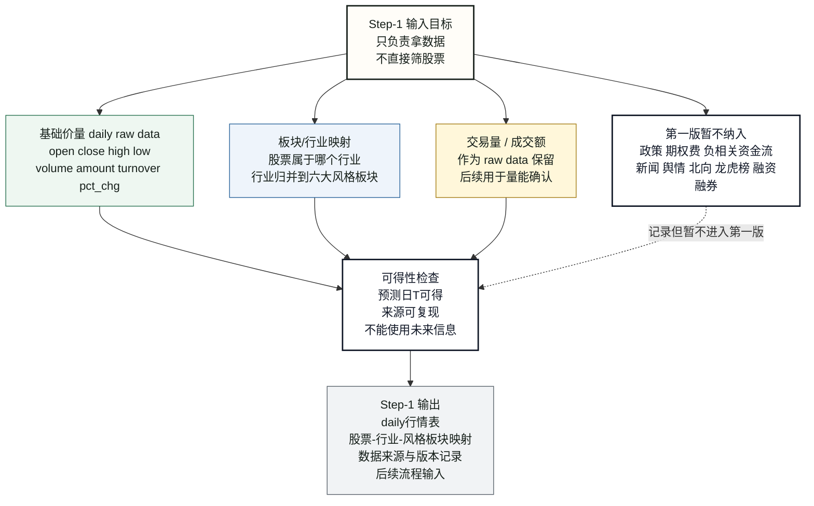
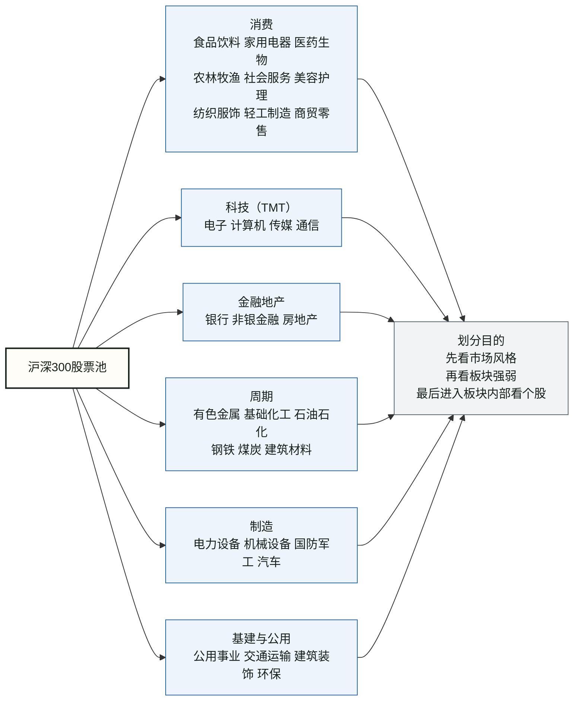
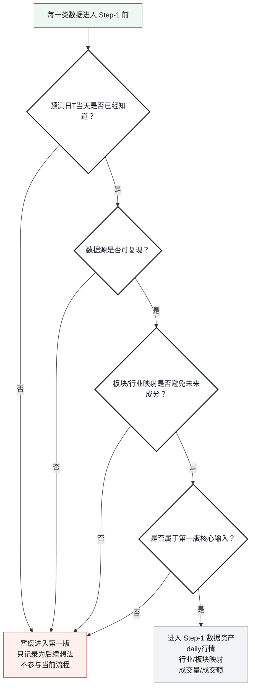

# THU-BDC2026 Step-1：数据获取流程与思考逻辑

来源背景：`流程修改想法.md`

本文只整理 Step-1，不展开后续特征工程、模型训练、精排和评分。

核心定位：

```text
Step-1 只负责拿数据。
Step-1 不直接筛股票。
Step-1 不判断最终买什么。
Step-1 的目标是形成干净、可复现、预测日T可得的数据资产。
```

---

## 图 1：Step-1 主流程



---

## 图 2：六大风格板块划分



---

## 图 3：Step-1 防未来信息泄漏检查



---

## Step-1 思考逻辑整理

### 1. Step-1 的边界

Step-1 的任务不是“找出强势股票”，而是把后续判断需要的数据准备好。

```text
拿数据
保留原始日频信息
记录数据来源
保证预测日T可得
把股票映射到六大风格板块
```

不在 Step-1 做：

```text
不直接筛股票
不生成候选池
不计算最终分数
不使用未来才知道的信息
```

### 2. 为什么保留 daily raw data

虽然比赛关注未来 5 个交易日收益，但 Step-1 不把原始数据压成五日频率。

原因：

```text
五天内部路径仍然重要。
中途大跌、冲高回落、突然缩量、流动性枯竭，都需要日频数据才能看见。
```

第一版基础字段：

```text
open
close
high
low
volume
amount
turnover
pct_chg
```

### 3. 板块/行业数据的核心想法

在判断强势板块之前，先定义股票被分到哪些板块。

第一版采用六大风格板块：

```text
消费
科技（TMT）
金融地产
周期
制造
基建与公用
```

数据口径先用“自聚合行业”：

```text
个股 daily 行情
+ 个股所属板块/行业映射
= 我们自己聚合出来的板块表现
```

这样的好处是：

```text
样本不会因为行业太细而过少。
更适合先判断市场风格。
也更容易解释：先看板块，再看个股。
```

### 4. 交易量 / 成交额的定位

交易量和成交额在 Step-1 只作为 raw data 保留。

核心想法：

```text
趋势必须有量能确认。
上涨但没有成交额支持，可能只是噪声。
成交额太低的股票，不适合进入后续候选池。
```

### 5. 第一版暂不纳入的数据

以下内容先记录，不进入 Step-1 第一版核心输入：

```text
政策信息
期权费映射
负相关资金流
新闻文本
舆情
北向资金
龙虎榜
融资融券
```

原因：

```text
复杂度高。
时间戳和可得性不好控制。
容易引入未来信息泄漏。
第一版 baseline 先不要变重。
```

### 6. Step-1 输出

Step-1 最终输出的是数据资产，不是交易结论。

```text
daily行情表
股票-行业映射
股票-六大风格板块映射
成交量/成交额原始数据
数据来源、日期、版本记录
暂缓数据清单
```

一句话总结：

```text
Step-1 的重点是把“后续可以判断强弱的数据基础”搭好，而不是在这里判断谁强谁弱。
```
