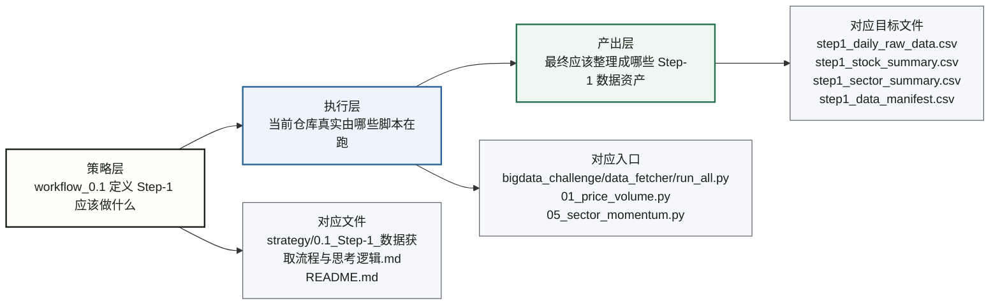
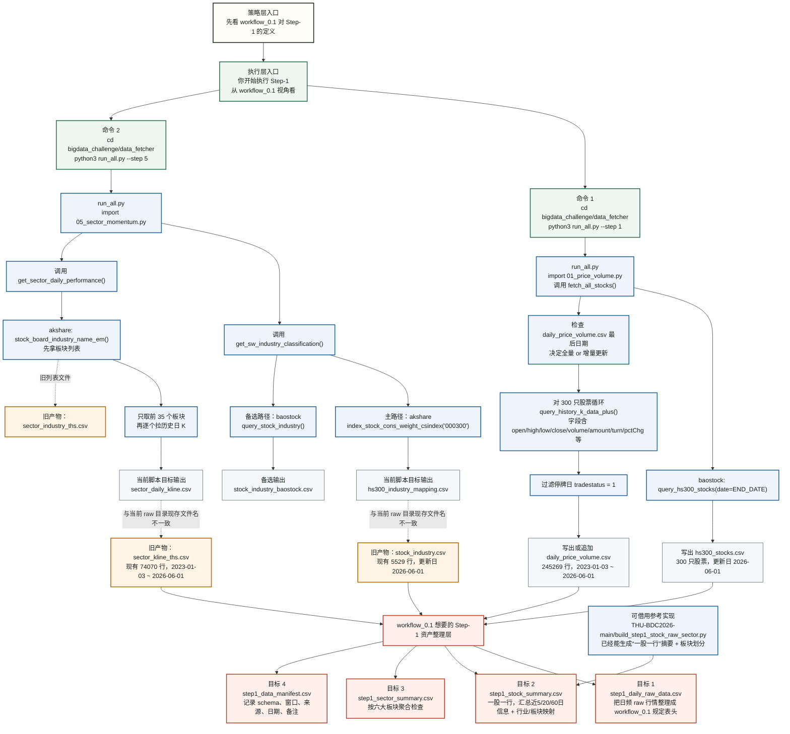
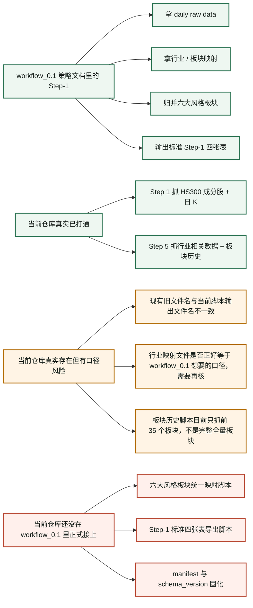

# workflow_0.1 Step-1 真实调度图（代码视角）

这张图不是策略设想图，而是“如果你现在在这个仓库里跑 Step-1，背后真实会发生什么”的代码视角流程图。

这次补充一个最重要的理解框架：

`策略层 -> 执行层 -> 产出层`

也就是：

- 先看 `workflow_0.1` 想让 Step-1 做什么
- 再看当前仓库实际上靠哪些脚本去执行
- 最后看这些脚本应该整理成什么 Step-1 产物

阅读原则：

- 绿色：当前仓库里确实存在、可直接调用的脚本或产物
- 橙色：仓库里现存的旧产物，但不是当前脚本的标准输出文件名
- 红色：`workflow_0.1` 视角下还缺的一步，需要补脚本或统一口径

---

## 图 0：Step-1 的三层结构总图



这张总图表达的意思是：

- `strategy/` 里的文档负责定义“Step-1 应该做什么”
- `data_fetcher/` 里的代码负责定义“现在实际上怎么跑”
- `workflow_0.1` 最终要的不是 raw 零散文件，而是标准化的 Step-1 输出表

---

## 图 1：从命令到文件的真实调度图



---

## 图 2：你以为的 Step-1 和代码里真实 Step-1 的区别



---

## 真实口径小结

### 1. 你现在真正在跑的“抓数层”

最接近真实入口的是：

```bash
cd bigdata_challenge/data_fetcher
python3 run_all.py --step 1
python3 run_all.py --step 5
```

这两步解决的是：

- 抓沪深 300 成分股列表
- 抓 300 只股票的日频行情
- 抓行业相关映射
- 抓行业板块历史日 K

### 2. `workflow_0.1` 想要的“Step-1 资产层”

这层在策略上已经定义清楚了，但还没有在 `Experiment/workflow_0.1/` 目录下形成一套正式脚本，把 raw 文件稳定转成：

- `step1_daily_raw_data.csv`
- `step1_stock_summary.csv`
- `step1_sector_summary.csv`
- `step1_data_manifest.csv`

### 3. 哪些文件是“现在目录里有，但别轻易当成当前脚本标准输出”的

- `bigdata_challenge/data/raw/stock_industry.csv`
- `bigdata_challenge/data/raw/sector_kline_ths.csv`
- `bigdata_challenge/data/raw/sector_industry_ths.csv`

它们是现有可参考的数据资产，但从当前 `05_sector_momentum.py` 的代码看，标准输出文件名已经写成别的名字了。

### 4. 如果只用一句话解释你跑 Step-1 时背后在干什么

你不是在“直接跑出 workflow_0.1 的最终 Step-1 成果”，而是在先跑一层通用抓数脚本，把原始行情和行业相关数据抓下来；然后还需要再补一层整理脚本，才能变成 `workflow_0.1` 真正定义的 Step-1 资产表。

### 5. 以后看这张图时，建议按这三个问题去读

- 策略层：`workflow_0.1` 希望 Step-1 解决什么问题？
- 执行层：当前仓库到底调用了哪些脚本和数据源？
- 产出层：这些 raw 文件最后有没有被整理成标准 Step-1 结果？
