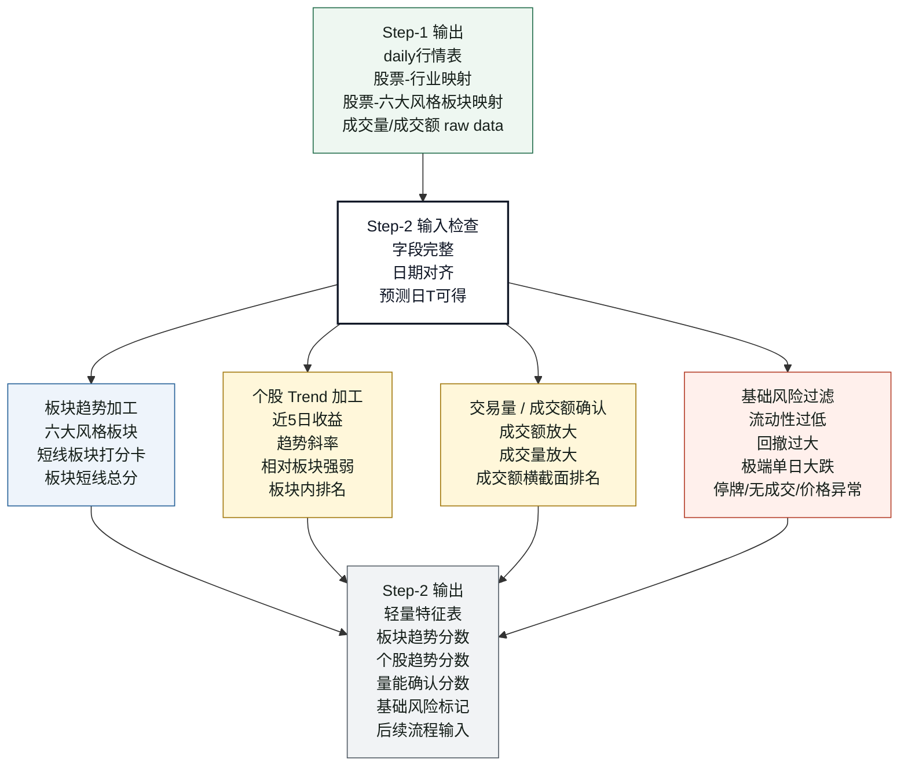
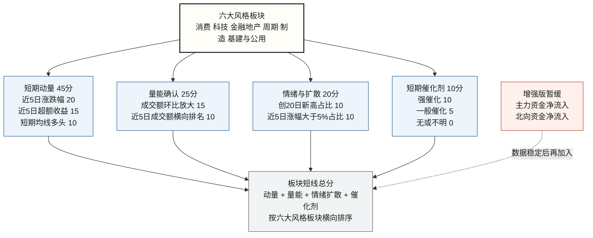
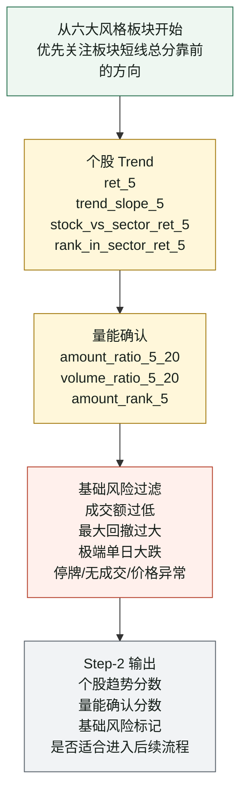

# THU-BDC2026 Step-2：特征工程与初步筛选流程与思考逻辑

来源背景：`流程修改想法.md`、`THU-BDC2026_Step-1_数据获取流程与思考逻辑.md`

本文只整理 Step-2，不展开模型训练、精排和评分。

核心定位：

```text
Step-2 负责把 Step-1 的 daily raw data 转成可判断强弱的轻量特征。
Step-2 不追求大而全。
Step-2 第一版只围绕：板块趋势、个股趋势、量能确认、基础风险。
Step-2 的输出是特征和标记，不是最终交易结论。
```

---

## 图 1：Step-2 主流程



---

## 图 2：短线板块打分卡



---

## 图 3：个股初步筛选思路



---

## Step-2 思考逻辑整理

### 1. Step-2 的边界

Step-2 的任务不是直接生成最终股票组合，而是把 Step-1 拿到的数据变成可用的判断变量。

```text
从 daily raw data 计算特征
从六大风格板块计算板块短线总分
从个股日频行情计算趋势和量能确认
从日频路径计算基础风险标记
输出轻量特征和筛选标记
```

不在 Step-2 做：

```text
不生成最终提交文件
不直接给最终权重
不使用未来收益作为输入特征
不把主力资金、北向资金强行放入第一版核心权重
```

### 2. Step-2 输入

Step-2 只使用 Step-1 已经确认可得的数据。

```text
daily行情表
股票-行业映射
股票-六大风格板块映射
成交量/成交额 raw data
已知且预测日T之前可得的催化剂记录
```

输入检查：

```text
日期必须对齐
股票代码必须可映射
板块归属必须明确
所有特征只能使用预测日T及以前的数据
```

---

## 3. 板块趋势：短线板块打分卡

Step-2 先判断六大风格板块的强弱。

我们希望回答：

```text
哪些风格板块最近处于上涨趋势？
哪些风格板块同时有成交额放大？
哪些风格板块内部不是只有一两只股票在涨？
```

第一版原则：

```text
只使用可以从 daily 行情和已知事件中稳定得到的数据。
先不把主力资金、北向资金放进核心权重。
```

### 3.1 短期动量：45分

```text
1. 近5日累计涨跌幅：20分
   在六大风格板块中排名。
   第1名20分，第2名16分，第3名12分，第4名8分，第5名4分，第6名0分。

2. 近5日超额收益 vs 沪深300：15分
   计算：板块近5日收益 - 沪深300近5日收益。
   同样在六大风格板块中排名给分。
   目的是判断板块是不是真的强于大盘。

3. 短期均线多头形态：10分
   5日均线在10日均线之上，且今日收盘价在5日均线之上：10分
   只满足一个条件：5分
   均线缠绕或空头：0分
```

### 3.2 量能确认：25分

```text
1. 成交额环比放大程度：15分
   计算：板块近5日日均成交额 / 板块近20日日均成交额。
   比值 > 1.3：15分
   1.0 到 1.3：8分
   < 1.0：0分

2. 板块近5日成交额横向排名：10分
   在六大风格板块中比较近5日平均成交额。
   成交额越活跃，得分越高。
   目的是确认上涨是否有资金参与。
```

### 3.3 情绪与扩散：20分

```text
1. 板块内创20日新高个股占比：10分
   统计板块内收盘价创近20日新高的股票占比。
   占比越高，说明赚钱效应越扩散。

2. 近5日涨幅大于5%的个股占比：10分
   统计板块内近5日累计涨幅超过5%的股票占比。
   占比越高，说明板块攻击力越强。
```

### 3.4 短期催化剂：10分

```text
未来5天事件评分：10分
强催化：10分
一般催化：5分
无或不明：0分
```

催化剂约束：

```text
催化剂必须在预测日T之前已经知道。
不能评分后再补理由。
```

### 3.5 板块短线总分

```text
板块短线总分 =
    短期动量
  + 量能确认
  + 情绪与扩散
  + 短期催化剂
```

第一版用法：

```text
先计算六大风格板块各自的短线总分。
再按总分从高到低排序。
优先进入总分靠前的强势板块内部选股。
```

增强版暂缓指标：

```text
近5日主力资金净流入强度
近5日北向资金净流入强度
```

暂缓原因：

```text
当前这两类数据不一定有稳定的历史板块级序列。
如果直接加入第一版，可能导致无法回测，或者引入未来信息泄漏。
等数据可以稳定按预测日T对齐后，再加入增强版打分卡。
```

---

## 4. 个股 Trend

个股 Trend 用来判断强势板块内部哪些股票更强。

因为最终提交后中途不会换手，所以更关注短期趋势是否能延续 5 个交易日。

可以考虑的特征：

```text
ret_5：个股近5日收益
ret_10：个股近10日收益
ma5_over_ma20：MA5 / MA20 - 1
trend_slope_5：近5日收盘价趋势斜率
stock_vs_sector_ret_5：个股近5日收益 - 所属板块近5日收益
rank_in_sector_ret_5：个股近5日收益在板块内排名
```

第一版最核心：

```text
ret_5
trend_slope_5
stock_vs_sector_ret_5
rank_in_sector_ret_5
```

思考逻辑：

```text
不只看个股自己涨没涨。
还要看它是否跑赢所属风格板块。
如果板块强、个股也跑赢板块，才更符合短线延续的方向。
```

---

## 5. 交易量 / 成交额确认

趋势要配合量能确认。

可以考虑的特征：

```text
amount_ma5：近5日平均成交额
amount_ratio_5_20：近5日成交额 / 近20日成交额
volume_ratio_5_20：近5日成交量 / 近20日成交量
amount_rank_5：近5日成交额在横截面中的排名
```

第一版最核心：

```text
amount_ratio_5_20
volume_ratio_5_20
amount_rank_5
```

思考逻辑：

```text
上涨但没有成交额支持，可能只是噪声。
成交额放大说明资金参与度更高。
成交额太低的股票，即使趋势好，也不适合进入后续流程。
```

---

## 6. 基础风险过滤

基础风险过滤不是为了预测收益，而是为了先排除不适合继续进入后续流程的股票。

可以考虑：

```text
近3日平均成交额过低：剔除
近20日最大回撤过大：剔除或降权
近20日出现极端单日大跌：剔除或降权
停牌、无成交、价格异常：剔除
```

思考逻辑：

```text
短线策略不是只找最强信号，也要避免明显不能交易或风险过高的标的。
基础风险过滤应该早于后续更复杂判断。
```

---

## 7. Step-2 输出

Step-2 不直接生成最终交易结论。

### 7.1 输出设计原则

Step-2 不追求把所有内容塞进一张大表。

原因是 Step-2 天然有三种不同粒度：

```text
股票 + 日期：个股每日特征
板块 + 日期：板块每日特征和板块分数
最新 T 日：给后续流程使用的当日初筛视图
```

如果强行合并成一张表，会出现：

```text
板块特征在每只股票上重复出现
最新 T 日视图和历史每日特征混在一起
风险过滤字段不方便单独复盘
metadata 和 manifest 无法自然放进主特征表
```

所以第一版采用：

```text
5 个核心输出 + 2 个派生视图
```

核心输出负责后续流程和自动验收：

```text
step2_feature_table_daily.csv
step2_sector_feature_table.csv
step2_latest_t_screen.csv
step2_feature_metadata.csv
step2_data_manifest.csv
```

派生视图负责人工复盘和快速检查：

```text
step2_sector_score_latest.csv
step2_risk_feature_table.csv
```

原则：

```text
核心输出是唯一真相来源。
派生视图可以由核心输出重新生成。
如果核心输出和派生视图冲突，以核心输出为准。
```

### 7.2 第一版输出内容

第一版输出应该是：

```text
轻量特征表
板块趋势分数
个股趋势分数
量能确认分数
基础风险标记
后续流程输入
```

输出边界：

```text
Step-2 输出的是“可用于判断强弱的变量”。
不是最终买入名单。
不是最终权重。
不是最终评分结果。
```

一句话总结：

```text
Step-2 的重点是把 Step-1 的数据加工成“板块强不强、个股强不强、有没有量、风险能不能接受”的轻量判断体系。
```
