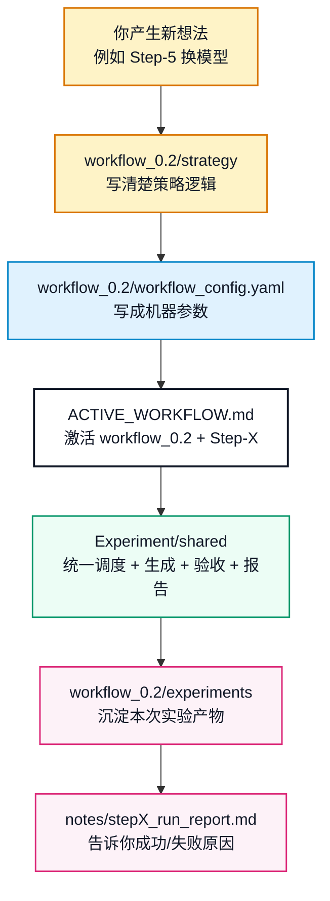
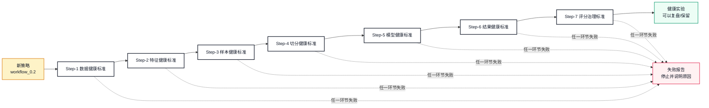
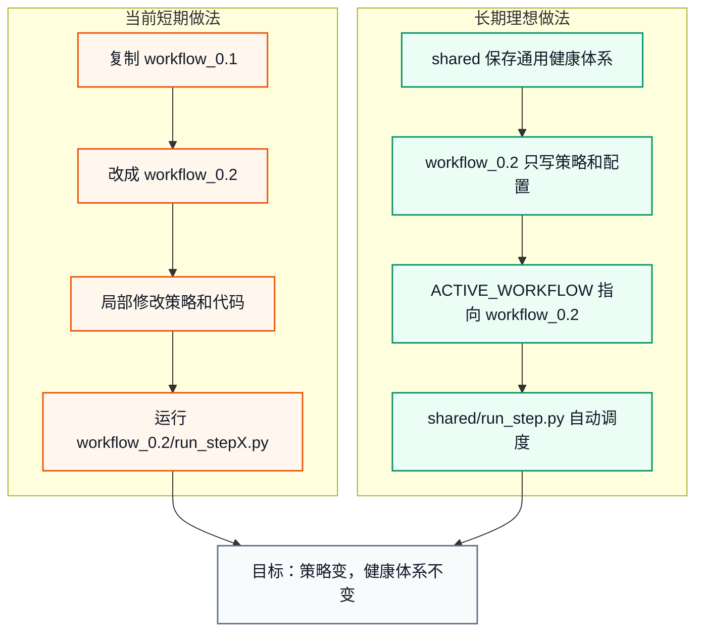
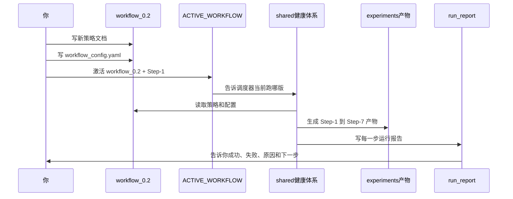

# 多 Workflow 策略迁移与健康体系复用指南

本文回答一个核心问题：

```text
如果 workflow_0.1 已经建立了 Step-1 到 Step-7 的健康体系，
下一次我新建 workflow_0.2 并修改策略时，
应该怎么复用这套体系，而不是重新造一遍？
```

一句话结论：

```text
策略可以变，但健康体系不要每次重写。
```

更具体地说：

```text
你负责提出新的策略假设。
workflow_config.yaml 负责把策略变成机器可读参数。
shared 健康体系负责按标准流程执行、验收、报告。
experiments/ 负责沉淀每一次实验结果。
```

## 1. 先分清三件事

新建实验时，最容易混在一起的是：

```text
策略
调度
产物
```

它们应该分层：

| 层级 | 放在哪里 | 作用 | 例子 |
|---|---|---|---|
| 策略层 | `workflow_x.x/strategy/` | 解释这版实验想法和逻辑 | Step-2 加特征、Step-5 换模型、Step-6 改精排 |
| 配置层 | `workflow_x.x/workflow_config.yaml` | 把策略写成机器能读的参数 | `model_family: lightgbm_ranker` |
| 健康体系层 | `Experiment/shared/` | 通用执行、验收、报告、manifest、防泄漏 | `run_step.py`、`validate_step.py` |
| 产出层 | `workflow_x.x/experiments/` | 每次真实运行结果 | `outputs/`、`notes/`、`leakage_check` |

这套结构的目标是：

```text
策略变化只影响 workflow_x.x/
健康体系尽量沉淀到 shared/
实验结果永远写到对应 workflow 的 experiments/
```

## 2. 目标目录结构

理想状态下，`Experiment/` 应该逐步演化成：

```text
Experiment/
├── ACTIVE_WORKFLOW.md
├── shared/
│   ├── runners/
│   │   └── run_step.py
│   ├── pipelines/
│   │   ├── step1/
│   │   ├── step2/
│   │   ├── step3/
│   │   ├── step4/
│   │   ├── step5/
│   │   ├── step6/
│   │   └── step7/
│   ├── validators/
│   ├── schemas/
│   ├── reports/
│   └── tests/
│
├── workflow_0.1/
│   ├── strategy/
│   ├── workflow_config.yaml
│   ├── docs/
│   └── experiments/
│
├── workflow_0.2/
│   ├── strategy/
│   ├── workflow_config.yaml
│   ├── docs/
│   └── experiments/
│
└── 策略流程与实验方案.md
```

当前真实状态是：

```text
workflow_0.1 已经是健康体系样板间。
Step-1 到 Step-7 的真实执行代码还主要放在 workflow_0.1/ 里。
shared/ 已经落地第一阶段：读取 active workflow、读取 workflow_config.yaml、校验配置、统一分发 runner。
```

因此当前迁移方式分两阶段：

```text
短期：复制 workflow_0.1 作为 workflow_0.2，再局部修改策略和 config。
中期：用 Experiment/shared/runners/run_step.py 统一入口。
长期：把策略无关的 build、validate、report helper 继续抽到 Experiment/shared/。
```

当前已经可以使用：

```bash
/opt/miniconda3/bin/python3 Experiment/shared/validators/validate_workflow_config.py --workflow workflow_0.1
/opt/miniconda3/bin/python3 Experiment/shared/runners/run_step.py --step 7 --mode freeze-only --dry-run --print-context
```

## 3. 图 1：新策略如何复用健康体系



这张图的意思是：

```text
新策略不直接改底层抓数脚本。
新策略先进入 workflow_x.x 的策略和配置。
总调度器读取当前 workflow，再决定怎么跑。
```

## 4. 图 2：新策略和健康体系的“对碰”

这里的“对碰”可以理解为：

```text
你的新策略假设
    碰上
健康体系的硬标准
```

只有通过硬标准，它才算一次健康实验。



这张图强调：

```text
策略可以大胆试。
健康标准不能放松。
```

如果新策略失败，不代表策略一定没价值，而是说明它没有通过当前这套可复现、无泄漏、可验收的实验标准。

## 5. 新建 workflow_0.2 应该怎么操作

假设我们要建立一个新的策略版本：

```text
workflow_0.2
```

### 第一步：复制样板间

短期现实做法：

```bash
cp -R Experiment/workflow_0.1 Experiment/workflow_0.2
```

然后清理 `workflow_0.2/experiments/` 中不属于新实验的旧产物。

建议保留：

```text
strategy/
docs/
pipelines/
run_step1.py ~ run_step7.py
README.md
```

建议清空或归档：

```text
experiments/
__pycache__/
```

### 第二步：写策略变化

在这里写人能读懂的策略说明：

```text
Experiment/workflow_0.2/strategy/
```

例如：

```text
0.2_Step-2_新增估值与质量特征.md
0.2_Step-5_LightGBM排序模型策略.md
0.2_Step-6_风险调整精排策略.md
```

策略文档要回答：

```text
这次改什么？
为什么改？
影响哪个 Step？
新增哪些输入？
新增哪些输出？
是否可能引入未来信息泄漏？
失败时怎么判断？
```

### 第三步：写 workflow_config.yaml

建议新增：

```text
Experiment/workflow_0.2/workflow_config.yaml
```

示例：

```yaml
workflow_id: workflow_0.2
schema_version: workflow_0.2_csv_v1

inherit_from: workflow_0.1

step1:
  data_source: baostock
  require_hs300_count: 300
  fetch_mode: online

step2:
  feature_set_id: feature_set_v2_momentum_risk_value_quality
  add_features:
    - rsi_14
    - pe_percentile
    - roe_ttm
  keep_legacy_features: true

step3:
  label_window: 5
  input_window: 60

step4:
  train_window: 252
  gap_days: 5
  final_test_days: 5

step5:
  model_family: lightgbm_ranker
  candidate_size: 30
  random_seed: 2026

step6:
  refine_rule: risk_adjusted_top5
  max_stock_count: 5
  max_per_sector: 3
  weighting_method: score_weighted

step7:
  default_mode: freeze-only
  official_score_script: THU-BDC2026-main/test/score_self.py
```

这份配置的意义是：

```text
策略文档给人看。
workflow_config.yaml 给调度器读。
```

### 第四步：激活 workflow_0.2

修改：

```text
Experiment/ACTIVE_WORKFLOW.md
```

变成：

```text
active_workflow: workflow_0.2
active_stage: Step-1
status: ready
```

### 第五步：按健康链路跑 Step-1 到 Step-7

如果还没有 `Experiment/shared/`：

```bash
/opt/miniconda3/bin/python3 Experiment/workflow_0.2/run_step1.py
/opt/miniconda3/bin/python3 Experiment/workflow_0.2/run_step2.py
/opt/miniconda3/bin/python3 Experiment/workflow_0.2/run_step3.py
/opt/miniconda3/bin/python3 Experiment/workflow_0.2/run_step4.py
/opt/miniconda3/bin/python3 Experiment/workflow_0.2/run_step5.py
/opt/miniconda3/bin/python3 Experiment/workflow_0.2/run_step6.py
/opt/miniconda3/bin/python3 Experiment/workflow_0.2/run_step7.py --mode freeze-only
```

当前已经可以使用 `Experiment/shared/` 的第一阶段入口：

```bash
/opt/miniconda3/bin/python3 Experiment/shared/runners/run_step.py --step 1
/opt/miniconda3/bin/python3 Experiment/shared/runners/run_step.py --step 2
/opt/miniconda3/bin/python3 Experiment/shared/runners/run_step.py --step 3
/opt/miniconda3/bin/python3 Experiment/shared/runners/run_step.py --step 4
/opt/miniconda3/bin/python3 Experiment/shared/runners/run_step.py --step 5
/opt/miniconda3/bin/python3 Experiment/shared/runners/run_step.py --step 6
/opt/miniconda3/bin/python3 Experiment/shared/runners/run_step.py --step 7 --mode freeze-only
```

## 6. 图 3：当前短期做法 vs 长期理想做法



短期做法可以马上用，但会有重复代码。

长期做法更干净，但需要一次工程抽象。

## 7. 哪些东西应该迁移，哪些不应该迁移

### 应该迁移的东西

```text
Step-1 到 Step-7 的健康检查思想
manifest 记录方式
leakage_check 防泄漏标准
notes/run_report 报告格式
实验目录结构
CSV schema 管理方式
runner -> build -> validate 的三段式结构
```

### 不应该简单复制的东西

```text
旧 experiments/ 产物
旧 run_report 结论
旧 active_stage 状态
旧 workflow_0.1 写死路径
旧 schema_version 如果字段已经破坏性变化
旧模型文件
旧评分结果
```

### 可以继承但要声明的东西

```text
Step-1 原始数据抓取逻辑
Step-2 旧特征
Step-3 标签定义
Step-4 切分规则
Step-5 baseline 模型
Step-6 精排规则
Step-7 freeze-only 评分治理
```

继承时要在 `workflow_config.yaml` 写明：

```yaml
inherit_from: workflow_0.1
```

并在 manifest 中记录：

```text
input_workflow_base = workflow_0.1
current_workflow = workflow_0.2
```

## 8. 图 4：一次新实验从想法到复盘



这张图的关键点：

```text
你不是直接控制每个脚本。
你控制当前 workflow 的策略与配置。
健康体系负责把它跑成可验收实验。
```

## 9. 新 workflow 的最小检查清单

新建 `workflow_0.2` 前，先问自己：

```text
1. 这次策略变化写清楚了吗？
2. 变化影响的是哪几个 Step？
3. 是否新增了字段？
4. 如果新增字段，schema 是否需要升级？
5. 是否新增了外部数据源？
6. 是否可能引入未来信息泄漏？
7. workflow_config.yaml 是否能表达这次变化？
8. ACTIVE_WORKFLOW 是否指向新 workflow？
9. experiments/ 是否是干净的新实验目录？
10. 每一步失败时是否能写出 report？
```

如果这些问题答不上来，不建议直接跑。

## 10. 什么时候只改 config，什么时候要改代码

### 只改 config 就够了

适合这种变化：

```text
候选池大小从 30 改成 50
Step-4 gap_days 从 5 改成 10
Step-6 max_per_sector 从 2 改成 3
Step-7 mode 从 freeze-only 改成 local-score
随机种子变化
权重策略在已有枚举里切换
```

### 需要改 pipeline 代码

适合这种变化：

```text
新增 RSI、MACD、PE、ROE 等新特征
Step-5 从 baseline_correlation_rank 换成 LightGBM Ranker
Step-6 新增事件日历或相关性矩阵约束
Step-7 新增多轮 walk-forward 评分汇总
CSV 字段发生破坏性变化
```

### 需要升级 schema

适合这种变化：

```text
字段改名
字段删除
单位变化
唯一键变化
收益率从百分数改成小数
result.csv 格式变化
```

如果只是新增扩展列，通常不一定要升级 schema，但要更新：

```text
feature_set_id
manifest
metadata
validate 规则
```

## 11. 推荐的 workflow_0.2 启动模板

```text
Experiment/workflow_0.2/
├── README.md
├── workflow_config.yaml
├── strategy/
│   ├── 0.2_策略总览.md
│   ├── 0.2_Step-2_特征变化.md
│   ├── 0.2_Step-5_模型变化.md
│   └── 0.2_Step-6_精排变化.md
├── docs/
│   └── 0.2_实验说明.md
└── experiments/
```

`0.2_策略总览.md` 建议写：

```text
本次实验目标
相对 workflow_0.1 改了什么
不改什么
预期收益
主要风险
每个 Step 的影响
验收标准
失败后怎么判断
```

## 12. 一句话心智模型

```text
workflow_0.1 是健康体系样板间。
workflow_0.2 是新策略实验间。
shared 是未来要沉淀的通用实验引擎。
ACTIVE_WORKFLOW 是当前指挥牌。
experiments 是每一次真实运行留下的证据。
```

最后压缩成一句话：

```text
以后你新建策略，不是重写 Step-1 到 Step-7，
而是新建 workflow、修改策略和配置，
再让同一套健康体系把它跑完、验收、记录和复盘。
```
