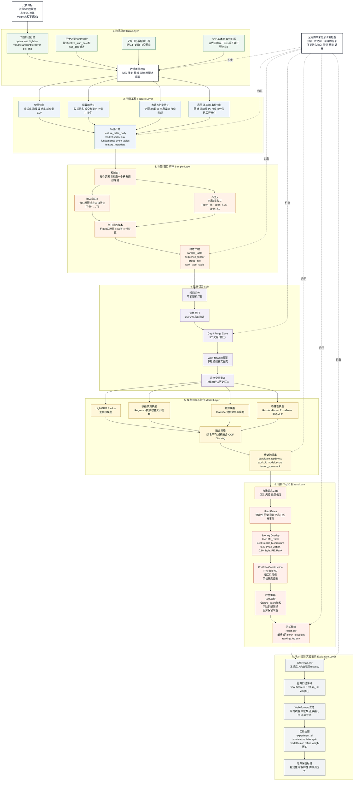
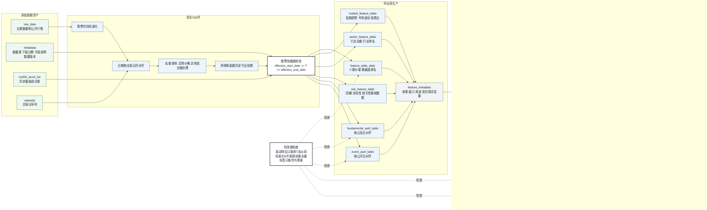
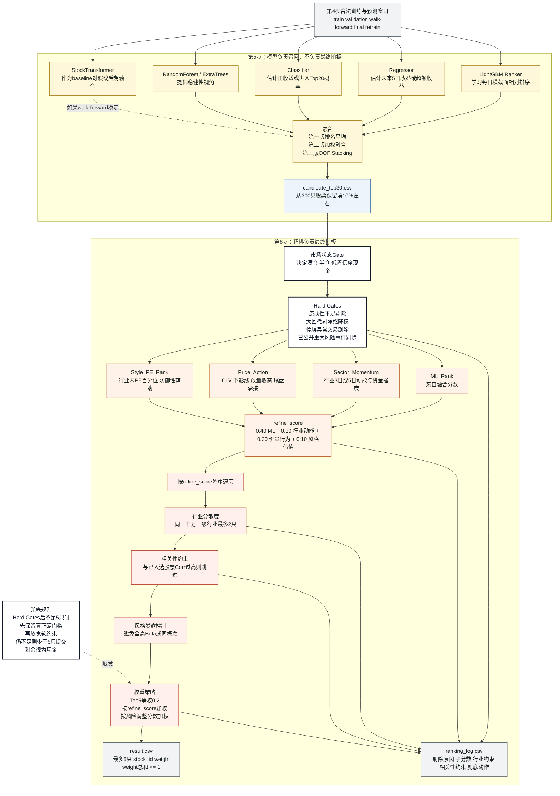
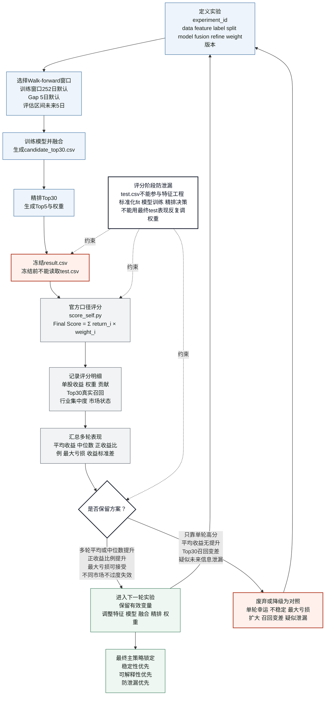
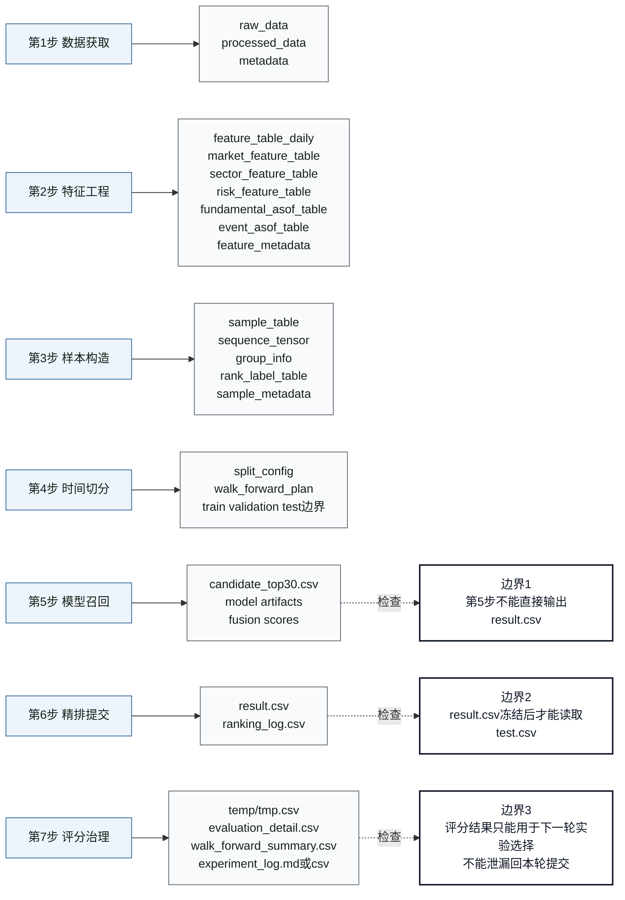

# THU-BDC2026 策略流程与实验方案：结构化流程图

来源背景：`大数据竞赛/THU-BDC2026_策略流程与实验方案.md`

设计目标：把比赛策略从“数据资产 → 特征样本 → 时间切分 → 模型召回Top30 → 精排Top5 → 冻结提交 → 评分复盘”的完整链路画成可执行、可汇报、可检查的流程图。

核心边界：

- 第5步只输出 `candidate_top30.csv`，不直接生成正式提交。
- 第6步从 Top30 精排出最终 Top5 和权重，并生成唯一 `result.csv`。
- 第7步只能在 `result.csv` 冻结后读取本地 `test.csv` 或等待组委会未来行情评分。
- 防未来信息泄漏贯穿所有阶段，任何数据都要能回答：预测日T当天是否已经知道？

---

## 图 1：七步主流程总图



---

## 图 2：数据到样本的可复现链路



---

## 图 3：模型召回 Top30 到精排 Top5



---

## 图 4：Walk-forward 实验闭环与治理



---

## 图 5：产物与责任边界



---

## 一页执行清单

| 阶段 | 关键输入 | 关键输出 | 必查项 |
|---|---|---|---|
| 1 数据获取 | 行情、股票池、交易日历、指数、行业、基本面、事件 | raw / processed / metadata | 合规、可复现、T日可得、股票池历史截面对齐 |
| 2 特征工程 | 原始数据与辅助表 | feature tables | 滚动窗口只用T及以前、公告日/公开日对齐、标准化不能看全量 |
| 3 样本构造 | feature tables、交易日历 | sample_table、window_data、group_info | X只能用过去，y只能当答案，窗口和标签完整 |
| 4 时间切分 | 样本表 | split_config、walk_forward_plan | 时间不随机打乱、训练与验证间保留Gap、test不调参 |
| 5 模型召回 | 合法训练样本 | candidate_top30.csv | 输出Top30，不直接拍Top5，不只看单轮最高收益 |
| 6 精排提交 | Top30、风险、行业、基本面、事件 | result.csv、ranking_log.csv | Hard Gates、行业相关性约束、weight总和不超过1 |
| 7 评分治理 | 冻结的result.csv、test.csv或未来行情 | Final Score、评分明细、实验日志 | 冻结后评分，评分结果只能用于下一轮复盘 |

---

## 最终心智模型

```text
历史可得数据
  -> 可复现数据资产
  -> 无泄漏特征体系
  -> 每日横截面排序样本
  -> 时间切分与Walk-forward
  -> 多模型融合召回Top30
  -> 金融逻辑精排Top5和权重
  -> 冻结result.csv
  -> 未来5日行情评分
  -> 实验记录和下一轮方案选择
```

一句话版本：

> 我们用历史数据训练排序模型，先从沪深300中召回 Top30 候选池，再通过精排选出最终 Top5 和权重，生成唯一提交的 `result.csv`，由未来真实行情决定成绩。
