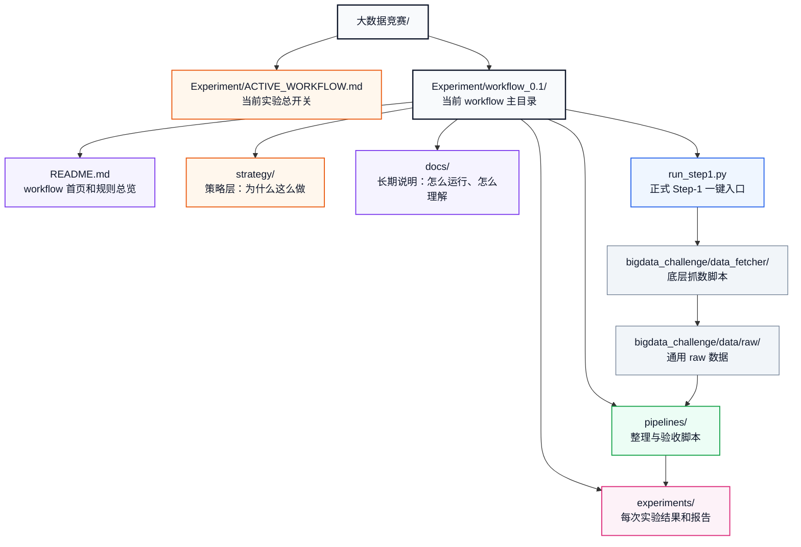
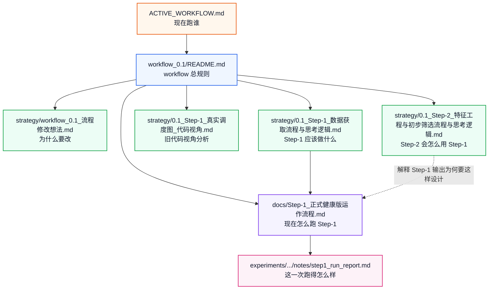
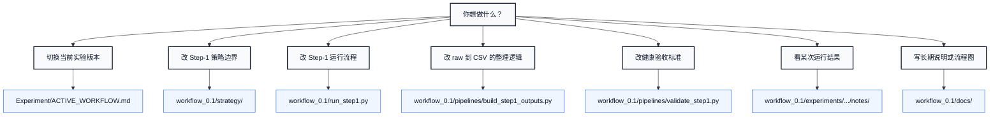

# workflow_0.1 文件夹与文档角色说明

本文解释 `Experiment/workflow_0.1/` 这套目录在实验运行中各自扮演什么角色。

你可以把它理解成一张“仓库地图”：知道每个文件夹是干什么的，遇到问题应该看哪里，想改策略应该改哪里，想看某次结果应该去哪里。

## 一句话总览

```text
ACTIVE_WORKFLOW.md 决定当前跑哪个 workflow
workflow_0.1/strategy 说明为什么这么设计
workflow_0.1/run_step1.py 负责正式执行 Step-1
workflow_0.1/pipelines 负责把 raw 数据整理成标准输出
workflow_0.1/docs 负责长期说明和流程图
workflow_0.1/experiments 负责保存每一次实验的结果和报告
```

## 图 1：workflow_0.1 总地图



## 推荐阅读顺序

如果你是第一次回来继续这个项目，建议按这个顺序读：

```text
1. Experiment/ACTIVE_WORKFLOW.md
2. Experiment/workflow_0.1/README.md
3. Experiment/workflow_0.1/docs/Step-1_正式健康版运作流程.md
4. Experiment/workflow_0.1/experiments/最近一次实验/notes/step1_run_report.md
5. Experiment/workflow_0.1/strategy/对应 Step 的策略文档
```

这样读最省脑子：

```text
先知道现在跑谁
再知道这个 workflow 怎么用
再看 Step-1 怎么运作
再看最近一次跑得怎么样
最后再看策略为什么这么设计
```

## 目录角色说明

| 路径 | 通俗角色 | 什么时候看 |
|---|---|---|
| `Experiment/ACTIVE_WORKFLOW.md` | 当前实验总开关 | 每次开跑前先看，确认当前是 `workflow_0.1` 还是别的版本 |
| `Experiment/workflow_0.1/` | workflow_0.1 的主基地 | 当前所有 0.1 版策略、脚本、文档、实验结果都从这里找 |
| `Experiment/workflow_0.1/strategy/` | 策略脑图和设计原因 | 想知道“为什么这样做”时看 |
| `Experiment/workflow_0.1/docs/` | 长期操作说明和流程图 | 想知道“怎么跑、怎么验收、怎么交接”时看 |
| `Experiment/workflow_0.1/pipelines/` | 数据整理和验收代码 | 想改 CSV 生成逻辑或健康检查规则时看 |
| `Experiment/workflow_0.1/experiments/` | 每次实验产物和报告 | 想看某次实验结果、输出 CSV、运行报告时看 |
| `Experiment/workflow_0.1/run_step1.py` | Step-1 正式按钮 | 真正跑 Step-1 时执行它 |

## 图 2：运行时真实数据流

```mermaid
flowchart LR
  classDef strategy fill:#fff7ed,stroke:#ea580c,color:#0f172a,stroke-width:1.5px
  classDef run fill:#eff6ff,stroke:#2563eb,color:#0f172a,stroke-width:1.5px
  classDef raw fill:#ecfdf5,stroke:#16a34a,color:#0f172a,stroke-width:1.5px
  classDef out fill:#fdf2f8,stroke:#db2777,color:#0f172a,stroke-width:1.5px
  classDef check fill:#ffffff,stroke:#111827,color:#0f172a,stroke-width:2px

  A["ACTIVE_WORKFLOW.md<br/>确认 workflow_0.1 + Step-1"]:::strategy
  B["run_step1.py<br/>正式调度器"]:::run
  C["run_all.py --step 1<br/>底层抓数入口"]:::run
  D["01_price_volume.py<br/>baostock 抓沪深300和日K"]:::run
  E["data/raw/<br/>hs300_stocks.csv<br/>daily_price_volume.csv<br/>stock_industry.csv"]:::raw
  F["validate_step1.py<br/>raw 健康检查"]:::check
  G["build_step1_outputs.py<br/>整理成标准 CSV"]:::run
  H["outputs/step1/<br/>四张 Step-1 标准表"]:::out
  I["validate_step1.py<br/>输出健康检查"]:::check
  J["notes/step1_run_report.md<br/>SUCCESS / FAILED 报告"]:::out

  A --> B --> C --> D --> E --> F --> G --> H --> I --> J
```



## 关键 Markdown 文件角色

### `Experiment/ACTIVE_WORKFLOW.md`

角色：当前实验的“总开关”。

它回答三个问题：

```text
现在激活哪个 workflow？
现在跑哪个 stage？
正式入口命令是什么？
```

现在它指向：

```text
active_workflow: workflow_0.1
active_stage: Step-1
正式入口: Experiment/workflow_0.1/run_step1.py
```

如果以后你开 `workflow_0.2`，优先改这个文件，而不是乱改底层脚本。

### `Experiment/workflow_0.1/README.md`

角色：`workflow_0.1` 的首页。

它不是单次实验报告，而是这个 workflow 的“规则总览”：

```text
目录怎么分工
Step-1 怎么正式运行
Step-1 成功标准是什么
Step-1 / Step-2 输出 CSV 格式是什么
schema 怎么迭代
```

如果你忘了 `workflow_0.1` 的整体约定，先看它。

### `Experiment/workflow_0.1/docs/Step-1_正式健康版运作流程.md`

角色：Step-1 的长期说明书。

它用图解释：

```text
Step-1 从命令到输出完整怎么流动
策略层、执行层、产出层、验收层分别是什么
成功和失败怎么判断
最近一次正式运行结果是什么
```

它不是某次实验的报告，而是“以后大家都可以反复看的操作说明”。

### `Experiment/workflow_0.1/experiments/README.md`

角色：实验目录的写法规范。

它告诉你每个实验目录应该记录什么：

```text
实验目的
代码来源
数据来源
关键改动
输出结果
实验结论
```

当前 `exp_20260616_step1_workflow_0_1/` 就是一次基于这个规范跑出来的 Step-1 实验。

### `Experiment/workflow_0.1/pipelines/README.md`

角色：pipeline 目录的职责说明。

它划清边界：

```text
bigdata_challenge/data_fetcher/ 负责抓 raw
workflow_0.1/pipelines/ 负责把 raw 整理成本 workflow 的标准产物
```

也就是说，`pipelines/` 不联网抓数据，不筛股票，不给交易结论，只做整理和验收。

### `Experiment/workflow_0.1/strategy/workflow_0.1_流程修改想法.md`

角色：最早的策略想法草稿。

它记录了为什么要改原流程：

```text
原流程太重
第一版 baseline 要更贴近 5 日持有期
先围绕板块趋势、个股趋势、成交量/成交额
```

它偏“想法源头”，不是最终执行说明。

### `Experiment/workflow_0.1/strategy/0.1_Step-1_数据获取流程与思考逻辑.md`

角色：Step-1 的策略定义。

它回答：

```text
Step-1 应该拿哪些数据？
Step-1 不应该做哪些事？
为什么保留 daily raw？
为什么做六大风格板块？
为什么第一版暂不纳入北向、融资融券、新闻舆情等？
```

一句话：它定义 Step-1 的“边界”和“理由”。

### `Experiment/workflow_0.1/strategy/0.1_Step-1_真实调度图_代码视角.md`

角色：早期代码视角调度说明。

它的价值是记录我们当时如何从旧代码理解 Step-1：

```text
哪些脚本存在
哪些 raw 文件是旧产物
哪些地方当时需要补代码
策略层、执行层、产出层如何对应
```

注意：现在正式流程已经升级为 `run_step1.py`。所以这份文件更像“调度演化记录”和“历史分析说明”，当前正式执行以：

```text
run_step1.py
docs/Step-1_正式健康版运作流程.md
README.md
```

为准。

### `Experiment/workflow_0.1/strategy/0.1_Step-2_特征工程与初步筛选流程与思考逻辑.md`

角色：Step-2 的策略草图。

它不是 Step-1 当前运行必需文件，但很重要，因为它说明 Step-1 的输出为什么这样设计。

它回答：

```text
Step-2 会怎么使用 Step-1 的 daily raw？
要计算哪些轻量特征？
如何做板块趋势、个股趋势、量能确认和风险标记？
```

一句话：Step-1 是给 Step-2 铺路，这份文件说明“路通向哪里”。

### `Experiment/workflow_0.1/experiments/exp_20260616_step1_workflow_0_1/notes/step1_run_report.md`

角色：某一次正式运行的体检报告。

它不是长期说明，而是一次运行结果：

```text
这次是 SUCCESS 还是 FAILED
用了哪个 workflow
输出目录在哪里
raw 数据是否健康
output 是否健康
如果失败，失败原因是什么
```

这份报告可以用来判断：

```text
这次 Step-1 能不能进入 Step-2？
```

当前这次结果是：

```text
Status: SUCCESS
daily_current_code_count: 300
daily_latest_T: 2026-06-15
daily_duplicates: 0
output_stock_count: 300
output_unmatched_sector_count: 0
```

### `Experiment/workflow_0.1/experiments/exp_20260616_step1_workflow_0_1/outputs/step1/step1_data_manifest.csv`

角色：标准输出里的数据说明书。

虽然它不是 Markdown，但它在运行复盘中很重要。

它记录：

```text
schema_version
date_start
date_end
latest_T
raw_交易日数
data_source
stock_count
unmatched_sector_count
data_window_note
```

如果 `step1_run_report.md` 是“这次运行是否健康”，那 `step1_data_manifest.csv` 就是“四张 CSV 的数据身份证”。

## 关键脚本文件角色

| 文件 | 通俗角色 | 运行中负责什么 |
|---|---|---|
| `run_step1.py` | 正式 Step-1 总调度器 | 串起检查 workflow、联网抓数、raw 验收、生成输出、输出验收、写报告 |
| `pipelines/build_step1_outputs.py` | raw 到标准 CSV 的转换器 | 读取 raw，生成 `step1_daily_raw_data.csv`、`step1_stock_summary.csv`、`step1_sector_summary.csv`、`step1_data_manifest.csv` |
| `pipelines/validate_step1.py` | Step-1 体检医生 | 检查 raw 和输出是否健康，不健康就失败 |
| `pipelines/tests/test_build_step1_outputs.py` | 输出生成测试 | 确保生成的四张表字段和板块映射正确 |
| `pipelines/tests/test_validate_step1.py` | 验收规则测试 | 确保缺股票、重复行、表头错误、未匹配板块会被抓出来 |
| `pipelines/tests/test_run_step1_runner.py` | 调度器测试 | 确保 runner 会检查 active workflow、失败写报告、成功生成报告 |

## 图 3：Markdown 文档之间的关系



## 图 4：你要改东西时应该去哪里



## 单次实验目录怎么看

当前已有一次正式 Step-1 实验：

```text
Experiment/workflow_0.1/experiments/exp_20260616_step1_workflow_0_1/
├── outputs/
│   └── step1/
│       ├── step1_daily_raw_data.csv
│       ├── step1_stock_summary.csv
│       ├── step1_sector_summary.csv
│       └── step1_data_manifest.csv
└── notes/
    └── step1_run_report.md
```

怎么理解：

| 文件夹或文件 | 角色 |
|---|---|
| `outputs/step1/` | 这次实验真正产出的 Step-1 数据资产 |
| `step1_daily_raw_data.csv` | 每只股票、每个交易日一行的行情表 |
| `step1_stock_summary.csv` | 每只股票一行的摘要表 |
| `step1_sector_summary.csv` | 六大板块聚合统计表 |
| `step1_data_manifest.csv` | 数据窗口、来源、schema、备注 |
| `notes/step1_run_report.md` | 这次运行的健康报告 |

## 哪些文件不用你主动管

以下文件通常不用主动阅读或维护：

```text
.DS_Store
__pycache__/
*.pyc
```

它们是系统或 Python 自动生成的缓存文件，不是策略、流程或实验结论。

## 当前状态总结

当前 `workflow_0.1` 的 Step-1 已经形成清晰分工：

```text
strategy/ 负责解释为什么
docs/ 负责解释怎么跑
run_step1.py 负责正式执行
pipelines/ 负责整理和验收
experiments/ 负责保存每次结果
```

最重要的心智模型是：

```text
长期说明不要放进单次实验目录。
单次运行报告不要放进 docs。
策略想法不要写进执行脚本。
raw 抓数不要写进 pipelines。
```

这样后面进入 Step-2、workflow_0.2 或新的实验时，目录不会越跑越乱。
